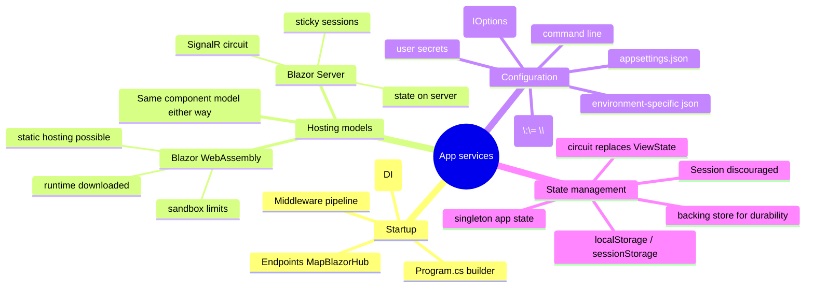

# Blazor App Services — Startup, DI, Configuration, State, Hosting

> Source: *Blazor for ASP.NET Web Forms Developers* — ch 3 (hosting models),
> ch 5 (app startup), ch 8 (state management), ch 12 (app configuration).

This page collects the *infrastructure* around components: how a Blazor app
starts, how services are provided, where configuration comes from, how state
survives, and the hosting-model trade-offs.



## Startup: from `Global.asax` to `Program.cs`

Web Forms apps configure themselves in `Global.asax.cs` (`Application_Start`,
`RouteConfig`, `BundleConfig`, per-request lifecycle events). ASP.NET Core /
Blazor consolidates this into `Program.cs` with two phases:

1. **Build the container** — `WebApplication.CreateBuilder(args)`, then
   `builder.Services.Add*` registers services with the built-in DI container
   (Razor Pages, `AddServerSideBlazor`, DbContexts, identity, app services).
   This replaces "features enabled by referencing ASP.NET in web.config".
2. **Configure the pipeline** — after `builder.Build()`, middleware is declared
   top-to-bottom: exception handling per environment, `UseHttpsRedirection`,
   `UseStaticFiles` (only `wwwroot/` is addressable), `UseRouting`,
   `UseAuthentication`/`UseAuthorization`, then endpoints:
   `MapBlazorHub()` (the SignalR connection carrying Blazor Server UI events)
   and `MapFallbackToPage("/_Host")` (deep links land on the host page, which
   starts the Blazor router).

Key differences from Web Forms:
- Custom error pages move from web.config to `UseExceptionHandler` keyed off
  the environment (`ASPNETCORE_ENVIRONMENT`, default **Production**).
- `Application_BeginRequest` becomes an `app.Use((ctx, next) => …)` middleware.
- **Custom middleware** (Blazor ch 11): inline delegates (`app.Use(async
  (context, next) => { …; await next(); })` — e.g. reading a `?culture=`
  query value into `CultureInfo.CurrentCulture`), or classes implementing
  `IMiddleware` / following the middleware convention. Common IIS modules
  map to built-ins: custom errors → Status Code Pages, static files → Static
  File Middleware, compression/caching/rewriting → their corresponding
  middleware.
- Bundling/minification moves from runtime `BundleConfig` to external tools
  (Grunt/Gulp/Webpack) invoked as an MSBuild `<Target BeforeTargets="Build">`.
- The app must `app.Run()` itself — no IIS to implicitly host it.

## Dependency injection

DI is a guiding principle of ASP.NET Core: nearly everything is replaceable.
Register services on `builder.Services` with lifetimes (singleton/scoped/
transient) and consume with `@inject` or `[Inject]` in components. The eShop
migration example swaps mock/real implementations purely by registration:

```csharp
if (builder.Configuration.GetValue<bool>("UseMockData"))
    builder.Services.AddSingleton<ICatalogService, CatalogServiceMock>();
else
    builder.Services.AddScoped<ICatalogService, CatalogService>();
```

Third-party containers (e.g. Autofac) can be carried forward. This is the
same idea as DMMF's *injecting dependencies into workflow steps* and Elm's
*commands carrying effects to the runtime* — keep capabilities at the edges
(see [workflows-and-error-handling](../workflows-and-error-handling/index.md)
and [elm-architecture](../elm-architecture/index.md)). MAUI devotes a full
chapter to the identical container API:
[mvvm-patterns](../mvvm-patterns/index.md).

## Hosting models

| | **Blazor Server** | **Blazor WebAssembly** |
| --- | --- | --- |
| Where components run | server (ASP.NET Core) | browser (WebAssembly .NET runtime) |
| Transport | real-time SignalR connection; UI events up, serialized UI diffs down | none required |
| Download size / load | tiny initial, fast | larger (runtime + assemblies), slower first load |
| Latency | every interaction is a network hop | local, instant |
| Offline | no | yes (client resources) |
| Server dependency | required (no CDN/serverless) | none — deployable as static files |
| Capabilities | full .NET APIs, thin clients OK, code stays private | browser sandbox (`PlatformNotSupportedException` for file system/arbitrary sockets), client hardware matters |
| Scalability | challenging (per-client connection + server-held state) | scales like static hosting |

Choose by workload, and remember: **the component model is identical** in both
— the same components run either way. Introduce abstractions so components
stay hosting-model-agnostic. Server-side most closely resembles Web Forms
(state lives on the server, like `UpdatePanel` partial postbacks but over a
persistent connection).

A **circuit** is Blazor Server's unit of app state: an active connection whose
in-memory component state persists between interactions. Consequences:
- component state is ready without rebuilds and never travels to the browser;
- a server restart loses it; load balancers need **sticky sessions**; many
  circuits create memory pressure.
- Therefore: treat the circuit as a cache, and **persist important state to a
  backing store** (e.g. shopping-cart rows written as added, multi-part form
  data saved per step) so it can be reconstituted.

## State management

Web Forms had ViewState / Session / Application. Blazor redistributes them:

| Web Forms | Blazor equivalent | Notes |
| --- | --- | --- |
| ViewState (encoded round-trip field, could reach MBs) | component instance state held in the circuit | not transmitted to the browser; not durable (see above) |
| `Session` (`ISession`, cookie-based) | available in ASP.NET Core / Blazor Server but **discouraged** | fails if cookies declined; prefer a data repository |
| `Application` object | a **singleton service** injected where needed | volatile + per-server; persist durable values externally |
| — | `localStorage` (browser-wide) and `sessionStorage` (per tab) via JS interop or `Microsoft.AspNetCore.ProtectedBrowserStorage` | client-side persistence |

Example singleton app-state service consumed by a component:

```csharp
public class MyApplicationState {
    public int VisitorCounter { get; private set; }
    public void IncrementCounter() => VisitorCounter += 1;
}
// app.AddSingleton<MyApplicationState>();  … @inject MyApplicationState AppState
```

The pattern of an observable app-state service that components subscribe to
(`AppState.OnChange += StateHasChanged`) is exactly MVVM's change notification
(mvvm-patterns) and rhymes with Elm's one-model-per-app discipline
(elm-architecture).

## App configuration

`ConfigurationManager.AppSettings["key"]` is gone. ASP.NET Core aggregates
**ordered configuration sources** — later sources win:

1. `appsettings.json`
2. `appsettings.{Environment}.json`
3. user secrets (Development only; outside the repo; `dotnet user-secrets set "Parent:ApiKey" "…"`)
4. environment variables (`__` maps to the `:` hierarchy separator: `Parent__ApiKey`)
5. command-line arguments (`--Key=value`, `/Key value`)

Details that matter:
- JSON hierarchies flatten to colon keys: `section1:key0`.
- web.config *returns* on IIS, but only to configure the ASP.NET Core Module
  (ANCM) — process path, hosting model, and optionally
  `<environmentVariables>` for the app. Secrets in web.config were a classic
  leak into source control; the new sources exist to fix that.
- Read values with `@inject IConfiguration Config` → `Config["section1:key0"]`
  or `Config.GetSection("section1")`.
- **Strongly-typed configuration (Options pattern)**: bind a POCO hierarchy
  with `services.Configure<MyConfig>(Configuration)` and consume
  `IOptions<MyConfig>.Value`. No `ConfigurationSection` inheritance needed.

Configuration-driven service selection (mock vs real, above) is the boundary
composition idea from DMMF ch 9 (compose the workflow from implementations
chosen at startup).

## Cross-links

- DI concepts and testability: [mvvm-patterns](../mvvm-patterns/index.md),
  [testing-practices](../testing-practices/index.md).
- Where configuration meets resilience/config-of-remote-clients:
  [remote-data-and-security](../remote-data-and-security/index.md).
- The circuit's in-memory state and its "persist to the edge" remedy is the
  same principle as DMMF's persistence at the edges:
  [persistence-and-evolution](../persistence-and-evolution/index.md).
- Hosting models determine where Elm's runtime flags equivalent (startup
  arguments to the program) live: [elm-architecture](../elm-architecture/index.md).
