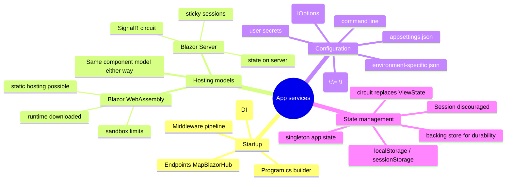

# Blazor App Services — Startup, DI, Configuration, State, Hosting

> Source: *Blazor for ASP.NET Web Forms Developers* — ch 3 (hosting models),
> ch 5 (app startup), ch 8 (state management), ch 12 (app configuration).

The infrastructure around components: startup, DI, configuration, state
survival, and the hosting-model trade-offs.



## Startup: `Global.asax` → `Program.cs`

Two phases, replacing web.config feature-enablement:

1. **Build the container** — `WebApplication.CreateBuilder(args)` +
   `builder.Services.Add*` (Razor Pages, `AddServerSideBlazor`, DbContexts,
   identity, app services).
2. **Configure the pipeline** — after `builder.Build()`, middleware top to
   bottom: exception handling (per environment), `UseHttpsRedirection`,
   `UseStaticFiles`, `UseRouting`, `UseAuthentication`/`UseAuthorization`,
   then `MapBlazorHub()` (the SignalR connection for Blazor Server) and
   `MapFallbackToPage("/_Host")` (deep links → host page → Blazor router).

Web Forms → ASP.NET Core mapping:

| Web Forms | Becomes |
| --- | --- |
| `Application_BeginRequest` | `app.Use((ctx, next) => …)` middleware |
| custom error pages in web.config | `UseExceptionHandler` keyed off `ASPNETCORE_ENVIRONMENT` (default **Production**) |
| IIS modules (custom errors, static files, compression, caching, rewriting) | built-in middleware (Status Code Pages, Static Files, …) |
| runtime bundling (`BundleConfig`) | external tools (Grunt/Gulp/Webpack) as an MSBuild `<Target BeforeTargets="Build">` |
| implicit IIS hosting | the app **must** call `app.Run()` itself |

**Custom middleware**: inline delegate —
`app.Use(async (context, next) => { …; await next(); })` (e.g. read
`?culture=` into `CultureInfo.CurrentCulture`) — or an `IMiddleware` class.

## Dependency injection

Register on `builder.Services` with lifetimes; consume via `@inject` or
`[Inject]`. The eShop migration swaps mock/real by registration only:

```csharp
if (builder.Configuration.GetValue<bool>("UseMockData"))
    builder.Services.AddSingleton<ICatalogService, CatalogServiceMock>();
else
    builder.Services.AddScoped<ICatalogService, CatalogService>();
```

Same idea as DMMF's injected workflow dependencies
([workflows-and-error-handling](../workflows-and-error-handling/index.md))
and MAUI's container ([mvvm-patterns](../mvvm-patterns/index.md)).

## Hosting models

| | **Blazor Server** | **Blazor WebAssembly** |
| --- | --- | --- |
| Components run | server (ASP.NET Core) | browser (.NET on WebAssembly) |
| Transport | SignalR: events up, UI diffs down | none required |
| First load | tiny, fast | larger (runtime + assemblies) |
| Latency | every interaction = network hop | local, instant |
| Offline | no | yes |
| Server needed | yes (no CDN/serverless) | no — static files |
| Capabilities | full .NET, code stays private | browser sandbox (`PlatformNotSupportedException` for filesystem/sockets) |
| Scalability | hard (per-client connection + state) | like static hosting |

**The component model is identical either way** — keep components
hosting-agnostic via abstractions. Server-side ≈ Web Forms (state on
server, like `UpdatePanel` postbacks over a persistent connection).

### The circuit: treat it as a cache

A **circuit** = one active SignalR connection + its in-memory component
state. Consequences:

- state never travels to the browser; ready without rebuilds;
- server restart loses it; load balancers need **sticky sessions**; many
  circuits = memory pressure;
- therefore **persist important state to a backing store** (cart rows
  written as added, multi-step form data saved per step) so it can be
  reconstituted.

## State management

| Web Forms | Blazor | Notes |
| --- | --- | --- |
| ViewState (MB-sized round-trip field) | component state in the circuit | not sent to browser; not durable |
| `Session` | available but **discouraged** | breaks if cookies declined; prefer a repository |
| `Application` object | a **singleton service** | volatile, per-server — persist durable values externally |
| — | `localStorage` (browser-wide) / `sessionStorage` (per tab) | via JS interop or `ProtectedBrowserStorage` |

Singleton app state:

```csharp
public class MyApplicationState {
    public int VisitorCounter { get; private set; }
    public void IncrementCounter() => VisitorCounter += 1;
}
// app.AddSingleton<MyApplicationState>();  … @inject MyApplicationState AppState
```

Observable app state (`AppState.OnChange += StateHasChanged`) = MVVM change
notification ([mvvm-patterns](../mvvm-patterns/index.md)) and rhymes with
Elm's one-model discipline ([elm-architecture](../elm-architecture/index.md)).

## App configuration

`ConfigurationManager.AppSettings` is gone. **Ordered sources — later
wins:**

1. `appsettings.json`
2. `appsettings.{Environment}.json`
3. user secrets (Development only, outside the repo:
   `dotnet user-secrets set "Parent:ApiKey" "…"`)
4. environment variables (`Parent__ApiKey` — `__` maps to `:`)
5. command line (`--Key=value`)

Details that matter:

- JSON hierarchies flatten to colon keys: `section1:key0`.
- web.config survives **only** to configure IIS's ASP.NET Core Module —
  hosting model, env vars. (Secrets in web.config were a classic leak; the
  new sources exist to stop that.)
- Read: `@inject IConfiguration Config` → `Config["section1:key0"]`.
- **Options pattern** = strongly typed: bind a POCO with
  `services.Configure<MyConfig>(Configuration)`, consume
  `IOptions<MyConfig>.Value`.

Mock-vs-real selection by configuration (above) = DMMF's composition root
choosing implementations at startup
([workflows-and-error-handling](../workflows-and-error-handling/index.md)).

## Cross-links

- DI concepts and testability: [mvvm-patterns](../mvvm-patterns/index.md),
  [testing-practices](../testing-practices/index.md).
- Configuration of remote clients + resilience: [remote-data-and-security](../remote-data-and-security/index.md).
- "Persist to the edge" = DMMF's principle: [persistence-and-evolution](../persistence-and-evolution/index.md).
- Startup data ≈ Elm flags: [elm-architecture](../elm-architecture/index.md).
