# Blazor Components

> Source: *Blazor for ASP.NET Web Forms Developers* — ch 4 (project structure),
> ch 6 (build reusable UI components), ch 7 (pages, routing, layouts),
> ch 9 (forms and validation).

A Blazor app = a tree of **components** — self-contained UI units owning
state, rendering, events, and lifecycle. The `.ascx` user-control analogue,
but: plain .NET types, run on client *or* server, render through a diffable
tree.

```mermaid
mindmap
  root((Blazor components))
    Razor syntax
      "@expression / &#40;&#41; explicit"
      "@code members"
      Directives
        "@page @layout @inject"
        "@inherits @implements @typeparam"
      Directive attributes
        "@onclick @bind @key @ref"
    Composition
      Parameters
      ChildContent RenderFragment
      Templated RenderFragment<T>
      EventCallback
    Lifecycle
      OnInitialized
      OnParametersSet
      OnAfterRender
      IDisposable
    State change
      RenderTree diffing
      StateHasChanged
      ErrorBoundary
    Pages & routing
      @page route templates
      Router / RouteView
      NavigationManager
      Layouts (nested)
    Forms & validation
      EditForm / EditContext
      Input* components
      DataAnnotationsValidator
```



## Razor in two tables

A `.razor` file compiles to a .NET class. `@` enters C#; `@code { … }` adds
members (the `<script runat="server">` analogue); control flow is plain C#
(`@if`, `@foreach`).

**Directives** (compile-time):

| Directive | Purpose | Web Forms equivalent |
| --- | --- | --- |
| `@page "/product/{id}"` | route | `<%@ Page %>` |
| `@layout MainLayout` | layout | `MasterPageFile` |
| `@inject IJSRuntime JS` | service | — (DI) |
| `@inherits Base` / `@implements IDisposable` | base class / interface | code-behind |
| `@typeparam TItem` | generic parameter | code-behind |
| `@using NS` (centralized in `_Imports.razor`) | namespace | `@import` |

**Directive attributes** (runtime):

| Attribute | Does |
| --- | --- |
| `@onclick="Handler"` | DOM event (`@on{event}` family; lambda/method; sync or `async Task`) |
| `@bind="username"` | two-way binding (default `onchange`; `@bind:event="oninput"`) |
| `@key="person"` | diffing hint — preserve elements in collections |
| `@ref="field"` | capture component/element reference |
| `@attributes="dict"` | splat attributes |

## Using and composing components

Components are used as HTML tags matching the type name — no registration:

```razor
<Counter IncrementAmount="10" />
```

- Data in via `[Parameter]` public properties.
- Route + query values feed parameters too:
  `@page "/product/{id:int}"` binds `{id}` to a `[Parameter]`;
  query: `[Parameter] [SupplyParameterFromQuery(Name = "IncBy")]`.
- `[Parameter] RenderFragment ChildContent` captures child markup;
  `RenderFragment<T>` = templated per-item fragment (the `Repeater`
  analogue). Generic: `@typeparam TItem`, type via `TItem="string"`,
  rename context with `Context="message"`.
- Component events out: `[Parameter] EventCallback<T>`.

## State change: the render tree

Components render to an in-memory **RenderTree**; Blazor diffs against the
previous output and patches the DOM minimally (Elm's virtual DOM twin —
[elm-architecture](../elm-architecture/index.md)).

- After an event handler runs → automatic re-render.
- **Async handlers render twice**: after the sync part (so `Loading…` shows)
  and again when the `Task` completes.
- State changed *outside* an event (a service pushes) → call
  `StateHasChanged()` manually — typically wired to a service's `OnChange`
  in `OnInitialized`.
- Every component runs on one `SynchronizationContext`.
- `<ErrorBoundary>` contains exceptions to a subtree instead of failing the
  page.

## Lifecycle

**Rendering is synchronous** — async work belongs in lifecycle methods.

| Method | When | Web Forms analogue |
| --- | --- | --- |
| `OnInitialized(Async)` | once, at creation | `Page_Load` |
| `OnParametersSet(Async)` | after params assigned (init + every render) | — |
| `OnAfterRender(Async firstRender)` | after render; refs populated; JS interop safe | — |
| `Dispose()` (`@implements IDisposable`) | removed from UI | `Page_UnLoad` |

- `OnAfterRender` is **not** called during server prerendering.
- `@ref` values populate *after* render; mutating child state via refs
  bypasses re-rendering — discouraged.
- Element refs are opaque — for JS interop, never direct DOM edits (Blazor
  owns the DOM).

**Code-behind**: `Counter.razor` + `Counter.razor.cs`
(`public class CounterBase : ComponentBase`, markup declares
`@inherits CounterBase`). The `.designer.cs` file is gone — Razor output
lives in `obj/`.

## Pages, routing, layouts

**A page = a component with a route.** No `.aspx` files.

- `@page "/counter"` — explicit; never inferred from folder (`Pages/` is a
  convention only).
- Templates: `{param}` placeholders + constraints (`{id:int}`).
- Routing is **client-side**: `<Router AppAssembly=…>` discovers routable
  components; match → `<RouteView>`; else `<NotFound>`. Deep links hit the
  server first → `MapFallbackToPage("/_Host")` → client route.
- `NavigationManager` = current/base address + `NavigateTo` + address-change
  event. No `Response.Redirect` — Blazor isn't request-reply.

**Layouts** = Master Pages: inherit `LayoutComponentBase`, render `@Body`.
Apply with `@layout MainLayout`, per folder via `_Imports.razor`, or as the
Router's `DefaultLayout`. Layouts **nest**. `<html>`/`<body>` live in the
host page (`_Host.cshtml` / `wwwroot/index.html`). Components cannot render
`<script>` tags — scripts belong in the host page.

## Forms and validation

One model, shared client + server: **the model type + data annotations**.

```razor
<EditForm Model="@model" OnValidSubmit="…">
    <DataAnnotationsValidator />
    <ValidationSummary />
    <ValidationMessage For="() => model.Prop" />
    <InputText @bind-Value="model.Name" />
    <InputNumber @bind-Value="model.Qty" />
</EditForm>
```

- Input components render typed HTML: `InputText`, `InputNumber`,
  `InputDate`, `InputSelect`, `InputCheckbox`, `InputTextArea`.
- `<EditForm>` orchestrates via an `EditContext`; submit events:
  `OnValidSubmit` / `OnInvalidSubmit` / manual `OnSubmit`.
- Annotations: `[Required]`, `[StringLength(16)]`, `[Range(1, 100000)]`,
  custom rules.
- (DMMF's deeper point — make invalid states unrepresentable in the type —
  is the design-time twin: [functional-design-and-types](../functional-design-and-types/index.md).)
- A submitted form persists nothing by itself — POST to an API (WebAssembly)
  or call a persistence path:
  [remote-data-and-security](../remote-data-and-security/index.md),
  [persistence-and-evolution](../persistence-and-evolution/index.md).

## Project structure essentials

- `.razor` files compile into one assembly — **no runtime UI compilation**.
- Only `wwwroot/` is web-addressable.
- Server entry: `Program.cs` + `AddServerSideBlazor()` + `MapBlazorHub` +
  `MapFallbackToPage`. WebAssembly entry: `RootComponents.Add<App>("#app")`
  + DI, no HTTP server.
- Host render modes: `RenderMode.Server` (interactive over connection),
  `ServerPrerendered` (static HTML first), `Static`.
- Hot Reload = live updates with page state — the Web Forms designer loop.

## Cross-links

- The same unidirectional loop in Elm: [elm-architecture](../elm-architecture/index.md).
- The ViewModel analogue: [mvvm-patterns](../mvvm-patterns/index.md).
- Services/config/hosting: [blazor-app-services](../blazor-app-services/index.md).
- Route params as typed boundary parsing: [workflows-and-error-handling](../workflows-and-error-handling/index.md).
