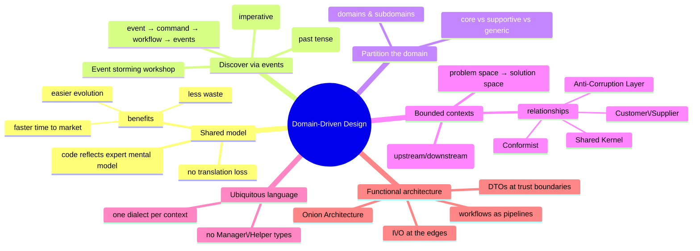

# Domain-Driven Design — Understanding the Problem First

> Source: *Domain Modeling Made Functional* (Scott Wlaschin) — ch 1
> (Introducing DDD), ch 2 (Understanding the Domain), ch 3 (A Functional
> Architecture).

A developer's job is to solve a problem through software — coding is just one
part. If requirements are garbage, no amount of code fixes it ("garbage in,
garbage out"). DDD is the discipline of minimizing the garbage-in by building
a **shared model** between domain experts and developers.



## The importance of a shared model

The children's game "Telephone" — a message whispered down a chain gets
distorted — is what happens when requirements pass through specifications,
documents, and translators. Three approaches to bridging the domain
expert ↔ developer gap:

1. **Written specs** — creates distance; the document is the intermediary.
2. **Agile iteration** — a feedback loop, but the developer still acts as a
   lossy "translator" of the expert's mental model into code.
3. **DDD** — domain experts, development team, stakeholders, **and the source
   code itself share the same model**. No translation, because the code is
   designed to reflect the shared mental model directly.

Benefits: faster time to market, more business value, less waste (clearer
requirements reveal which components are high-value), easier maintenance and
evolution. Sidebar: Dan North's "insanely effective delivery machine" — a
trading firm where developers were *trained as traders*, making them domain
experts themselves.

## Guideline 1: understand the domain through business events

A business doesn't just *have* data, it **transforms** it — value is created
in the transformation. Static data contributes nothing. What triggers work?
An outside trigger (mail arrives), a time trigger (daily at 10am), or an
observation (inbox empty). Capture these as **Domain Events** — always in the
past tense ("Order form received"), because they are facts that can't change.

### Event storming

A collaborative workshop to discover events: everyone who has questions and
anyone who has answers, a big wall, sticky notes. Events go on the wall;
workflows get posted next to them; events connect into a timeline. The session
reveals:

- a **shared model** (everyone sees the same wall; "us vs them" dissolves),
- **all the teams** (billing speaks up: "we need Order placed too"),
- **gaps in requirements** (missing "Order acknowledgment sent" becomes
  visible),
- **connections between teams** (one team's output event is another's input),
- **reporting needs** (reporting and read-only models are part of the domain
  too).

Follow the chain of events "out to the edges" (what triggers the first event?
what happens after the last?) to catch missing requirements. Don't worry about
paper-vs-digital: the concepts are usually implementation-independent (e.g.
accounting hasn't changed in centuries). Convert only the parts that benefit
most.

**Vocabulary precision**: a *scenario* is a user-goal ("place an order", like
an agile story); a *use-case* is a detailed scenario; a *business process* is
a business-goal-oriented scenario; a **workflow** is the detailed steps one
person or team performs — when a process spans teams, split it into workflows
per team, coordinated.

### Commands

What *made* an event happen? A **command** — a request, always in the
imperative ("Place an order"). If a command succeeds, it initiates a workflow
that emits corresponding events:

> Command "Place an order" → workflow → events "Order placed", "Order
> acknowledgment sent", …

This pipeline shape (input → transformation → outputs) is exactly how
functional programming models computation — the deep reason DDD + FP fit
together (see [workflows-and-error-handling](../workflows-and-error-handling/index.md)).
Not all events need commands — some come from schedulers or monitors
(`MonthEndClose`, `OutOfStock`).

## Guideline 2: partition the domain into subdomains

A **domain** is "an area of coherent knowledge" — practically, *that which a
domain expert is expert in*. **Subdomains** are smaller specialized areas
within a domain. Domains overlap in the real world (CSS is part of web
programming *and* web design); boundaries are fuzzy — don't force crisp ones.

Within the business, existing **department boundaries are strong clues** to
subdomains: order-taking, shipping, billing. Check by asking an expert "do you
know how billing works?" — "a little, ask the billing team" confirms a
separate domain.

Some domains matter more than others:

- **core domains** — provide business advantage, bring in the money;
- **supportive domains** — required but not differentiating;
- **generic domains** — not unique to the business (can be outsourced, e.g.
  delivery).

Prioritize: don't attempt to implement all bounded contexts at once — focus
on the highest-value ones and expand. Sometimes the core is unexpected (an
e-commerce business may find inventory management is core).

## Guideline 3: bounded contexts

Distinguish the **problem space** (the domain) from the **solution space**
(the model). In the solution space, subdomains map to **bounded contexts** —
subsystems with clear boundaries, each a mini domain model with its own
dialect of the language. "Context" = the specialized knowledge inside;
"bounded" = reduced coupling so contexts can evolve independently (explicit
APIs, no shared code). A bounded context maps to a concrete software
component: an assembly, a service, or a namespace.

The mapping isn't necessarily 1:1 — a legacy system covering order-taking
*and* billing might have to be one bounded context.

**Getting boundaries right** (an art, not a science):

- listen to the domain experts (same language → same subdomain);
- respect team/department boundaries;
- guard the "bounded" part — scope creep makes a boundary meaningless
  ("good fences make good neighbors");
- **design for autonomy** — two groups pulling one context in different
  directions is a three-legged race;
- **design for friction-free workflows** — if a workflow keeps bumping into
  context boundaries, refactor the boundaries, even if the design gets
  "uglier." Business value beats pure design.

**Context maps** show contexts and their relationships at high level (like a
route map — main routes only). Contexts relate as **upstream** and
**downstream**; they agree on shared message formats; sometimes a translator
is needed. Kinds of relationships:

- **Shared Kernel** — both contexts share a common design; changes require
  collaboration (order-taking and shipping co-own the address design);
- **Customer/Supplier (consumer-driven contract)** — downstream defines what
  it needs; upstream provides exactly that (billing dictates the
  `BillableOrderPlaced` contents);
- **Conformist** — downstream accepts the upstream's model as-is
  (order-taking adopts the product catalog's model);
- **Anti-Corruption Layer (ACL)** — a translator between two different
  "languages," protecting your model from an external one (third-party
  address-checking service). The ACL is not primarily about validation — it
  prevents your model being "corrupted" by the outside world and avoids
  vendor lock-in.

Deciding how contexts interact is as much an organizational challenge as a
technical one (some teams use the "Inverse Conway Manoeuvre" to align org
structure with architecture).

## Guideline 4: the ubiquitous language

If the domain expert calls it an "Order," the code must have an `Order` that
corresponds and behaves the same. Conversely, **no `OrderFactory`,
`OrderManager`, `OrderHelper`** — a domain expert wouldn't know what those
mean; technical terms shouldn't leak into the design.

The **Ubiquitous Language** is the shared vocabulary, used everywhere:
requirements, design, and most importantly source code. It is built
collaboratively, evolves with the design, and — crucially — **each context
has its own dialect**. "Order" means different things to shipping (inventory,
quantities) and billing (prices, money). Forcing one global meaning leads to
painful misunderstandings or design errors.

## Chapter 2 — interviewing a domain expert

Rather than all-day meetings, do **short interviews focused on one workflow**.
Start high-level: inputs and outputs only. Key lessons from the Widgets Inc
interview:

- **Resist assumptions** — don't assume "e-commerce with shopping cart"
  because it *looks* familiar; B2B customers are experts who order 200 items
  by product code. Good interviewing = lots of listening ("be an
  anthropologist").
- **Capture non-functional requirements** — scale (~200 orders/day,
  consistent), user expertise (experts: don't slow them down), latency and
  consistency expectations, audit trails. A B2B system values predictability
  and robust data handling over flash.
- **Follow the money** — orders are prioritized over quotes because orders
  make money. Businesses don't treat requirements as equal.
- **Piles are real** — incoming forms, quotes-to-do-later, invalid forms.
  Piles have priorities; in implementation a pile maps to a queue, but during
  design stay away from technical details.
- **Discover dependencies** — the address-checking application is an external
  service the workflow needs (`CheckAddressExists`); the product catalog is
  another bounded context this workflow reads. Autonomy matters: Ollie keeps
  his own catalog copy because "it's about control, not speed" — he doesn't
  want his work blocked by another team's availability.
- **Learn the words** — domain experts don't say "float"; they say "Order
  Quantity." And "it depends" means complexity ahead (widgets sell by unit,
  gizmos by kilogram → `UnitQuantity` vs `KilogramQuantity`).
- **Phase markers** — Ollie marks forms per stage (validated, priced) so
  states are distinguishable. The order has a **lifecycle**: Unvalidated →
  Validated → Priced → Placed. A naive single `Order` record erases these
  distinctions (see state machines in
  [functional-design-and-types](../functional-design-and-types/index.md)).
- **Output = events, not documents** — the workflow's output is the events
  that trigger other contexts (`OrderPlaced`), not the completed order
  document and not the acknowledgment (that's a *side effect*).

**Two anti-patterns to fight during requirements**:
1. **Database-driven design** — sketching `Order`/`OrderLine`/`Customer`
   tables. The database is not part of the ubiquitous language. This is
   **persistence ignorance**. DB thinking loses subtleties (a quote needs no
   billing address — hard to model with a foreign key doing dual duty).
2. **Class-driven design** — inventing `OrderBase` classes that don't exist
   in the expert's world. Both distort the domain.

**Document with text, not UML**: workflows as input/output + pseudocode;
data structures using `AND` (both required) and `OR` (choice):

```text
data Order =
  CustomerInfo AND ShippingAddress AND BillingAddress
  AND list of OrderLines AND AmountToBill

data WidgetCode = string starting with "W" then 4 digits
data ProductCode = WidgetCode OR GizmoCode
```

This is not scary to non-programmers, so domain experts can review (and even
write) it. Part 2 of the book shows this maps *directly* onto F# types — the
documentation and the code converge
([functional-design-and-types](../functional-design-and-types/index.md)).

## Chapter 3 — a functional architecture

Use the **C4** levels: system context → containers (deployables) → components
→ classes/modules. The goal of architecture: define boundaries so the **cost
of change** stays low.

### Bounded contexts as autonomous components

A bounded context can be a module with a clean interface, an assembly, a
service, or a microservice (one workflow per deployable). **Decouple first,
deploy later**: build a monolith initially and refactor to separate containers
only when needed — beware the "microservice premium," and beware the
*distributed monolith* (if switching one service off breaks others, you don't
have microservices).

### Communicating between contexts

Contexts communicate through **events**, fully decoupled: `PlaceOrder`
workflow emits `OrderPlaced` → published (queue or direct call) → shipping
context listens, converts the event to a `ShipOrder` command → `ShipOrder`
workflow runs → emits `OrderShipped`. The event→command translation lives at
the downstream boundary or in a router/process manager.

Data inside events travels as **DTOs** (serializable, structured for the
wire), *not* domain objects: domain object → DTO → JSON on the way out;
JSON → DTO → domain object on the way in. Usually an Event DTO contains child
DTOs (Order DTO containing OrderLine DTOs).

**Trust boundaries**: a context's perimeter is a trust boundary. The **input
gate** *always validates* untrusted input into valid domain objects (if
validation fails, the workflow is bypassed with an error). The **output gate**
deliberately *loses* information to prevent leakage (e.g. never emit credit
card numbers to shipping) and to avoid accidental coupling.

### Workflows within a context

Each workflow is a single function: input = command data, output = a **list
of events**. Public workflows "stick out" of the context boundary. Two
important design rules:

- **Don't publish events internally** — a workflow *returns* events;
  publishing is a separate infrastructure concern. OO-style internal
  event handlers (`OrderPlaced` → handler sends acknowledgment → handler
  emits another event) create hidden dependencies and global mutable state.
  In the functional style, "listeners" are just appended to the end of the
  pipeline — explicit and easier to maintain.
- **Respect consumer-driven contracts** — emit `BillableOrderPlaced`
  (OrderId AND BillingAddress AND AmountToBill) for billing rather than the
  generic `OrderPlaced`, so each downstream context gets only what it needs.

### Code structure: onion, not layers

Horizontal layers (domain → services → DB → UI) violate "code that changes
together, lives together" — one workflow change touches every layer. Vertical
slices (all code for one workflow) are better but intermingle concerns inside
the pipe. The **Onion Architecture** fixes it: domain code at the center,
infrastructure assembled around it, **all dependencies pointing inward**
(Hexagonal and Clean Architecture are the same idea).

**Keep I/O at the edges**: no DB reads/writes (or randomness, or mutation)
inside the workflow — I/O only at the start and end. This forces separation
of concerns, pairs with persistence ignorance, and makes workflows pure and
testable (see the "IO sandwich" in
[persistence-and-evolution](../persistence-and-evolution/index.md)).

## Cross-links

- The event→command→workflow→event loop is the same unidirectional flow as
  The Elm Architecture (msg → update → model): [elm-architecture](../elm-architecture/index.md).
- DTOs at trust boundaries: detailed conversion guidelines in
  [persistence-and-evolution](../persistence-and-evolution/index.md).
- Bounded-context ownership of data and eventual consistency:
  [persistence-and-evolution](../persistence-and-evolution/index.md).
- The eShop MAUI reference app is an example of these architectural ideas in
  a client app: [mvvm-patterns](../mvvm-patterns/index.md).
- Microservices and owned data: [remote-data-and-security](../remote-data-and-security/index.md).
