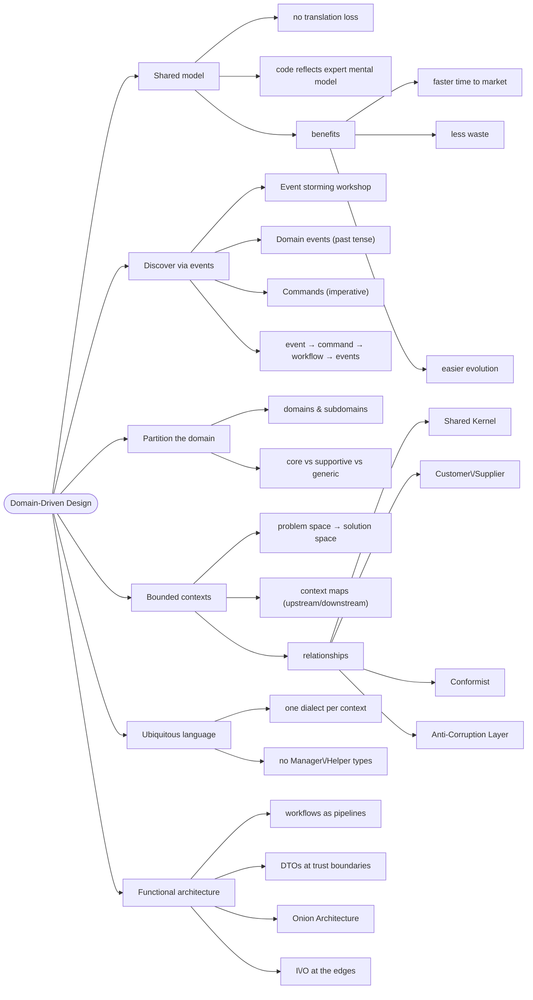

# Domain-Driven Design — Understanding the Problem First

> Source: *Domain Modeling Made Functional* (Scott Wlaschin) — ch 1
> (Introducing DDD), ch 2 (Understanding the Domain), ch 3 (A Functional
> Architecture).

Code is the easy part; understanding the problem is the hard part. DDD =
build a **shared model** between domain experts and developers so the code
reflects the expert's mental model directly — no translation loss.



## The shared model (ch 1)

The children's game "Telephone" is what happens to requirements passed
through documents and translators. Three ways to bridge the gap:

1. **Written specs** — the document is the intermediary → distance.
2. **Agile** — feedback loop, but the developer still translates lossily.
3. **DDD** — experts, team, stakeholders, **and the code share one model**.

Payoffs: faster time to market, less waste, easier evolution. (Sidebar: Dan
North's "insanely effective delivery machine" — a trading firm whose
developers were *trained as traders*, making them domain experts.)

## Guideline 1 — discover the domain through business events

A business doesn't *have* data, it **transforms** it. Value is created in
the transformation.

- Capture **Domain Events** — always **past tense** ("Order form received"):
  facts that can't change.
- Triggers: outside input (mail arrives), time (daily at 10am), observation
  (inbox empty).

### Event storming

Sticky notes on a wall: events first, workflows beside them, timeline
emerges. The session reveals:

- a **shared model** ("us vs them" dissolves),
- **all the teams** (billing: "we need Order placed too"),
- **requirement gaps** (missing "Order acknowledgment sent" becomes visible),
- **team connections** (one team's output = another's input),
- **reporting needs** (read models are part of the domain too).

Follow events out to the edges (what triggers the first? what happens after
the last?) to catch missing requirements. Don't sweat paper-vs-digital —
concepts are implementation-independent.

**Vocabulary precision**: *scenario* = user goal ("place an order");
*use-case* = detailed scenario; *business process* = goal-oriented scenario;
**workflow** = the steps one person/team performs. A cross-team process
splits into workflows per team.

### Commands trigger workflows

```
Command "Place an order" → workflow → events "Order placed", "Order acknowledgment sent"
```

- Commands are **imperative**; events are **past tense**.
- Some events have no command (schedulers: `MonthEndClose`, `OutOfStock`).
- This pipeline shape (input → transform → outputs) is exactly how FP models
  computation — the deep reason DDD + FP fit
  ([workflows-and-error-handling](../workflows-and-error-handling/index.md)).

## Guideline 2 — partition into subdomains

- **Domain** = "an area of coherent knowledge" = what a domain expert is
  expert *in*. Boundaries are fuzzy (CSS ∈ web programming **and** design).
- **Subdomains**: department boundaries are strong clues (order-taking,
  shipping, billing). Test: "do you know how billing works?" — "a little,
  ask the billing team" ✅ separate domain.

| Kind | Meaning | Action |
| --- | --- | --- |
| **Core** | business advantage, the money | build yourself, first |
| **Supportive** | needed, not differentiating | build later / simpler |
| **Generic** | not unique (delivery) | outsource / buy |

Don't implement all contexts at once — highest value first. The core may
surprise you (e-commerce sometimes finds inventory is core).

## Guideline 3 — bounded contexts

Problem space (domain) → solution space (model). A **bounded context** =
one subdomain as a subsystem with its own model and its own dialect.
"Context" = the knowledge inside; "bounded" = low coupling, independent
evolution. Maps to an assembly, a service, or a namespace — not always 1:1
(one legacy system may cover order-taking *and* billing).

Getting boundaries right:

- listen to experts (same language → same subdomain);
- respect team boundaries;
- guard the "bounded" — scope creep kills the boundary;
- design for **autonomy** (two teams pulling one context = a three-legged
  race);
- workflows keep bumping boundaries? **Refactor the boundaries** — business
  value beats pure design.

### Context maps and relationship kinds

Contexts relate **upstream → downstream** and agree on message formats:

| Relationship | Meaning | Example |
| --- | --- | --- |
| **Shared Kernel** | co-owned common design; changes need collaboration | order-taking + shipping co-own the address design |
| **Customer/Supplier** | downstream defines needs; upstream delivers exactly that | billing dictates `BillableOrderPlaced` contents |
| **Conformist** | downstream accepts upstream's model as-is | order-taking adopts the catalog's model |
| **Anti-Corruption Layer** | translator protecting your model from an external one | third-party address checker. Not about validation — about avoiding corruption & vendor lock-in |

Organizational too: some teams use the **Inverse Conway Manoeuvre** (align
org structure to the desired architecture).

## Guideline 4 — the ubiquitous language

- Expert says "Order" → the code has an `Order` that behaves like one.
- **No `OrderFactory`, `OrderManager`, `OrderHelper`** — experts don't know
  what those are; tech terms don't leak into the design.
- **Each context has its own dialect**: "Order" means quantities to shipping,
  prices to billing. One global meaning = painful misunderstandings.

## Interviewing a domain expert (ch 2)

Short interviews, one workflow each, inputs/outputs only. Lessons from the
Widgets Inc interview:

| Lesson | Example |
| --- | --- |
| **Resist assumptions** | don't assume "e-commerce cart" — B2B experts order 200 items by product code. Listen like an anthropologist |
| **Capture non-functional reqs** | ~200 orders/day, consistent latency; experts — don't slow them down; audit trails |
| **Follow the money** | orders beat quotes — orders make money. Requirements aren't equal |
| **Piles are real** | incoming forms, later-pile, invalid pile → piles have priorities (queues at implementation, not during design) |
| **Discover dependencies** | `CheckAddressExists` external service; the product catalog is another context. Ollie keeps his own catalog copy — *"it's about control, not speed"* |
| **Learn the words** | experts don't say "float"; they say "Order Quantity." "It depends" = complexity ahead (widgets by unit, gizmos by kilo → `UnitQuantity` vs `KilogramQuantity`) |
| **Phase markers = lifecycle** | Unvalidated → Validated → Priced → Placed. A single `Order` record erases these (state machines: [functional-design-and-types](../functional-design-and-types/index.md)) |
| **Output = events** | the workflow emits `OrderPlaced` — not the order document; the acknowledgment is a side effect |

### Two requirements anti-patterns

1. **Database-driven design** — sketching `Order`/`OrderLine` tables first.
   The DB is not the ubiquitous language (persistence ignorance). DB
   thinking loses subtleties (a quote needs no billing address — hard when
   a foreign key does double duty).
2. **Class-driven design** — inventing `OrderBase` classes that don't exist
   in the expert's world.

### Document with text, not UML

```text
data Order =
  CustomerInfo AND ShippingAddress AND BillingAddress
  AND list of OrderLines AND AmountToBill

data WidgetCode = string starting with "W" then 4 digits
data ProductCode = WidgetCode OR GizmoCode
```

AND = both required, OR = choice. Non-programmers can read — and review —
this. It maps *directly* onto F# types: documentation and code converge
([functional-design-and-types](../functional-design-and-types/index.md)).

## A functional architecture (ch 3)

**C4 levels**: system context → containers → components → classes. Goal:
boundaries that keep the **cost of change** low.

### Contexts as autonomous components

- A context = module, assembly, service, or microservice (one workflow per
  deployable).
- **Decouple first, deploy later**: monolith → split when needed. Beware the
  *microservice premium* and the *distributed monolith* (switching one
  service off breaks others = you don't have microservices).

### Communication = events

```
PlaceOrder workflow → OrderPlaced → (queue) → shipping converts to ShipOrder
command → ShipOrder workflow → OrderShipped
```

The event→command translation lives at the downstream boundary or in a
router/process manager.

- Event payloads are **DTOs**, not domain objects:
  domain → DTO → JSON out; JSON → DTO → domain in.
- **Trust boundaries**: the **input gate** always validates untrusted input
  (fail → bypass workflow with error); the **output gate** deliberately
  *loses* data (never emit credit card numbers to shipping).

### Workflow design rules

- A workflow is one function: command in → **list of events** out.
- **Don't publish events internally** — *return* them; publishing is
  infrastructure. OO-style internal handlers create hidden dependencies and
  global mutable state; functional "listeners" append to the end of the
  pipeline.
- **Consumer-driven contracts**: emit `BillableOrderPlaced`
  (OrderId AND BillingAddress AND AmountToBill) for billing — only what the
  consumer needs.

### Onion, not layers

- Horizontal layers (domain → services → DB → UI): one workflow change
  touches every layer.
- Vertical slices: better, but concerns intermingle inside the pipe.
- **Onion Architecture**: domain at the center, infrastructure around it,
  **dependencies point inward** (Hexagonal/Clean = same idea).
- **I/O at the edges only** — no DB/randomness/mutation inside the workflow.
  Pure workflows = testable workflows (the "IO sandwich":
  [persistence-and-evolution](../persistence-and-evolution/index.md)).

## Cross-links

- The event→command→workflow loop = TEA's msg→update→model: [elm-architecture](../elm-architecture/index.md).
- DTO conversion guidelines: [persistence-and-evolution](../persistence-and-evolution/index.md).
- eShop is these ideas in a client app: [mvvm-patterns](../mvvm-patterns/index.md).
- Microservices owning data: [remote-data-and-security](../remote-data-and-security/index.md).
