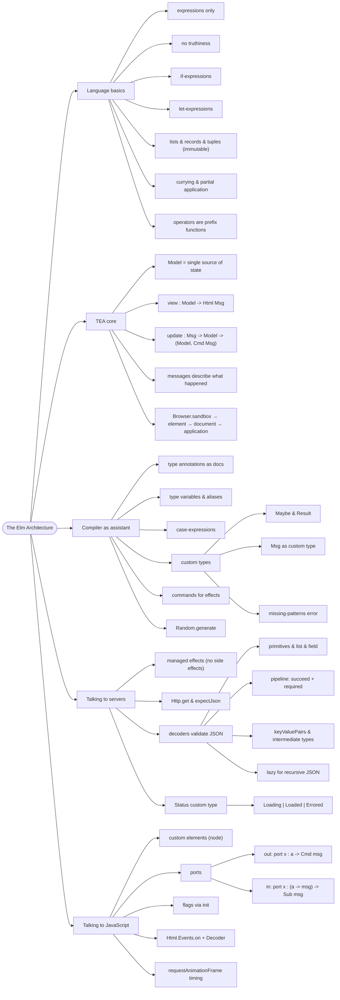

# The Elm Architecture — Model, Update, View, and Talking to the Outside

> Source: *Elm in Action* (Richard Feldman) — ch 1 (Welcome to Elm),
> ch 2 (Your first Elm application), ch 3 (Compiler as assistant),
> ch 4 (Talking to servers), ch 5 (Talking to JavaScript).

Elm compiles to JavaScript and its pitch is **reliability**: no runtime
exceptions, a compiler that catches mistakes before users do, and one
architecture — **The Elm Architecture (TEA)** — for all data flow.



## The language (ch 1)

| Rule | Example |
| --- | --- |
| Everything is an **expression** (evaluates to one value); no statements | `if` requires `else` and yields a value |
| **No truthiness** | conditions are exactly `True` / `False` |
| Immutable collections; **no statements, no `return`** | the body's last expression is the result |
| Arguments by spaces, **no commas** | `pluralize "elf" "elves" 3` — commas mean tuples |
| All functions **curried** | `String.padLeft 9` = partial application |
| Operators are 2-arg functions | `(+) 3 4` — prefix style |
| No methods — modules only | `String.length "storm"`, never `"storm".length` |

- Records: `{ name = "Li", cats = 2 }`; **update copies**:
  `{ catLover | cats = 3 }` — original untouched (this is how model changes
  are expressed).
- Tuples: ≤3 elements, destructure in parameters:
  `multiply3d (x, y, z) = x * y * z`.
- Lists: homogeneous (mixed types = compile error), iterate only;
  `List.map`, `List.filter`.

Adoption: "plant the seed" — rewrite one small part of an existing JS app,
then grow. Learn in `elm repl`: every expression shows its type
(`"Ahoy, World!" : String`).

## TEA: the loop (ch 2)

```
event → Msg → update → new Model → view → virtual-DOM diff → DOM patch
```

Four pieces:

```elm
initialModel = { photos = […], selectedUrl = "1.jpeg" }   -- Model: ALL state, one value

view : Model -> Html Msg                                   -- pure Model → DOM description
view model = div [ class "content" ] [ h1 [] [ text "Photo Groove" ] ]

type Msg = ClickedPhoto String                             -- Msg: "what happened"

update : Msg -> Model -> Model                             -- always returns a Model
update msg model = case msg of ...
```

Wire it: `main = Browser.sandbox { init = initialModel, view = view,
update = update }` — sandbox = pure UI, no effects.

| Task | JavaScript | Elm |
| --- | --- | --- |
| Change the DOM | alter nodes directly | return `Html` from `view` |
| React to input | attach a listener | specify a `Msg` for `update` |
| Change state | mutate in place | return a new model |

## Compiler as assistant (ch 3)

**Annotations are docs the compiler enforces** — comments drift, types
can't. Annotating the `Model` is the best onboarding doc you can write.

- **Type variables** (lowercase) are placeholders: same variable = same
  type. Constrained ones: `number` (Int/Float), `comparable`, `appendable`.
- **Type aliases** name existing types — and record aliases *generate a
  constructor*: `Photo "1.jpeg" == { url = "1.jpeg" }` (argument order =
  field order!).
- **Custom types** define values by listing them:

```elm
type ThumbnailSize = Small | Medium | Large
```

  Comparing a `ThumbnailSize` to anything else = compile error. Variants can
  carry data as functions: `ClickedPhoto : String -> Msg`.

- **Maybe** kills null-checks: `Array.get 2 photos : Maybe Photo` — you
  *can't forget* the `Nothing` case.
- **Msg as a custom type** beats `{description, data}` strings: typos are
  compile errors, each variant carries only its own data.

**The missing-patterns error is a gift**: forget a case in `update`, the
build fails. Avoiding `\_ ->` default branches maximizes this.

### Randomness = a command

Pure functions can't be random, so `update` returns **`( Model, Cmd Msg )`**
— a value *describing* an effect the runtime performs:

```elm
Random.generate GotSelectedIndex randomPhotoPicker
```

Requires `Browser.element` (upgraded from `sandbox`: `init : flags ->
(Model, Cmd Msg)` + `subscriptions`).

## Talking to servers (ch 4)

### Managed effects — the key idea

Elm functions never have side effects. `update` just *describes* effects by
returning `Cmd` values; the runtime performs them. (Call `update` 100 times
→ 100 tuples. This is why Elm is trivially testable:
[testing-practices](../testing-practices/index.md).)

### Model loading states exactly

```elm
type Status
    = Loading
    | Loaded (List Photo) String   -- photos + selectedUrl
    | Errored String
```

Data exists **only where it's valid** — reading `selectedUrl` while
`Loading` is a compile error, not a null check. This is DMMF's "make
illegal states unrepresentable" at runtime
([functional-design-and-types](../functional-design-and-types/index.md)).

### HTTP = a command at init or from update

```elm
initialCmd =
    Http.get
        { url = "http://elm-in-action.com/photos/list.json"
        , expect = Http.expectJson GotPhotos (list photoDecoder) }
```

- `init` and `update` are the only places that can return commands.
- `Http.Error` is a custom type — `BadUrl | Timeout | NetworkError |
  BadStatus Int | BadBody` — handle each mode with a case branch.

### Decoders validate JSON — wrong shape = `Err`, never a crash

```elm
photoDecoder =
    succeed Photo                       -- the generated constructor
        |> required "url" string
        |> required "size" int
        |> optional "title" string "(untitled)"
```

`succeed Photo` starts as `Decoder (String -> Int -> String -> Photo)`;
each `required` peels one argument and one field.

| Combinator | Does |
| --- | --- |
| `list`, `field`, `at ["a","b"]`, `oneOf`, `keyValuePairs` | structure |
| `map2`…`map8` | combine decoders |
| `Decode.lazy (\_ -> list folderDecoder)` | recursive JSON without infinite expansion |
| intermediate types + `Decode.map fromPairs` | JSON shape ≠ model shape |

**Dicts for key lookup**: `Dict k v` — `Dict.get` → `Maybe`. List wins for
iteration/order; dict wins for find-by-key. `Maybe.andThen` flattens nested
lookups (strictly more powerful than `map` — but prefer `map` when enough).

## Talking to JavaScript (ch 5)

Rule of thumb: write as little JS as possible — runtime exceptions will
come from the JS side if anywhere.

### Custom elements (rendering)

```elm
rangeSlider attributes children = node "range-slider" attributes children
-- pass config via properties: Attr.property "val" (Encode.int magnitude)
-- receive events via decoders: at ["detail","userSlidTo"] int |> Json.Decode.map toMsg |> on "slide"
```

### Ports (data) — send via command, receive via message

```elm
port setFilters : FilterOptions -> Cmd msg           -- Elm → JS ("fire and forget")
port activityChanges : (String -> msg) -> Sub msg    -- JS → Elm (a subscription)
```

- The module becomes a `port module`; JS side:
  `app.ports.setFilters.subscribe(fn)` / `app.ports.activityChanges.send(x)`.
- Subscriptions wire into `subscriptions : Model -> Sub Msg` — dynamic per
  model.
- **Timing**: runtime batches view calls to repaint — a `Cmd` may run before
  the new `<canvas>` exists. Fix JS-side: wrap in `requestAnimationFrame`.

### A worked modeling decision: three filters

`Hue`/`Ripple`/`Noise`, each `Int 0–11`. Three `Msg` variants
(`SlidHue`/`SlidRipple`/`SlidNoise`) over one `SlidFilter String Int`:

- a typo'd **variant** = compile error; a typo'd **string** compiles and
  silently fails;
- renames are compiler-guided vs hope-and-tests.

**Ask "which design rules out more bugs?"** — in Elm, weigh that ahead of
conciseness. (Record-typed args = "named arguments", preventing swapped
same-typed params.)

### Flags = init data before first render

```elm
init : Float -> ( Model, Cmd Msg )
main : Program Float Model Msg
-- JS: Elm.PhotoGroove.init({node: …, flags: Pasta.version})
```

Production: prefer `Program Value Model Msg` + a decoder — malformed flags
degrade gracefully instead of throwing.

## Cross-links

- `update` = the state-machine shape DMMF models with types:
  [functional-design-and-types](../functional-design-and-types/index.md),
  [workflows-and-error-handling](../workflows-and-error-handling/index.md).
- The loop as Blazor events / MVVM binding: [blazor-components](../blazor-components/index.md),
  [mvvm-patterns](../mvvm-patterns/index.md).
- Decoders = inbound DTO conversion: [persistence-and-evolution](../persistence-and-evolution/index.md).
- Testing update/view/decoders: [testing-practices](../testing-practices/index.md);
  SPA structure: [elm-in-production](../elm-in-production/index.md).
