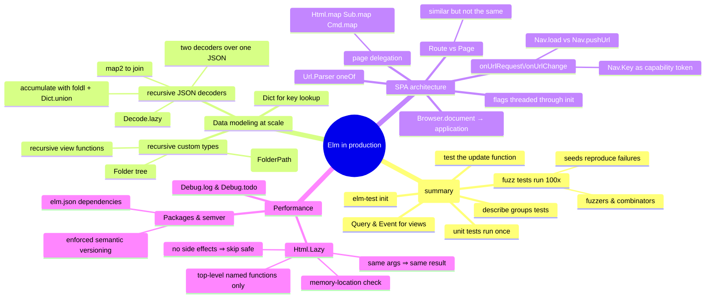

# Elm in Production — Data Modeling at Scale, SPAs, Performance

> Source: *Elm in Action* — ch 6 (Testing), ch 7 (Data modeling),
> ch 8 (Single-page applications), Appendix B (packages), Appendix C
> (`Html.Lazy`'s change check).

This page collects the production-grade concerns: automated tests, large data
models (dictionaries, recursive types, recursive decoders), single-page
application architecture (routing, page delegation), and the performance
toolkit (`Html.Lazy`, packages/semver). Testing has its own deep page —
[testing-practices](../testing-practices/index.md) — and is summarized here
for context.



## Testing in one page (details in [testing-practices](../testing-practices/index.md))

- `elm-test init` creates `tests/`, `Example.elm` (rename it; module name
  must match filename), and installs `elm-explorations/test` as a
  **test dependency** (only importable from `tests/`).
- A **unit test** runs once and performs no effects:
  `test "description" (\_ -> Expect.equal 2 (1 + 1))` — the anonymous
  wrapper delays evaluation so the runner can report progress and parallelize
  (`test : String -> (() -> Expectation) -> Test`).
- A **fuzz test** runs ~100× with generated inputs: `fuzz2 string int "…"
  <| \url size -> …`; fuzzers weight bug-likely values (empty strings, 0,
  extremes). Failures print a `--seed` for exact reproduction;
  `--fuzz 5000` for deeper runs.
- **Why Elm is easy to test**: one `Model` value holds all state; the model
  changes *only* through `update`; `update` is a plain function — call it
  with a crafted `Msg`, inspect the returned `( Model, Cmd Msg )`
  (`Tuple.first` discards the `Cmd`). Generic test functions + `describe`
  produce families of tests
  (`testSlider "SlidHue" SlidHue .hue` — a `Msg`-constructor and a field
  accessor passed as values).
- **View tests** render `view initialModel |> Query.fromHtml`, descend with
  `Query.findAll [ tag "img", attribute (Attr.src …) ]`, assert with
  `Query.count (Expect.equal 0)` / `Expect.all checks`; simulate clicks with
  `Event.simulate Event.click |> Event.expect (ClickedPhoto url)`. Scope
  assertions narrowly (`Result.map .title`) so unrelated model changes don't
  cascade into spurious failures.
- Expose deliberately (`exposing (main, photoDecoder, update, …)`,
  `Msg(..)` for variants) — exposing is required for testability but should
  stay minimal.

## Data modeling at scale (ch 7)

### Dictionaries for key-based lookup

Storing photos: a `List Photo` means linear scans to find the selected one,
and ambiguity on duplicate URLs. A **`Dict String Photo`** (keyed by URL)
gives unique keys and efficient lookup. Decision table:

| Structure | Iteration | Mixed types | Lookup by key |
| --- | --- | --- | --- |
| Record | no | yes | efficient |
| List | yes | no | inefficient |
| Dictionary | yes | no | efficient |

`Dict.get` returns a `Maybe` — the *have/want* technique: list the types you
have (`Maybe String` selection, `Dict String Photo` photos) and the type you
want (`Photo` for the view), then find the few functions that bridge them
(`Maybe.andThen photoByUrl model.selectedPhotoUrl`). Model evolves:
`{ selectedPhotoUrl : Maybe String, photos : Dict String Photo, root : Folder }`.

### Recursive custom types: trees

`type alias Folder = { …, subfolders : List Folder }` **cannot compile** —
alias expansion never terminates. Custom types *can* refer to themselves:

```elm
type Folder =
    Folder
        { name : String
        , photoUrls : List String
        , subfolders : List Folder
        , expanded : Bool
        }
```

This is the standard "upgrade a type alias to a single-variant custom type"
move (same name for type and variant); with `--optimize` the compiler
*unboxes* single-variant types to zero runtime cost. (Under the hood, `List`
itself is `type MyList e = Empty | Prepend e (MyList e)`.)

- **Recursive views**: `viewFolder` calls itself over `subfolders`
  (`List.indexedMap viewSubfolder …`); inline destructuring
  `viewFolder path (Folder folder) =` unwraps the single variant without a
  case-expression. Expanded folders render contents; collapsed ones don't.
- **Recursive messages**: a `FolderPath = End | Subfolder Int FolderPath`
  (itself a recursive custom type) addresses any node. `toggleExpanded :
  FolderPath -> Folder -> Folder` recurses down the path
  (`List.indexedMap transform` targets only the index on the path). The view
  builds each folder's path with a recursive `appendIndex` (prepend-vs-append
  order matters!). The `Msg` carries it: `ClickedFolder FolderPath` — the
  *event data structure mirrors the data structure it acts on*.

### Decoding graphs and trees

The server sends one recursive JSON shape; the model wants (a) a folder tree
and (b) one flat `Dict String Photo` as a single source of truth. Two
decoders over the same JSON:

- `folderDecoder` — recursive via
  `required "subfolders" (Decode.lazy (\_ -> list folderDecoder))`;
  `folderFromJson` post-processes (`Dict.keys photos` for `photoUrls`,
  `expanded = True`). A value defined in terms of itself is a *cyclic
  definition* (the compiler catches it); `Decode.lazy` defers expansion.
- `modelPhotosDecoder` — same traversal, but
  `modelPhotosFromJson folderPhotos subfolderPhotos = List.foldl Dict.union
  folderPhotos subfolderPhotos` **accumulates** every nested photo dict into
  one (fold = reduce; `Dict.union` merges two dicts, later keys winning).
- Join them with `Decode.map2 (\photos root -> { … }) modelPhotosDecoder
  folderDecoder`. Prefer `map`/`map2` over `andThen` when either suffices
  (`andThen` is for when the outcome itself may change, e.g. validation).

## Single-page applications (ch 8)

### From element to document to application

- **`Browser.document`** — `view : Model -> Document Msg` = `{ title :
  String, body : List (Html Msg) }`: the app owns the whole page (title
  included) instead of one div.
- **`Browser.application`** — adds URL powers:
  `init : flags -> Url -> Nav.Key -> (Model, Cmd Msg)`,
  `onUrlRequest`, `onUrlChange`. During migration, `Debug.todo "…"`
  placeholder type-checks everywhere but *throws if run* — and `elm make
  --optimize` (the production flag) **errors** if any `Debug` usage remains.
- Single page = single *page load*: URLs, links, and Back/Forward behave
  like a multipage site, but without full loads.

### Route vs Page — similar but not the same

Storing page state needs the page's *model*; parsing URLs needs a data-free
tag. Cramming both into one type forced `Folders.init ()` calls inside the
URL parser and header links. The fix — recognize when one data structure has
outgrown two use cases and split it:

```elm
type Page                                  type Route
    = GalleryPage Gallery.Model                = Gallery
    | FoldersPage Folders.Model                | Folders
    | NotFound                                 | SelectedPhoto String
```

`Route` feeds `Url.Parser` and header links; `Page` feeds `view`/`update`.
`NotFound` is a *page*, never a route (it's what parsing failure means). The
selected-photo filename lives inside `Folders.Model`, so `Page` needs no
`SelectedPhoto` variant. Splitting also shrank `isActive` into a clean
truth-table case-expression over `(link, page)` tuples.

### Parsing and handling URLs

```elm
parser : Parser (Route -> a) a
parser =
    Parser.oneOf
        [ Parser.map Folders Parser.top
        , Parser.map Gallery (s "gallery")
        , Parser.map SelectedPhoto (s "photos" </> Parser.string)
        ]
```

`oneOf` tries parsers in order (cf. `Json.Decode.oneOf`); `s "gallery"`
matches a literal segment; `</>` composes segments; `Parser.string` captures
a non-empty segment; `Parser.top` matches `/`. Run with `Parser.parse parser
url : Maybe Route`, defaulting to `NotFound` via `Maybe.withDefault`.
Static hosting note: an SPA server must serve `index.html` for every route
(and load scripts as `/app.js` so deep links resolve relative to root).

**The URL loop**:

- `onUrlRequest = ClickedLink` — *overrides all link clicks*. The
  `Browser.UrlRequest` splits **Internal** vs **External**:
  external → `Nav.load href` (full page load, exactly like a multipage app —
  and the hook for "leaving site" confirmations); internal →
  `Nav.pushUrl model.key (Url.toString url)`, which only pushes the browser
  history entry (address bar + Back button work; no reload) and triggers
  `onUrlChange`. New-tab and `download` links are not overridden.
- `onUrlChange = ChangedUrl` — fires for `pushUrl` *and* Back/Forward, so one
  branch (`updateUrl url model`) covers both.
- **`Nav.Key`** is a capability token: only `Browser.application`'s `init`
  provides one, so `Nav.pushUrl` is only callable by apps that own the whole
  page — making the underlying assumption (total control) structurally
  guaranteed. Store it in `Model` once, never change it.
- Page transition logic (init per route, animations, etc.) lives in
  `updateUrl`; it re-runs `Folders.init (Just filename)` etc. When a page's
  init re-fetches, preserve user state explicitly
  (`{ newModel | selectedPhotoUrl = model.selectedPhotoUrl }`).
- Flags (e.g. a JS library version) used by *multiple* init calls must live
  in the top-level `Model` — data stored inside a `Page` variant is
  discarded when the page changes.

### Delegating to pages

Each page module exposes `init`, `view`, `update`, `subscriptions` (no
`main`); `Main` composes them around a shared header/footer:

- **view**: `Folders.view folders |> Html.map GotFoldersMsg` — wraps the
  page's `Msg` inside the app's `Msg` (`Html.map : (a -> b) -> Html a -> Html b`,
  same shape as every other `map`).
- **update**: on `GotFoldersMsg foldersMsg`, check `model.page` is actually
  `FoldersPage` (a response may arrive after the user navigated away — then
  ignore it), delegate `Folders.update foldersMsg folders`, and convert
  `(Folders.Model, Cmd Folders.Msg) → (Model, Cmd Msg)` with a helper that
  does `Cmd.map GotFoldersMsg` and stores the model back into the variant.
- **subscriptions**: delegate per-page with `Sub.map GotGalleryMsg` (and
  `Sub.none` elsewhere).

The wrapper-variant pattern (`GotFoldersMsg : Folders.Msg -> Msg`) is Elm's
module-composition equivalent of nested components.

## Performance and packaging

### `Html.Lazy` — skip unnecessary renders

`view` rebuilds an `Html Msg` description on every relevant change; building
it is cheap but not free (rarely a real cost — except on underpowered
devices with big views or high-frequency events like `mousemove`). `lazy
viewHeader model.page` caches: if the argument is unchanged, the function is
*not called* and the previous `Html` is reused (appendix C: the check is
JS `===` — value equality for strings/numbers, **memory location** for
everything else; e.g. `{ model | … }` creates a new location, so returning
the *unchanged* model from `update` is what lets `lazy` skip).

Why skipping is safe: Elm guarantees (1) same args → same result, (2) no
side effects — so rerunning a function with cached arguments can only
reproduce the cached value. Costs: bookkeeping per `lazy` call — don't
sprinkle it everywhere. Rules that make `lazy` effective:
- pass **named top-level functions** — lambdas and let-bound functions get a
  fresh memory location every call, so `lazy` can never skip them;
- pass the *narrow subset* of the model the function needs (lazy on
  `model.page` skips far more often than lazy on the whole model);
- verify with `Debug.log` inside the view while developing.

### Debug helpers

- `Debug.log "label" value` — logs to console, **returns the value
  unchanged** (`Debug.log : String -> a -> a`), so it threads into any
  expression. The one sanctioned side effect, dev-only.
- `Debug.todo "…"` — type-checks as any type; crashes if executed. Never
  ship it: `elm make --optimize` fails the build if any `Debug` usage
  remains.
- `elm make --debug` adds a time-traveling debugger for msg/model history.

### Packages and semantic versioning

`elm.json` separates **direct** dependencies (importable) from **indirect**
(locked, not importable — promote to direct to use) and **test-dependencies**
(`tests/` only). `elm install pkg` edits elm.json and caches code in `~/.elm`
(installs work offline once cached). Default imports: `Basics`, `List`,
`Maybe`, `Result`, `String`, `Tuple`, `Debug`, `Platform`, `Cmd`, `Sub` —
plus core type constructors like `Just`/`Nothing`.

**Semantic versioning, enforced by the package repository**: major = any
change to a public-facing value's API; minor = added public values; patch =
no API change. A breaking change published as minor/patch is *refused* —
which is why Elm codebases upgrade dependencies fearlessly: the ecosystem
itself guarantees compatibility boundaries.

## Cross-links

- Testing techniques in full: [testing-practices](../testing-practices/index.md).
- TEA fundamentals, decoders, ports: [elm-architecture](../elm-architecture/index.md).
- The `Route`/`Page` split is bounded-context thinking applied inside one
  app: [domain-driven-design](../domain-driven-design/index.md).
- Routing-as-data parallels Blazor's `Router`/`RouteView` and MAUI's
  navigation service: [blazor-components](../blazor-components/index.md),
  [mvvm-patterns](../mvvm-patterns/index.md).
- Recursive decoders accumulating into a single source of truth mirror DMMF's
  aggregate-as-unit-of-transfer: [functional-design-and-types](../functional-design-and-types/index.md).
