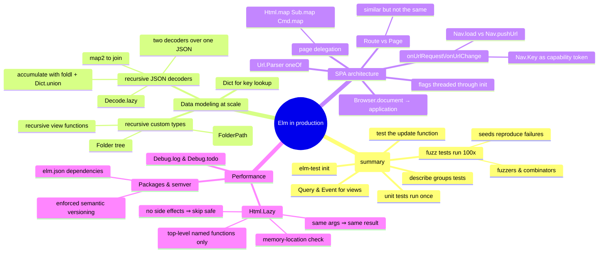

# Elm in Production — Data Modeling at Scale, SPAs, Performance

> Source: *Elm in Action* — ch 6 (Testing), ch 7 (Data modeling),
> ch 8 (Single-page applications), Appendix B (packages), Appendix C
> (`Html.Lazy`'s change check).

Production Elm: data models that scale (dicts, trees, recursive decoders),
SPA architecture (routing, page delegation), and performance (`Html.Lazy`).
Testing lives in [testing-practices](../testing-practices/index.md); a
one-page summary here.



## Testing in one page (full page: [testing-practices](../testing-practices/index.md))

- `elm-test init` → `tests/`, starter module, test dependency.
- **Unit**: runs once, no effects — `test "…" (\_ -> Expect.equal 2 (1+1))`.
- **Fuzz**: ~100 generated runs — `fuzz2 string int "…" <| \url size -> …`;
  failures print a reproducing `--seed`.
- **Why so easy**: one `Model`; changes only via `update`; `update` is a
  plain function — call with a crafted `Msg`, inspect
  `( Model, Cmd Msg )`.
- **Views**: `view model |> Query.fromHtml |> Query.findAll [ tag "img" ] |>
  Query.count (Expect.equal 0)`; clicks via `Event.simulate Event.click |>
  Event.expect (ClickedPhoto url)`.
- Expose deliberately (`Msg(..)`, decoders) — required for tests, keep it
  minimal.

## Data modeling at scale (ch 7)

### Dicts for key lookup

A `List Photo` = linear scans + duplicate-URL ambiguity.
**`Dict String Photo`** (keyed by URL) fixes both:

| Structure | Iterate | Mixed types | Lookup by key |
| --- | --- | --- | --- |
| Record | no | yes | efficient |
| List | yes | no | inefficient |
| **Dictionary** | yes | no | efficient |

**Have/want technique**: list what you have (`Maybe String` selection,
`Dict String Photo` photos) and what you want (`Photo`) — then bridge with
the few functions in between:
`Maybe.andThen photoByUrl model.selectedPhotoUrl`.

Model grows to:
`{ selectedPhotoUrl : Maybe String, photos : Dict String Photo, root : Folder }`.

### Trees: recursive custom types

```elm
type alias Folder = { …, subfolders : List Folder }   -- ✗ cannot compile: infinite expansion

type Folder =                                          -- ✓ works
    Folder
        { name : String
        , photoUrls : List String
        , subfolders : List Folder
        , expanded : Bool
        }
```

- The fix = "upgrade a type alias to a single-variant custom type" (same
  name for type and variant); `--optimize` unboxes it — zero runtime cost.
  (`List` itself is `Empty | Prepend e (MyList e)`.)
- **Recursive views**: `viewFolder` calls itself over `subfolders`;
  `viewFolder path (Folder folder) =` destructures inline — no case
  expression needed.
- **Recursive messages** address any node:
  `FolderPath = End | Subfolder Int FolderPath`. `toggleExpanded :
  FolderPath -> Folder -> Folder` recurses down the path. **The event's data
  structure mirrors the structure it acts on.**

### Decoding trees: two decoders over one JSON

The server sends one recursive shape; the model wants (a) a folder tree and
(b) one flat `Dict String Photo` as a single source of truth.

```elm
folderDecoder =   -- recursive
    succeed folderFromJson
        |> required "name" string
        |> required "subfolders" (Decode.lazy (\_ -> list folderDecoder))
        -- lazy defers expansion; a self-reference without it = cyclic definition

modelPhotosDecoder =   -- accumulates every nested photo dict
    … |> Decode.map (\{photos, subfolderPhotos} ->
           List.foldl Dict.union folderPhotos subfolderPhotos)
```

Join the two outputs with `Decode.map2`. Prefer `map`/`map2` over
`andThen` — use `andThen` only when the outcome itself may change
(validation).

## Single-page applications (ch 8)

### Program types, by ambition

| Program | Adds |
| --- | --- |
| `Browser.sandbox` | pure UI, no effects |
| `Browser.element` | commands + subscriptions |
| `Browser.document` | owns the whole page — `view : Model -> Document Msg` (`{ title, body }`) |
| `Browser.application` | URL powers: `init : flags -> Url -> Nav.Key -> (Model, Cmd Msg)`, `onUrlRequest`, `onUrlChange` |

Migration helper: `Debug.todo "…"` type-checks everywhere, throws if run —
and `elm make --optimize` **fails** the build if any `Debug` remains.

### Route vs Page — split them

One type can't serve both URL parsing (needs a data-free tag) and page
state (needs the model) — `Folders.init ()` calls start leaking into the
parser. Split:

```elm
type Page                 type Route
    = GalleryPage Gallery.Model     = Gallery
    | FoldersPage Folders.Model     | Folders
    | NotFound                      | SelectedPhoto String
```

- `Route` feeds `Url.Parser` + header links; `Page` feeds `view`/`update`.
- `NotFound` is a **page**, never a route (it's what parsing *failure*
  produces).
- Splitting shrank `isActive` into a clean truth table over `(link, page)`.

### Parsing and the URL loop

```elm
parser =
    Parser.oneOf
        [ Parser.map Folders Parser.top
        , Parser.map Gallery (s "gallery")
        , Parser.map SelectedPhoto (s "photos" </> Parser.string) ]
-- Parser.parse parser url : Maybe Route → Maybe.withDefault NotFound
```

- **`onUrlRequest` = ClickedLink** overrides link clicks:
  **External** → `Nav.load href` (full reload — the hook for
  "leaving site?" confirmations); **Internal** →
  `Nav.pushUrl model.key (Url.toString url)` (history entry only, no
  reload, triggers `onUrlChange`). New-tab/download links untouched.
- **`onUrlChange`** fires for `pushUrl` **and** Back/Forward — one branch
  (`updateUrl`) covers both.
- **`Nav.Key`** is a capability token: only `Browser.application`'s `init`
  provides one → `pushUrl` is only callable by apps that own the page.
  Store once, never change.
- `updateUrl` runs page init per route; re-init **preserves user state
  explicitly**: `{ newModel | selectedPhotoUrl = model.selectedPhotoUrl }`.
- Flags used by several page inits live in the **top-level Model** — page
  variants are discarded on navigation.
- Static hosting: serve `index.html` for every route; load scripts as
  `/app.js` (deep links resolve relative to root).

### Delegating to pages

Each page exposes `init`, `view`, `update`, `subscriptions` (no `main`);
`Main` composes them:

```elm
-- view:   Folders.view folders |> Html.map GotFoldersMsg
-- update: GotFoldersMsg foldersMsg →
--           if model.page is still FoldersPage   -- a reply may arrive after
--           then delegate Folders.update …        -- navigating away — ignore it
--           else keep model
-- subs:   per-page with Sub.map GotGalleryMsg (Sub.none elsewhere)
```

The wrapper variant (`GotFoldersMsg : Folders.Msg -> Msg`) is Elm's
nested-components equivalent.

## Performance and packaging

### `Html.Lazy` — skip unchanged renders

```elm
lazy viewHeader model.page
```

If the argument is unchanged, the function **is not called** — the previous
`Html` is reused. (The check is JS `===`: value equality for
strings/numbers, **memory location** for everything else — so returning the
*unchanged* model from `update` is what lets `lazy` skip.)

- Safe because Elm guarantees same-args → same-result and no side effects.
- Costs bookkeeping per call — don't sprinkle.
- Rules that make it effective:
  - pass **named top-level functions** (lambdas get a fresh memory location
    every call — `lazy` can never skip them);
  - pass the **narrow subset** the view needs (`model.page` skips far more
    often than the whole model);
  - verify with `Debug.log` in the view while developing.

### Debug helpers

- `Debug.log "label" value` — logs, **returns the value unchanged** —
  threads into any expression. Dev-only.
- `Debug.todo "…"` — any type; crashes if run; `--optimize` refuses to ship
  it.
- `elm make --debug` — time-traveling debugger for msg/model history.

### Packages & enforced semver

`elm.json`: **direct** (importable) vs **indirect** (locked — promote to
use) vs **test-dependencies** (`tests/` only). `elm install` works offline
once cached. Default imports: `Basics`, `List`, `Maybe`, `Result`,
`String`, `Tuple`, `Debug`, `Platform`, `Cmd`, `Sub` (+ `Just`/`Nothing`).

**The package repository enforces semantic versioning** — a breaking change
published as minor/patch is *refused*. That's why Elm codebases upgrade
dependencies fearlessly: the ecosystem guarantees the boundary.

## Cross-links

- Testing techniques in full: [testing-practices](../testing-practices/index.md).
- TEA fundamentals, decoders, ports: [elm-architecture](../elm-architecture/index.md).
- The Route/Page split = bounded contexts inside one app: [domain-driven-design](../domain-driven-design/index.md).
- Routing-as-data parallels: [blazor-components](../blazor-components/index.md),
  [mvvm-patterns](../mvvm-patterns/index.md).
- Recursive decoders = aggregate-as-unit-of-transfer: [functional-design-and-types](../functional-design-and-types/index.md).
