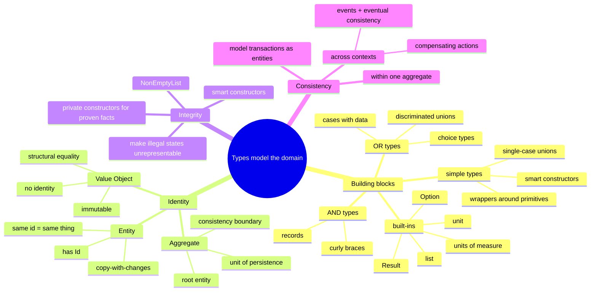

# Functional Design and Types — Modeling the Domain with the Type System

> Source: *Domain Modeling Made Functional* — ch 4 (Understanding Types),
> ch 5 (Domain Modeling with Types), ch 6 (Integrity and Consistency).

A type = a named set of possible values. Build models from **AND** types
(records) and **OR** types (choice types). The same AND/OR shapes the
requirements documents use become the code — design and code never drift.



## Types and functions (ch 4)

### The basics in five lines

- Signature: `int -> int`. Inferred; annotate for docs.
- `let` defines values *and* functions (a function **is** a value).
- Indentation, no braces; last expression = return.
- Equality is `=` (not `==`); generics are `'a`.
- Say **value**, never "variable"/"object" — immutable, no behavior.

### AND type = record (all fields required)

```fsharp
type FruitSalad = {
    Apple: AppleVariety
    Banana: BananaVariety
    Cherries: CherryVariety
}
```

### OR type = choice type (exactly one case)

```fsharp
type FruitSnack =
    | Apple of AppleVariety
    | Banana of BananaVariety
    | Cherries of CherryVariety
```

- Cases are **not subclasses**: `UnitQuantity 10` and `KilogramQuantity 2.5`
  are both `OrderQuantity`.
- Read them with `match … with` — the compiler forces every case.

### Simple type = wrapper around a primitive

```fsharp
type ProductCode = ProductCode of string
```

`CustomerId 42` can't go where `OrderId` is expected — compile error. This
prevents "stringly-typed" bugs for free.

### The built-ins that matter

| Need | Type | Written as |
| --- | --- | --- |
| Maybe missing | `Option<'a> = Some 'a \| None` | `MiddleInitial: string option` |
| Can fail | `Result<'S,'F> = Ok 'S \| Error 'F` | `PayInvoice = UnpaidInvoice -> Payment -> Result<PaidInvoice,PaymentError>` |
| Nothing | `unit` (`()`) | `SaveCustomer = Customer -> unit` |
| Collection | immutable `list` | `OrderLine list`, literals `[1; 2; 3]`, cons `::` |

- F# types are **never null** — required is the default; optionality is
  explicit.
- `unit` in a domain signature = hidden side effects — avoid in the core.

### Sketch a model by composition (~25 lines)

```
wrappers:  CheckNumber of int, CardNumber of string
choices:   CardType = Visa | Mastercard
record:    CreditCardInfo = { CardType; CardNumber }
choice:    PaymentMethod = Cash | Check of CheckNumber | Card of CreditCardInfo
record:    Payment = { Amount; Currency; Method }
```

**Verbs are function types:**

```fsharp
type PayInvoice = UnpaidInvoice -> Payment -> PaidInvoice
```

### Organizing types

- Declaration before use (per file and compile order).
- Layout: shared types → per-context files (`OrderTaking.Types.fs`,
  `OrderTaking.Functions.fs`).
- Simple types top, compound below, in dependency order.
- `rec` modules / `and` allow forward references — sketching only.

## Domain modeling with types (ch 5)

Four patterns cover every domain model:

| Pattern | Example | F# representation |
| --- | --- | --- |
| Simple value | `ProductId` | single-case union wrapper |
| AND combination | `PersonalName`, `Order` | record |
| OR choice | `Unit` vs `Kilogram` quantity | choice type |
| Process | "validate the order" | function type |

### Unknown types? Placeholder now, define later

```fsharp
type Undefined = exn
type CustomerInfo = Undefined
```

The model compiles today. Writing functions that *use* `CustomerInfo`
forces you to replace each `Undefined` — top-down modeling stays possible.

### Value Object vs Entity — a question of identity

| | Value Object | Entity |
| --- | --- | --- |
| Identity | none — contents are everything | an `Id` that persists as fields change |
| Equality | structural (all fields) | by id |
| Example | "Chris has the same *name* as me" | "I'm still me after moving house" |
| Mutation | forbidden — change anything = new value | copy-with-changes: `{initial with Name="Joe"}` |

Identity is **context-dependent**: a phone is an entity in the factory
(serial number), a value object on the shelf (specs only), an entity again
once sold (the customer's phone survives a screen swap).

Updates must return the new entity —
`UpdateName = Person -> Name -> Person`, **never**
`Person -> Name -> unit` (that's hidden mutation).

**Ids on choice types go inside** — each case carries its own id
(`UnpaidInvoice {InvoiceId}` / `PaidInvoice {InvoiceId}`); pattern matching
then has all data in one place.

**Entity equality**: F#'s all-fields default is wrong for entities. Either
`[<CustomEquality; NoComparison>]` (compare by id) or — usually better —
`[<NoEquality; NoComparison>]` to forbid object equality; compare ids
explicitly.

### Aggregates

Immutability ripples: changing one `OrderLine` forces a new `Order`. That
ripple boundary **is** the DDD aggregate — related entities updated as one
unit, through the **root**.

Rules:

- all changes go through the root (it recomputes `AmountToBill`, enforces
  "at least one order line");
- other aggregates are referenced **by id only** — `Order` holds a
  `CustomerId`, never an embedded `Customer`;
- the aggregate is the atomic unit of **persistence, transactions, and
  transfer** (load/save/serialize whole, never parts);
- not every collection is an aggregate — a customer list has no root and no
  consistency role.

### The finished order model

```fsharp
type PlaceOrder =
    UnvalidatedOrder -> Result<PlaceOrderEvents, PlaceOrderError>
```

**Can types replace documentation?** Yes — the F# model ≈ the AND/OR text
doc, but it compiles. **The design *is* the code**, and domain experts can
read (even write) it.

## Integrity and consistency (ch 6)

**Integrity** = data follows the rules. **Consistency** = parts of the model
agree (total = sum of lines; a used voucher is marked used).

### Smart constructors: constraints live in the type

```fsharp
type UnitQuantity = private UnitQuantity of int   // private constructor!

module UnitQuantity =
    let create qty =
        if qty < 1 then Error "UnitQuantity can not be negative"
        elif qty > 1000 then Error "UnitQuantity can not be more than 1000"
        else Ok (UnitQuantity qty)
    let value (UnitQuantity qty) = qty
```

Data is immutable → checked **once at creation**, trusted forever. No
defensive checks downstream. No unit tests for the constraint.

### Units of measure: compiler-checked numbers, zero runtime cost

```fsharp
[<Measure>] type kg
type KilogramQuantity = KilogramQuantity of decimal<kg>
```

`fiveKilos = fiveMeters` → compile error. Also: seconds vs milliseconds, x
vs y coordinates, currency.

### Invariants in types: NonEmptyList

```fsharp
type NonEmptyList<'a> = { First: 'a; Rest: 'a list }
```

"An order has at least one line" → `OrderLines : NonEmptyList<OrderLine>`.
The type *cannot* be empty — a compile-time unit test.

### Make illegal states unrepresentable

❌ Naive — nothing stops marking an unverified address verified:

```fsharp
type Customer = { EmailAddress: EmailAddress; IsVerified: bool }
```

✅ Type-driven — verification is a *different type* with a private
constructor:

```fsharp
type CustomerEmail =
    | Unverified of EmailAddress
    | Verified   of VerifiedEmailAddress

type VerifiedEmailAddress = private VerifiedEmailAddress of EmailAddress
```

Only the verification service can construct `VerifiedEmailAddress`, so rules
land in signatures — the compiler enforces them:

```fsharp
type SendPasswordResetEmail = VerifiedEmailAddress -> …
```

Same technique for "email **or** postal address" — two option fields allow
*neither*, so enumerate the legal cases:

```fsharp
type ContactInfo =
    | EmailOnly of EmailContactInfo
    | AddrOnly  of PostalContactInfo
    | EmailAndAddr of BothContactMethods
```

And for the order workflow: `UnvalidatedAddress` / `ValidatedAddress`
(private, produced only by the validation service). An unvalidated address
inside a `ValidatedOrder` becomes **impossible** — zero tests needed.

### Consistency: expensive — avoid or delay it

| Scope | Guidance |
| --- | --- |
| Within one aggregate | **calculate** derived data (sum lines when needed); if stored (`AmountToBill`), the root updates it, and the aggregate persists atomically |
| Across contexts | no synchronous two-phase commit — *"Starbucks does not use two-phase commit."* Async messages; if lost: do nothing, **reconcile**, or **compensate** (refunds) → **eventual consistency** |
| Between aggregates (one context) | update **one aggregate per transaction**; else events. Exception: the business sees one transaction (money transfer)? Model the transfer itself as an entity: `MoneyTransfer {Id; ToAccount; FromAccount; Amount}` — compute balances from transfers |
| Shared constraints | reuse types (`NonNegativeMoney`) and validation functions — FP validation isn't attached to objects, so it's shareable across workflows |

## Cross-links

- Implementation of the pipeline (bind, map, CEs): [workflows-and-error-handling](../workflows-and-error-handling/index.md).
- Choice types ↔ DTOs and DB columns: [persistence-and-evolution](../persistence-and-evolution/index.md).
- Elm's compiler-as-assistant is the same instinct: [elm-architecture](../elm-architecture/index.md).
- UI-level validation cousins: [blazor-components](../blazor-components/index.md),
  [mvvm-patterns](../mvvm-patterns/index.md).
