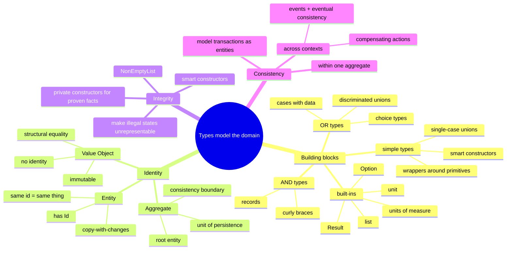

# Functional Design and Types — Modeling the Domain with the Type System

> Source: *Domain Modeling Made Functional* — ch 4 (Understanding Types),
> ch 5 (Domain Modeling with Types), ch 6 (Integrity and Consistency).

Functional programming is "programming as if functions really mattered." A
**type** is simply the name of a *set of possible values* — no behavior
attached. Compound types are built two ways: **AND** (product types —
records) and **OR** (sum types — discriminated unions / "choice types"). This
algebraic type system is the material from which the domain model is carved,
and it maps directly onto the AND/OR documentation from requirements.



## Types and functions (ch 4)

### Type signatures

Functions are described by input → output: `int -> int`. F# infers types;
`let` defines both values and functions (a function *is* a value). Multi-line
functions use indentation, no braces; the last expression is the output.
Generics are written `'a`: `areEqual : 'a -> 'a -> bool`. Equality is `=` (not
`==`).

> Jargon: **values** vs **objects** — a value is just a member of a type,
> immutable, no behavior. An object encapsulates data + methods + mutable
> state. In FP, say "value," never "variable" or "object."

### The two composition rules

**AND types** — records; all fields required:

```fsharp
type FruitSalad = {
    Apple: AppleVariety
    Banana: BananaVariety
    Cherries: CherryVariety
}
```

**OR types** — choice types ("discriminated unions"); exactly one case, tags
distinguish same-typed choices:

```fsharp
type FruitSnack =
    | Apple of AppleVariety
    | Banana of BananaVariety
    | Cherries of CherryVariety
```

Cases are *not* subclasses — `UnitQuantity 10` and `KilogramQuantity 2.5` both
have type `OrderQuantity`. Deconstruction uses pattern matching
(`match … with`), which forces every case to be handled.

**Simple types** — single-case unions wrapping a primitive:
`type ProductCode = ProductCode of string`. These give domain meaning to raw
data and prevent mixing (`CustomerId 42` cannot be passed where `OrderId` is
expected — compiler error).

Construction and deconstruction are symmetric (same curly braces / same case
label on either side of `=`).

### Modeling optional values, errors, collections, and "nothing"

- **Optional** — `Option<'a> = Some 'a | None`; written as a suffix:
  `MiddleInitial: string option`. Records and choice types can never be
  `null` in F#, so "required" is the default and optionality is explicit.
- **Errors** — `Result<'Success,'Failure> = Ok 'Success | Error 'Failure`;
  e.g. `PayInvoice = UnpaidInvoice -> Payment -> Result<PaidInvoice,PaymentError>`
  with `PaymentError` a choice type of specific failure cases. Failures
  become part of the documented signature (details in
  [workflows-and-error-handling](../workflows-and-error-handling/index.md)).
- **No value** — `unit` (`()`); every function returns something, so
  `SaveCustomer = Customer -> unit`. A `unit` in a signature signals hidden
  side effects — avoid in the domain core.
- **Collections** — prefer the immutable `list` (`OrderLine list`);
  literals use semicolons `[1; 2; 3]`, cons is `::`. Others: `array`
  (mutable, indexed), `ResizeArray` (grow/shrink), `seq` (lazy).

### Sketching a model by composition

~25 lines compose a payments model: wrappers (`CheckNumber of int`,
`CardNumber of string`) → choices (`CardType = Visa | Mastercard`) → records
(`CreditCardInfo = { CardType; CardNumber }`) → bigger choices with data
(`PaymentMethod = Cash | Check of CheckNumber | Card of CreditCardInfo`) →
top record (`Payment = { Amount; Currency; Method }`). **Verbs** (processes)
are modeled as function types:
`type PayInvoice = UnpaidInvoice -> Payment -> PaidInvoice`.

### Organizing types

F# requires declaration-before-use within a file and across the compile
order. Standard layout: shared types first, then per-context files
(`Common.Types.fs`, `OrderTaking.Types.fs`, `OrderTaking.Functions.fs`, …);
within a file, simple types at top, compound below in dependency order.
`rec` modules (F# 4.1) or the `and` keyword allow forward references — fine
for sketching, prefer dependency order for production.

## Domain modeling with types (ch 5)

Four recurring patterns in any domain model, each with a type-level
representation:

| Pattern | Example | F# representation |
| --- | --- | --- |
| Simple values | `ProductId`, `ProductCode` | single-case union wrapper |
| AND combinations | `PersonalName`, `Order` | record |
| OR choices | `Unit` or `Kilogram` quantity | choice type |
| Processes | "validate the order" | function type |

### Modeling unknown types

Early in design you know names but not structures. Use an explicit
placeholder: `type Undefined = exn` (an exception type alias), then
`type CustomerInfo = Undefined`. The model compiles; when you write functions
that *use* the types you're forced to replace each `Undefined` with a real
definition. This keeps top-down modeling flow possible.

### Value objects vs entities — a question of identity

- **Value Object** — no persistent identity; interchangeable when contents
  match. "Chris has the same *name* as me" — the names are equal even though
  we aren't. F# gives this **structural equality** by default (records equal
  when all fields equal). Value objects *must* be immutable — change any part
  and it's a different value.
- **Entity** — has an identity that persists as properties change ("I'm still
  me after moving house"). Modeled with an Id field. Identity is
  **context-dependent**: a phone is an entity during manufacture (serial
  number), a value object on the shelf (specs are all that matter), an entity
  again once sold (the customer's phone, even after a screen replacement).
- Entities usually represent documents with a lifecycle: Orders, Invoices,
  Customer profiles.

**Where to put the id on a choice type**: prefer the *inside* approach —
each case is its own record carrying its own id (`UnpaidInvoice {InvoiceId}`,
`PaidInvoice {InvoiceId}`), with a top-level choice between them. Pattern
matching then has all data (including the id) in one place.

**Equality for entities**: F#'s default all-fields equality is wrong for
entities. Options: override `Equals`/`GetHashCode` with
`[<CustomEquality; NoComparison>]` (equality by id), or — often better —
`[<NoEquality; NoComparison>]` to *forbid* object equality entirely and
compare ids explicitly. Multiple key fields can be exposed as a synthetic
`Key` member.

**Immutability + identity**: entity updates are copies-with-changes:
`let updated = {initial with Name="Joe"}` — same id, new value. Because
immutability forces changes through the signature, an update function must
return the new entity: `UpdateName = Person -> Name -> Person` (never
`Person -> Name -> unit`, which implies hidden mutation).

### Aggregates

Changing one `OrderLine` inside an immutable `Order` forces a new `Order` —
immutability creates a **ripple effect** up the containment tree, so updates
must happen at the `Order` level. This is exactly the DDD **aggregate**: a
collection of related entities treated as one unit, with the top-level entity
as the **aggregate root**.

Rules:

- all changes inside an aggregate go through the root; the root is the
  **consistency boundary** (e.g. recompute `AmountToBill` when a line price
  changes — the root is the only component that knows how);
- invariants are enforced at the aggregate (e.g. "at least one order line");
- other aggregates are referenced **by id only** (`Order` holds a
  `CustomerId`, never an embedded `Customer`) — Customer and Order are
  independent aggregates connected by identifiers;
- an aggregate is the **atomic unit of persistence, transactions, and data
  transfer** (load/save/serialize whole aggregates, never parts);
- not every collection of entities is an aggregate — a list of Customers has
  no root and no consistency role.

### Putting it together

The complete order model lives in a namespace-per-context
(`OrderTaking.Domain`): simple types (all value objects), `Undefined` for
unknowns, entity records with ids, the workflow input
(`UnvalidatedOrder` built from primitives "as-is"), a
`PlaceOrderEvents` record of outputs, a `PlaceOrderError` choice type, and
the top-level function:

```fsharp
type PlaceOrder =
    UnvalidatedOrder -> Result<PlaceOrderEvents, PlaceOrderError>
```

**Can types replace documentation?** Yes — the F# model is nearly identical
to the AND/OR text documentation, but it *compiles*. The design can never
drift from the code, because **the design *is* the code**, and domain experts
can read (and even write) it.

## Integrity and consistency (ch 6)

**Integrity** (validity) = data follows the business rules. **Consistency** =
different parts of the model agree about facts (total = sum of lines; a
voucher used is marked used).

### Integrity of simple values: smart constructors

Constraints belong in the type, not in comments. Make the constructor
**private** and expose a **smart constructor** in a same-named module that
validates and returns a `Result`:

```fsharp
type UnitQuantity = private UnitQuantity of int

module UnitQuantity =
    let create qty =
        if qty < 1 then Error "UnitQuantity can not be negative"
        elif qty > 1000 then Error "UnitQuantity can not be more than 1000"
        else Ok (UnitQuantity qty)
    let value (UnitQuantity qty) = qty
```

Because data is immutable, the constraint is checked **once** at creation and
can be trusted forever — no defensive checks downstream, and no unit tests
for the constraint. (A `value` function unwraps, since private constructors
can't be pattern-matched outside the module.) Helper modules reduce
repetition across many constrained types.

**Units of measure** add a second dimension of safety for numbers:
`[<Measure>] type kg` … `KilogramQuantity of decimal<kg>`. The compiler
rejects mixing units (`fiveKilos = fiveMeters` → error), with **zero runtime
cost**. Useful beyond physics: seconds vs milliseconds, x vs y coordinates,
currency.

### Invariants in the type system

An **invariant** is a condition that always holds. Some are directly
encodable: "an order has at least one line" becomes a `NonEmptyList<'a> =
{ First: 'a; Rest: 'a list }` — the type *cannot* be empty. Swap it in:
`OrderLines : NonEmptyList<OrderLine>` and the rule is enforced by
construction ("compile-time unit tests").

### Business rules in types: make illegal states unrepresentable

The verified-email example. Naive: `{EmailAddress; IsVerified: bool}` —
nothing stops a developer from marking an unverified address verified
(security hole), and the "reset flag when email changes" rule is buried in
comments. Type-driven design:

```fsharp
type CustomerEmail =
    | Unverified of EmailAddress
    | Verified   of VerifiedEmailAddress   // a DIFFERENT type

type VerifiedEmailAddress = private VerifiedEmailAddress of EmailAddress
```

Only the verification service can construct a `VerifiedEmailAddress` (private
constructor), so the only way into the `Verified` case is through the
service. Rules then live in signatures:
`SendPasswordResetEmail = VerifiedEmailAddress -> …` — the compiler enforces
"only send password resets to verified addresses."

Same technique for the contact rule "email **or** postal address" — two
options allow *neither*, so enumerate the three legal cases instead:

```fsharp
type ContactInfo =
    | EmailOnly of EmailContactInfo
    | AddrOnly  of PostalContactInfo
    | EmailAndAddr of BothContactMethods
```

Applied to the order workflow: distinct `UnvalidatedAddress` /
`ValidatedAddress` (private constructor, produced only by the validation
service returning `ValidatedAddress option`), and `ValidatedOrder` requiring
a `ValidatedAddress`. It becomes *impossible* to have an unvalidated address
inside a validated order — guaranteed without a single test.

### Consistency

Consistency is a **business** term, context-dependent, and expensive —
avoid or delay it when possible.

- **Within one aggregate**: prefer *calculating* derived data (sum the lines
  when needed) over storing it. If stored (e.g. `AmountToBill`), the root
  updates it on every change, and the aggregate is persisted atomically.
- **Across contexts** (order placed ⇒ invoice created): don't do
  synchronous two-phase coordination ("Starbucks does not use two-phase
  commit" — real businesses work asynchronously with messages). If a message
  is lost, choose: (1) do nothing (errors rare + costs small), (2)
  **reconciliation** (compare + fix), (3) **compensating actions** (undo/correct,
  e.g. refunds). The system becomes consistent after some time — **eventual
  consistency**, which is *not* "optional consistency."
- **Between aggregates in one context**: guideline "only update one aggregate
  per transaction"; use events + eventual consistency otherwise. Exception:
  when the business sees one transaction (money transfer), consider that the
  transaction itself is an entity — model `MoneyTransfer {Id; ToAccount;
  FromAccount; Amount}` and compute account balances from transfers. This
  both fixes the design *and* teaches you something about the domain.
- **Multiple aggregates acting on the same data**: share constraints via
  types (`NonNegativeMoney`) or shared validation functions — FP validation
  isn't attached to objects, so it's reusable across workflows.

## Cross-links

- How the modeled pipeline gets *implemented* (bind, map, computation
  expressions): [workflows-and-error-handling](../workflows-and-error-handling/index.md).
- Choice types ↔ DTOs and DB columns (tag + nullable fields; one-table vs
  per-case tables): [persistence-and-evolution](../persistence-and-evolution/index.md).
- The same "explicit state, exhaustive handling" instinct drives Elm's
  compiler-as-assistant: [elm-architecture](../elm-architecture/index.md).
- Validation rules in UI form (data annotations) are the runtime cousin of
  smart constructors: [blazor-components](../blazor-components/index.md),
  [mvvm-patterns](../mvvm-patterns/index.md).
