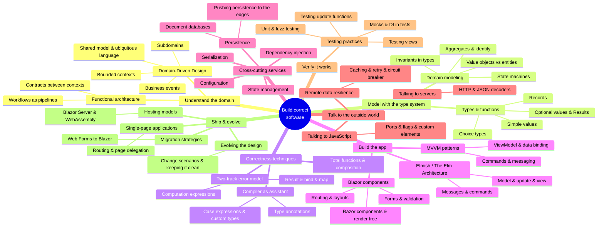

# Architecture Crash Course

A distilled guide to four books on building correct software, organized by
**knowledge topic** (not by book), in reading order from first principles to
production practice. The sources live in the repository under `knowledge/md/`.
Every page cross-references the other books where the same concept appears —
the course is meant to be read as one connected body of knowledge.

## How to use this guide

- **Beginner path**: read top to bottom. Each part assumes only the parts
  before it.
- **Reference path**: each topic folder is self-contained; use the cross-links
  at the end of each page to jump to related knowledge wherever it lives.
- Every claim is distilled from the source books; the source chapter is noted
  so you can go deeper.

## The four source books

| Source | Short name | What it contributes |
| --- | --- | --- |
| *Domain Modeling Made Functional* (Scott Wlaschin) — [Pragmatic Bookshelf](https://pragprog.com/titles/swdddf/domain-modeling-made-functional/) | **DMMF** | DDD + functional design: types, pipelines, errors, persistence |
| *Elm in Action* (Richard Feldman) — [Manning](https://www.manning.com/books/elm-in-action) | **EIA** | The Elm Architecture, compiler-driven correctness, testing, SPA structure |
| *Blazor for ASP.NET Web Forms Developers* (Microsoft) — [free online](https://learn.microsoft.com/en-us/aspnet/core/blazor/migration/web-forms) | **Blazor** | Component model, app services, hosting, migration from Web Forms |
| *Enterprise Application Patterns Using .NET MAUI* (Microsoft) — [free online](https://learn.microsoft.com/en-us/dotnet/architecture/maui/) | **MAUI** | MVVM, DI, messaging, navigation, validation, remote data resilience |

## Reading order (beginner → end)

### Part I — Understand the problem first

1. **[domain-driven-design](domain-driven-design/index.md)** — shared models,
   business events, subdomains, bounded contexts, ubiquitous language.
   *(DMMF ch 1–3, echoed by MAUI's eShop architecture and Blazor's intro.)*

### Part II — Model the domain with types

2. **[functional-design-and-types](functional-design-and-types/index.md)** —
   types and functions as the modeling material; simple values, choice types,
   records; value objects, entities, aggregates; state machines; integrity and
   invariants. *(DMMF ch 4–6; Elm's compiler-as-assistant perspective in
   [elm-architecture](elm-architecture/index.md).)*
3. **[workflows-and-error-handling](workflows-and-error-handling/index.md)** —
   modeling workflows as pipelines; the two-track model; `Result`, `bind`,
   `map`, computation expressions; total functions and composition.
   *(DMMF ch 7–10; Elm messages/commands in
   [elm-architecture](elm-architecture/index.md); the same pipeline shape
   appears in Blazor data access.)*

### Part III — Build the application

4. **[elm-architecture](elm-architecture/index.md)** — The Elm Architecture
   (model/update/view), messages, commands, the compiler as assistant, talking
   to servers and JavaScript. *(EIA ch 1–5; direct counterpart of
   [blazor-components](blazor-components/index.md) component events and
   [mvvm-patterns](mvvm-patterns/index.md) MVVM flow.)*
5. **[blazor-components](blazor-components/index.md)** — Razor components,
   render trees, parameters, lifecycle, routing, layouts, forms and validation.
   *(Blazor ch 4–9; compare with elm-architecture and mvvm-patterns.)*
6. **[mvvm-patterns](mvvm-patterns/index.md)** — Model-View-ViewModel,
   data binding, commands, behaviors, loosely-coupled messaging, navigation.
   *(MAUI ch 3, 5–6; the ViewModel ↔ Update analogy with Elm and Blazor.)*

### Part IV — Cross-cutting application services

7. **[blazor-app-services](blazor-app-services/index.md)** — app startup,
   dependency injection, configuration, state management, hosting models.
   *(Blazor ch 3, 5, 8, 12; MAUI ch 4; Elm flags in
   [elm-architecture](elm-architecture/index.md).)*
8. **[remote-data-and-security](remote-data-and-security/index.md)** — working
   with data, HTTP access, caching, retry/circuit-breaker resilience,
   authentication and authorization (Identity, IdentityServer), microservices.
   *(Blazor ch 10, 13; MAUI ch 9–11; Elm ch 4 decoders.)*

### Part V — Verify and maintain correctness

9. **[testing-practices](testing-practices/index.md)** — unit and fuzz testing,
   testing update functions and views, DI-friendly testable designs, testing
   INotifyPropertyChanged and message flow. *(EIA ch 6; MAUI ch 13; DMMF ch 9
   testing dependencies.)*

### Part VI — Ship, persist, and evolve

10. **[persistence-and-evolution](persistence-and-evolution/index.md)** —
    serialization (DTOs at the edge), persistence (document/relational,
    command-query separation), and evolving the design through real change
    requests. *(DMMF ch 11–13; Blazor data access overlap.)*
11. **[elm-in-production](elm-in-production/index.md)** — data modeling at
    scale (dictionaries, recursive types, decoding graphs), single-page app
    structure, performance with `Html.Lazy`. *(EIA ch 7–8 + appendices.)*
12. **[web-forms-migration](web-forms-migration/index.md)** — migrating from
    ASP.NET Web Forms: middleware, modules and handlers, project structure,
    data access migration, and the migration decision checklist.
    *(Blazor ch 1–2, 11, 14.)*

## Concept cross-reference (where topics recur across books)

| Concept | DMMF | Elm | Blazor | MAUI |
| --- | --- | --- | --- | --- |
| Separation of concerns / bounded contexts | ch 1, 3 | ch 8 (page modules) | ch 2 (architecture) | ch 2 (app architecture) |
| Model the state explicitly | ch 5, 7 | ch 2 (model), ch 7 (data modeling) | ch 8 (state mgmt) | ch 3 (ViewModel) |
| Explicit error handling | ch 6, 10 | ch 3 (Result in decoder), ch 4 (RemoteData) | ch 9 (validation), ch 10 | ch 7 (validation) |
| Unidirectional flow (events → update → view) | ch 7 (pipeline) | ch 2 (TEA) | ch 6 (component events) | ch 3 (binding), ch 5 (messenger) |
| Dependency injection / ports | ch 9 (injecting deps) | ch 4 (commands), ch 5 (ports) | ch 5 (DI), ch 12 (config) | ch 4 (DI), ch 13 (tests) |
| Serialization at the edge | ch 11 (DTOs) | ch 4 (decoders), ch 7 | ch 10 (HTTP/JSON) | ch 10 (REST) |
| Persistence pushed to the edge | ch 12 | — | ch 10 (EF Core) | ch 9 (microservices own data) |
| Testing as a design pressure | ch 9 | ch 6 (fuzz) | — | ch 13 (unit tests) |
| Incremental/progressive rendering | ch 7 (async workflows) | ch 4 (loading states) | ch 3 (hosting models) | — |
| Navigation as data | ch 7 (state machines) | ch 8 (routing) | ch 7 (routing) | ch 6 (navigation service) |
| Validation rules | ch 6 (invariants) | ch 3 (types as guarantees) | ch 9 (EditForm) | ch 7 (validation rules) |
| Loose coupling via messages | ch 3 (contracts) | ch 2 (messages) | ch 6 (EventCallback) | ch 5 (messenger) |

## About this course

- Distilled from four books: *Domain Modeling Made Functional*,
  *Elm in Action*, *Blazor for ASP.NET Web Forms Developers*, and
  *Enterprise Application Patterns Using .NET MAUI*. The source chapter is
  noted on every page so you can go deeper.
- Each topic page ends with **Cross-links** to related knowledge wherever it
  lives in the course.
- The full-text search index over the source books (`knowledge/distill/_index/`
  in the repository) is repo-local tooling and is not published with the site.
