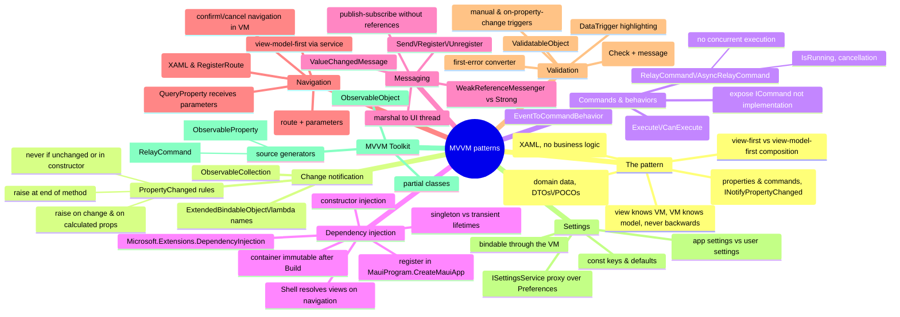

# MVVM Patterns — ViewModel, Binding, Commands, Messaging, Navigation

> Source: *Enterprise Application Patterns Using .NET MAUI* (Microsoft) —
> ch 2 (Introduction to .NET MAUI), ch 3 (MVVM), ch 4 (Dependency injection),
> ch 5 (Communicating between loosely coupled components), ch 6 (Navigation),
> ch 7 (Validation), ch 8 (Application settings), ch 12 (MVVM Toolkit).

MVVM = View knows ViewModel knows Model — **never backwards**. The ViewModel
adapts the model for the view, making both testable and replaceable.



## The pattern (ch 3)

| Component | Responsibility |
| --- | --- |
| **View** | XAML only; code-behind only for UI tricks (animations). `ContentPage`/`ContentView` |
| **ViewModel** | Properties + commands the view binds to; converts model data view-friendly; raises `INotifyPropertyChanged` |
| **Model** | Domain data + business + validation logic; DTOs/POCOs; services/repositories do data access |

Payoffs: VM = an **adapter** over a risky-to-change model; VM + model are
unit-testable **without a view**; UI redesign never touches logic.

Hard rules:

- VMs **never reference view types** (`Button`, `ListView`) — or they can't
  be tested in isolation;
- enable/disable UI via **bindings to VM state**, never code-behind;
- async I/O in view models — keep the UI responsive.

### Composition: view-first vs view-model-first

- **View-first** (eShop's choice): the view creates its VM. Follows the app
  by visual structure. XAML:
  `<ContentPage.BindingContext><local:LoginViewModel /></ContentPage.BindingContext>`
  or code-behind `BindingContext = new LoginViewModel(navigationService);`
- **View-model-first**: a service locates views; VMs can create VMs — but
  complex and harder to trace.

### Change notification rules (INotifyPropertyChanged)

- raise **on every public property change** (+ calculated properties that
  depend on them);
- raise **at the end** of the mutating method — mid-method = handlers see a
  half-updated object;
- **never** raise when the value didn't change (compare first);
- **never** raise in a constructor (no subscribers yet);
- raise **once per property per sync method** — even if a loop changed the
  field 50 times.

`ObservableCollection<T>` = list change notification.
`RaisePropertyChanged(() => IsLogin)` = compile-time-safe property names.

### Commands and behaviors

Actions live in the VM as `ICommand` — never code-behind.

- Expose the **interface**, not `RelayCommand` — implementations stay
  swappable.
- `ChangeCanExecute()` re-evaluates enablement on bound controls.
- **`EventToCommandBehavior`** maps *any* event to a command:
  `TextChanged` → `ValidateCommand`; extracts `WebView.Navigating` URLs.
  Event-handling becomes testable VM code, on controls that were never
  command-aware.

Frameworks: **.NET Community MVVM Toolkit** (below), ReactiveUI, Prism.

## Dependency injection (ch 4)

Declare dependencies as **interfaces**; the container constructs and
injects — the class never knows who built them. Wins: remap implementations
without touching consumers, mock in tests.

```csharp
public static MauiApp CreateMauiApp() =>
    MauiApp.CreateBuilder()
        .UseMauiApp<App>()
        .RegisterAppServices()   // AddSingleton<ISettingsService, SettingsService>()
        .RegisterViewModels()
        .RegisterViews()
        .Build();
```

⚠️ `Build()` **freezes** the container — register everything before it.

| Registration | Behavior | Use for |
| --- | --- | --- |
| `AddSingleton<T>` | one instance for app lifetime | root `CatalogViewModel`, `INavigationService` |
| `AddTransient<T>` | fresh instance per resolution | situational/heavy VMs (`CheckoutViewModel`) |

- Unregistered type → exception. Better than manual `GetService<T>()`: let
  **Shell** construct during navigation —
  `Routing.RegisterRoute("Filter", typeof(FiltersView))` injects
  constructor dependencies automatically.

## Messaging between loosely coupled components (ch 5)

.NET events couple lifetimes via object references — a short-lived
subscriber attached to a long-lived publisher **leaks**. The Toolkit's
`IMessenger` decouples: publish without knowing receivers, subscribe
without knowing publishers.

```csharp
// message = typed contract
public class AddProductMessage : ValueChangedMessage<int> { … }

// publish (fire-and-forget; no subscribers is fine)
WeakReferenceMessenger.Default.Send(new AddProductMessage(BadgeCount));

// subscribe — use the recipient parameter, not this (avoid capturing)
WeakReferenceMessenger.Default.Register<CatalogViewModel, AddProductMessage>(
    this, (r, m) => r.BadgeCount = m.Value);
```

- **Weak** messenger (eShop's choice): easy cleanup.
  **Strong**: faster, but unsubscribe explicitly.
- Messages arrive on the **publishing thread** — marshal to UI with
  `MainThread.BeginInvokeOnMainThread` or the app crashes.
- Treat payloads as immutable (concurrent readers).
- Other coupling tools: binding+property change (view↔VM), navigation
  parameters (VM↔VM).

## Navigation (ch 6)

MVVM navigation = a **navigation service** invoked from view models,
navigating by **route** (VMs stay view-free):

```csharp
public interface INavigationService
{
    Task InitializeAsync();
    Task NavigateToAsync(string route, IDictionary<string, object> routeParameters = null);
    Task PopAsync();
}
// → Shell.Current.GoToAsync(route[, parameters])
```

- Routes: XAML `<ShellContent Route="Catalog" …/>` or
  `Routing.RegisterRoute("Filter", typeof(FiltersView))`.
- Launch: `AppShell.OnParentSet` → `InitializeAsync()` → `//Login` or
  `//Main/Catalog` based on a cached token.
- **Parameters**: `NavigateToAsync("OrderDetail", new() { ["OrderNumber"] =
  order.OrderNumber })`; destination receives via
  `[QueryProperty(nameof(OrderNumber), "OrderNumber")]`.
- **Confirm/cancel** (dirty form) = view-model logic: ask, then decide.

## Validation (ch 7)

A composable rules engine — rules attached to data, errors as data:

```csharp
UserName.Validations.Add(new IsNotNullOrEmptyRule<string> {
    ValidationMessage = "A username is required." });
```

- `ValidatableObject<T>`: `Value` + `IValidationRule<T>` list + `Errors` +
  `IsValid` — all change-notifying. `Validate()` runs every rule's
  `Check(Value)`.
- **Triggers**: manually (submit command) and/or per keystroke
  (`EventToCommandBehavior` on `TextChanged` → `ValidateUserNameCommand`).
  Dependent properties need revalidation when the dependency changes.
- **Display**: `DataTrigger` on `IsValid` (red background); error text =
  `Label` bound to `Errors` through `FirstValidationErrorConverter`.

This is the runtime cousin of type-level validation
([functional-design-and-types](../functional-design-and-types/index.md)).

## Application settings (ch 8)

Two kinds: **app settings** (fixed endpoints, API keys) and **user
settings** (customizations). Never call the platform API directly — proxy it:

```csharp
public string AuthAccessToken
{
    get => Preferences.Get(AccessToken, AccessTokenDefault);  // const key + default
    set => Preferences.Set(AccessToken, value);
}
```

- `ISettingsService` implemented over `Microsoft.Maui.Storage.Preferences`
  (small data only — use a DB/filesystem for more).
- Register via DI; views bind to VM properties that read/write it →
  editable at runtime, mockable in tests.

## MVVM Toolkit (ch 12)

Hand-written `INotifyPropertyChanged` is long and error-prone. The Toolkit
reduces VMs to intent:

```csharp
public partial class SettingsViewModel : ObservableObject
{
    [ObservableProperty]
    private string _name;            // generates Name + change notification

    [RelayCommand]
    private Task SettingsAsync() …   // generates SettingsCommand
}
```

- `ObservableObject.SetProperty(ref _field, value)` = change-check + notify
  built in; `SetPropertyAndNotifyOnCompletion` notifies when a `Task`
  property completes.
- `AsyncRelayCommand` adds bindable `IsRunning`, `Cancel`, and **no
  concurrent execution by default** (double-tap can't re-trigger; bound
  controls auto-disable).
- Classes must be `partial` (source generators).

## Cross-links

- DI and testability deep-dive: [testing-practices](../testing-practices/index.md).
- Commands ↔ Blazor `EventCallback` ↔ TEA messages: [blazor-components](../blazor-components/index.md),
  [elm-architecture](../elm-architecture/index.md).
- eShop backend = DDD bounded contexts deployed: [domain-driven-design](../domain-driven-design/index.md),
  [remote-data-and-security](../remote-data-and-security/index.md).
- Settings/HttpClient wiring: [blazor-app-services](../blazor-app-services/index.md),
  [remote-data-and-security](../remote-data-and-security/index.md).
