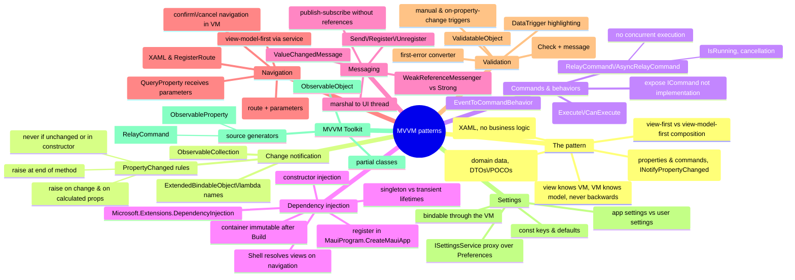

# MVVM Patterns — ViewModel, Binding, Commands, Messaging, Navigation

> Source: *Enterprise Application Patterns Using .NET MAUI* (Microsoft) —
> ch 2 (Introduction to .NET MAUI), ch 3 (MVVM), ch 4 (Dependency injection),
> ch 5 (Communicating between loosely coupled components), ch 6 (Navigation),
> ch 7 (Validation), ch 8 (Application settings), ch 12 (MVVM Toolkit).

Enterprise apps face changing requirements, new business opportunities, and
ongoing feedback that reshapes scope. The remedy is an architecture of
**discrete, loosely coupled components** that can be developed, tested, and
extended independently — with a clean separation between the UI and business
logic. That separation has a name: **MVVM**.



## The MVVM pattern (ch 3)

Three components with one-directional knowledge: the **view** knows about the
view model; the view model knows about the model; the model is unaware of the
view model, and the view model is unaware of the view. The view model isolates
the view from the model so the model can evolve independently.

| Component | Responsibility |
| --- | --- |
| **View** | Structure, layout, appearance. Ideally all XAML; code-behind only for UI logic hard to express in XAML (e.g. animations). Typically `ContentPage`/`ContentView`, or a data template bound to a view-model type. |
| **ViewModel** | Properties and commands the view binds to; coordinates the view's interactions with models; performs view-friendly data conversion; raises change notifications (`INotifyPropertyChanged`). |
| **Model** | Non-visual classes encapsulating the app's data — the domain model, data + business + validation logic. DTOs, POCOs, generated entities. Used with services/repositories that encapsulate data access and caching. |

Benefits: the view model acts as an **adapter** over a risky-to-change model;
view models and models are unit-testable *without the view*; the UI can be
redesigned without touching logic; designers and developers work concurrently.

Key discipline: **keep views and view models independent** — the binding
should be the view's principal dependency on the view model; view models must
never reference view types (`Button`, `ListView`), or they can't be tested in
isolation. Also: enable/disable UI via *bindings to view-model state*, never
in code-behind; and keep the UI responsive — async I/O in view models.

### Composition: view-first vs view-model-first

- **View-first** (eShop's choice): views connect to the view models they need
  — easy to follow the app by its visual structure, aligns with MAUI
  navigation (which constructs pages), and keeps view models view-agnostic.
  Connect by XAML: `<ContentPage.BindingContext><local:LoginViewModel /></
  ContentPage.BindingContext>` (simple, needs a parameterless constructor) or
  in code-behind: `BindingContext = new LoginViewModel(navigationService);`
  (simple, but the view must supply dependencies — a DI container helps).
- **View-model-first**: view models are composed and a service locates views;
  feels natural to some, allows VMs to create VMs, but is complex and harder
  to trace.

### Change notification rules

Every model/view-model class a view binds must implement
`INotifyPropertyChanged` correctly:

- raise `PropertyChanged` **always** when a public property changes (and for
  calculated properties used by other properties);
- raise **at the end** of the mutating method — raising mid-operation invokes
  handlers synchronously on a partially updated object;
- **never** raise when the value didn't change (compare old/new first);
- **never** raise during a constructor (no subscribers yet);
- raise **once per property per synchronous method** even if the backing
  field changed 50 times in a loop (per synchronous segment of async chains).

`ObservableCollection<T>` provides collection-change notification for lists.
`ExtendedBindableObject.RaisePropertyChanged(() => IsLogin)` uses a lambda
for compile-time-safe property names (small per-call cost, refactoring-safe).

### Commands and behaviors

Actions belong in the **view model** via `ICommand` (`Execute`, `CanExecute`,
`CanExecuteChanged`) — not code-behind. Expose commands publicly as
`ICommand` (not `Command<T>`/`RelayCommand` implementations) so
implementations can be swapped. Bindable controls invoke commands directly
(`<TapGestureRecognizer Command="{Binding RegisterCommand}" …/>`, with
optional `CommandParameter`); `ChangeCanExecute()` re-evaluates enablement.

**Behaviors** add functionality to controls without subclassing: derive from
`Behavior<T>` with `OnAttachedTo`/`OnDetachingFrom`. The
**`EventToCommandBehavior`** maps *any* event to a command (reflectively
registering the handler by `EventName`, optionally converting event args via
`EventArgsConverter`) — e.g. run `ValidateCommand` on an `Entry`'s
`TextChanged`, or extract the URL from a `WebView`'s `Navigating` event. This
moves event-handling code into testable view models and works on controls
that were never command-aware.

### MVVM frameworks

The pattern is verbose by hand; frameworks standardize it. The eShop app uses
the **.NET Community MVVM Toolkit** (see below); alternatives: ReactiveUI,
Prism.

## Dependency injection (ch 4)

Constructor injection with a **container** (a specialized Inversion of
Control): dependencies are declared as **interface types**, and a container
instantiates concrete implementations and injects them — the class never
knows who built its dependencies. Container advantages: classes don't locate
dependencies or manage lifetimes; implementations can be remapped without
touching consumers; dependencies can be **mocked** in tests; new classes slot
in easily. (Caveat: containers aren't always appropriate — trivial classes
with no dependencies, or fixed integral dependencies, may not belong in one.)

In .NET MAUI: `MauiProgram.CreateMauiApp` builds a `MauiAppBuilder` whose
`Services` (`IServiceCollection`) holds registrations; `Build()` creates the
app and **freezes** the container (register everything before calling it).
Organize registrations into extension methods:

```csharp
public static MauiApp CreateMauiApp() =>
    MauiApp.CreateBuilder()
        .UseMauiApp<App>()
        .RegisterAppServices()   // AddSingleton<ISettingsService, SettingsService>()
        .RegisterViewModels()
        .RegisterViews()
        .Build();
```

**Lifetimes**:

| Registration | Behavior | When to use |
| --- | --- | --- |
| `AddSingleton<T>` | one instance for the app's lifetime | always-needed components (root `CatalogViewModel`, services like `INavigationService`) |
| `AddTransient<T>` | new instance per resolution, no reference kept | situational/heavy/jit-data view models (`CheckoutViewModel`, `OrderDetailViewModel`) |
| `AddSingleton<TService, TImplementation>` | interface → implementation mapping | services behind interfaces |

**Resolution**: unregistered → exception; singleton → shared instance
(created on first request); transient → fresh instance. Resolve directly via
`this.Handler.MauiContext.Services.GetService<T>()` (guard against a null
`Handler`) — or better, let **Shell** do it: `Routing.RegisterRoute("Filter",
typeof(FiltersView))` makes Shell construct the view during navigation and
inject constructor dependencies (e.g. `CatalogViewModel`) automatically. The
container is the natural factory for view models.

## Communicating between loosely coupled components (ch 5)

.NET events implement publish-subscribe, but publisher and subscriber
lifetimes are **coupled by object references** — a short-lived subscriber
attached to a long-lived publisher is kept alive (a memory-management trap).
The **MVVM Toolkit `IMessenger`** decouples them: publishers send messages
without knowing receivers; subscribers listen without knowing publishers —
components can be developed and tested independently.

- Two implementations: **`WeakReferenceMessenger`** (weak references; easy
  cleanup — eShop's choice) and **`StrongReferenceMessenger`** (better
  performance, explicit lifetime — unsubscribe explicitly; good for
  page-scoped `OnAppearing`/`OnDisappearing` workflows). Access via
  `*.Default`.
- **Messages are typed**: `public class AddProductMessage :
  ValueChangedMessage<int>` — the payload type is the *contract*, giving
  compile-time safety and refactoring support on both ends. A token
  parameter can disambiguate same-type messages for different subscribers.
- **Publish** (fire-and-forget — no subscribers is fine):
  `WeakReferenceMessenger.Default.Send(new AddProductMessage(BadgeCount));`
  Messages arrive on the publishing thread — **marshal to the UI thread**
  for UI updates (`MainThread.BeginInvokeOnMainThread` /
  `Dispatcher.DispatchAsync`), or the app can crash.
- **Subscribe**: `Register<T>(recipient, (recipient, message) => …)` — use
  the `recipient` parameter, not `this`, to avoid capturing; treat payloads
  as immutable (multiple threads may read concurrently).
- **Unregister** when done (mandatory with the strong messenger; optional but
  tidy with weak).

Note: messaging isn't the only loose-coupling tool — binding + property
change handles view↔view-model; navigation parameters handle
view-model↔view-model.

## Navigation (ch 6)

Navigation in MVVM raises hard questions: which view to navigate to without
tight coupling; who instantiates view + view model and binds them;
view-first or view-model-first; where navigation logic lives (view vs
testable view model); how to pass parameters; how to enforce business rules
(confirm/cancel before leaving a dirty form).

**Answer: a navigation service invoked from view models** — but view models
must not reference view types. So `MauiNavigationService` navigates by
**route**, wrapping Shell navigation:

```csharp
public interface INavigationService
{
    Task InitializeAsync();
    Task NavigateToAsync(string route, IDictionary<string, object> routeParameters = null);
    Task PopAsync();
}
// NavigateToAsync → Shell.Current.GoToAsync(route[, parameters])
```

Registered as a singleton; stored on `ViewModelBase` so every view model has
`NavigationService`. Routes are registered in XAML
(`<ShellContent Route="Catalog" ContentTemplate="{DataTemplate
views:CatalogView}" />`) or code-behind
(`Routing.RegisterRoute("Filter", typeof(FiltersView))`). Launch navigation:
`AppShell.OnParentSet` calls `InitializeAsync()`, which routes to
`//Login` or `//Main/Catalog` depending on a cached access token.

**Parameters**: pass an `IDictionary<string, object>`
(`NavigateToAsync("OrderDetail", new() { ["OrderNumber"] = order.OrderNumber })`);
the destination view model receives them via
`[QueryProperty(nameof(OrderNumber), "OrderNumber")]`. Navigation can also be
triggered from views through `EventToCommandBehavior` (e.g. a WebView's
`Navigating` event → `NavigateCommand` → on success
`NavigateToAsync("//Main/Catalog")`). **Confirm/cancel** navigation is view
model logic: ask the user, then decide whether to navigate.

## Validation (ch 7)

Unvalidated input causes failures and enables injection. In MVVM, the view
model (or model) validates and *signals* errors to the view. The eShop
pattern is a **composable rules engine**:

- `ValidatableObject<T>` wraps a `Value`, a list of `IValidationRule<T>`,
  an `Errors` collection, and `IsValid` (all change-notifying via
  `ObservableObject`). `Validate()` runs every rule's `Check(Value)`,
  collects each failed rule's `ValidationMessage` into `Errors`, sets
  `IsValid`, and returns it.
- Rules implement `IValidationRule<T> { string ValidationMessage; bool
  Check(T value); }` — e.g. `IsNotNullOrEmptyRule<T>`, an `EmailRule<T>`
  built on a `Regex`. Rules are added per-property in the view model
  (`UserName.Validations.Add(new IsNotNullOrEmptyRule<string> {
  ValidationMessage = "A username is required." });`).
- **Triggering**: manually (a command calls `Validate()` on submit — login
  button), and/or automatically as properties change (`EventToCommandBehavior`
  on `TextChanged` → `ValidateUserNameCommand`, validating on every
  keystroke). Dependent properties (A valid only for some values of B) need
  revalidation when B changes.
- **Displaying**: a `DataTrigger` binds to `UserName.IsValid`, and when
  `False` applies a `Setter` (red background); the trigger reverts the
  property when the condition clears. Error text: a `Label` bound to
  `UserName.Errors` through a `FirstValidationErrorConverter` (showing the
  first of possibly many errors).

This is the runtime, UI-bound sibling of type-level validation
([functional-design-and-types](../functional-design-and-types/index.md)): the
same instinct — rules attached to data, errors as data — executed at the
boundary.

## Application settings (ch 8)

Two kinds: **app settings** (the app's own fixed endpoints, API keys,
runtime state) and **user settings** (customizations that affect behavior and
rarely change). Don't call the platform preferences API directly — that
couples the app to the implementation and blocks testing. Define an
**`ISettingsService`** proxy and implement it over
`Microsoft.Maui.Storage.Preferences` (type-safe, cross-platform, native
backing; meant for *small* data — use a database/filesystem for more):

```csharp
public string AuthAccessToken
{
    get => Preferences.Get(AccessToken, AccessTokenDefault);   // const key + default
    set => Preferences.Set(AccessToken, value);
}
```

Each setting = a `const string` key + a constant default + a public property.
Inject the service via DI; bind views to view-model properties that read and
write it (e.g. `SettingsView`'s `Entry` ↔ `SettingsViewModel.IdentityEndpoint`
↔ `UpdateIdentityEndpoint()` persisting to `Preferences`) so settings are
editable at runtime and mockable in tests. This is the client-side analogue
of configuration sources in ASP.NET Core
([blazor-app-services](../blazor-app-services/index.md)).

## MVVM Toolkit (ch 12)

The boilerplate problem: a view model implementing
`INotifyPropertyChanged` by hand is long and error-prone. The
**`CommunityToolkit.Mvvm`** package standardizes it, runtime-independent:

- **`ObservableObject`** — base class implementing
  `INotifyPropertyChanged`/`INotifyPropertyChanging` with `SetProperty(ref
  _field, value)` (change-check + notify built in),
  `SetPropertyAndNotifyOnCompletion` (notify when a `Task`-returning property
  completes), and explicit `OnPropertyChanged`/`OnPropertyChanging`.
- **`RelayCommand` / `AsyncRelayCommand`** — command implementations decoupled
  from MAUI (portable view models). `AsyncRelayCommand` adds what async
  workflows need: an `IsRunning` property bindable to spinners/enablement,
  `Cancel` support, **no concurrent execution by default** (a double-tap
  can't re-trigger a costly operation; it auto-raises `CanExecuteChanged`
  during execution so bound controls disable — override with a custom
  `canExecute` or `AsyncRelayCommandOptions.AllowConcurrentExecutions`).
- **Source generators** — mark the class `partial`, then:
  - `[ObservableProperty] private string _name;` generates a full `Name`
    property with change checks, `OnNameChanging`/`OnNameChanged` hooks, and
    notifications;
  - `[RelayCommand] private Task SettingsAsync() …` generates
    `SettingsCommand` (async → `AsyncRelayCommand`, void → `RelayCommand`),
    including the lazy `??=` backing field — all `ICommand` wiring removed.

The result: view models reduced to their *intent* — fields, methods, and the
declarative attributes that wire them to the UI.

## Cross-links

- DI and testability deep-dive: [testing-practices](../testing-practices/index.md).
- Commands and event→state→view flow parallel Blazor's `EventCallback` and
  TEA's messages: [blazor-components](../blazor-components/index.md),
  [elm-architecture](../elm-architecture/index.md).
- The eShop backend (microservices per context, event bus for eventual
  consistency) is DDD bounded contexts deployed: [domain-driven-design](../domain-driven-design/index.md),
  [remote-data-and-security](../remote-data-and-security/index.md).
- Settings/configuration and HttpClient usage:
  [blazor-app-services](../blazor-app-services/index.md),
  [remote-data-and-security](../remote-data-and-security/index.md).
