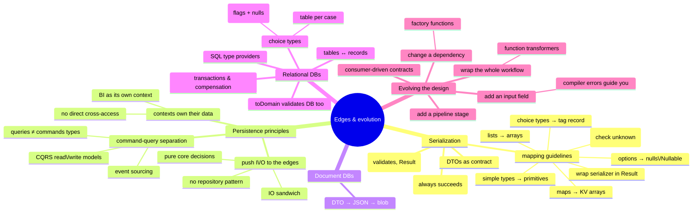

# Persistence and Evolution — Serialization, Databases, and Changing the Design

> Source: *Domain Modeling Made Functional* — ch 11 (Serialization), ch 12
> (Persistence), ch 13 (Evolving a Design and Keeping It Clean).

The domain stays persistence-ignorant; **edges** translate to/from the
outside world (DTOs, DBs), and type-driven design absorbs change without
mud. Three sections: serialize at the boundary, persist at the edges,
evolve cleanly.



## Serialization (ch 11)

### Two hard rules

1. **JSON → DTO almost always succeeds** — fail only on corrupt data.
   *Domain* validation happens in DTO→domain conversion, inside the context.
2. Event/command DTOs are a **contract** between contexts. Own the format —
   never let a library decide it. Expect multiple DTO versions over time.

### The pattern: `fromDomain` / `toDomain`

Both live in the `Dto` module — **the domain knows nothing about DTOs**:

```fsharp
module Dto =
    module Person =
        let fromDomain (person:Domain.Person) : Dto.Person = …        // infallible
        let toDomain (dto:Dto.Person) : Result<Domain.Person, string> = …
```

- `fromDomain` unwraps with `value` functions — always succeeds.
- `toDomain` runs smart constructors in a `result { }` — every constraint
  failure is caught at the boundary.

**Pipeline wiring** — deserialize first, serialize last:

```
json |> deserialiseInputDto |> inputDtoToDomain |> workflow
     |> outputDtoFromDomain |> serialiseOutputDto
```

Wrap third-party serializers in your own `Json` module returning `Result`;
combine failures into `DtoError = ValidationError of string |
DeserializationException of exn`. Attributes (`[<DataContract>]`,
`[<CLIMutable>]`) stay on the DTO.

### Mapping table: domain type → DTO

| Domain type | DTO representation |
| --- | --- |
| Simple type (single-case union) | the primitive (`ProductCode of string` → `string`) |
| Option | `null` (reference) / `Nullable<int>` (value) |
| Record | record, each field converted |
| `list` / `seq` / `Set` | arrays |
| `Map<K,V>` | JSON object, or `[{Key; Value}]` pairs |
| Union-as-enum | .NET enum — **must handle unknown values** on read |
| Tuple | a dedicated record (tuples aren't serializable) |
| Choice type | record with `Tag` string + one nullable field per case |

Choice-type DTO read: match the tag → **null-check the case data** →
recursively convert → error on unknown tags. (Alternative: schemaless
`IDictionary<string,obj>` — max decoupling, zero contract.)

## Persistence (ch 12)

### Principle 1 — push I/O to the edges (IO sandwich)

```
load (edge) → pure decision (core) → pattern-match decision → save (edge)
```

- The pure core takes all data as parameters and **returns a decision** as
  a choice type (`InvoicePaymentResult = FullyPaid | PartiallyPaid …`) —
  it never touches the DB.
- Queries needed mid-flow? Alternate I/O and pure segments ("layer cake");
  too deep → split into mini-workflows (sagas).
- **No Repository pattern** — it hides persistence behind a mutable OO API.
  Instead: one small explicit I/O function per need.

### Principle 2 — CQS → CQRS

"**Asking a question should not change the answer.**"

```fsharp
type DbResult<'a> = AsyncResult<'a, DbError>
type InsertData = Data -> DbResult<Unit>   // command: changes state, no data back
type ReadData   = Query -> DbResult<Data>  // query: returns data, no side effects
```

- **Don't reuse one type for reads and writes** — query results
  (denormalized, generated ids) differ from write inputs; queries multiply
  faster and must evolve independently → separate **read model** / **write
  model** = CQRS.
- Two physical stores (write-optimized + denormalized read stores), or
  logically just tables vs views. Physical separation = a copy process =
  **eventually consistent**.
- **Event sourcing**: persist every state change as an event (`InvoicePaid`)
  and replay to rebuild state — version control for data; fits audited
  domains ("accountants don't use erasers").

### Principle 3 — contexts own their data

- A context owns its store and schema — changes need no coordination.
- **Nobody reads another context's data directly** — use its API or a copy.
- Isolation: physical (separate DBs) or logical (namespaces).
- **Reporting/BI is its own context**: subscribe to events (pure) or ETL
  copies (easier, schema-coupled).

### Document DBs: trivial

DTO → `Json.serialize` → store API (e.g. blob `UploadText`); reverse to
load. Done.

### Relational DBs: two mapping problems

**Choice types → tables** (e.g. `ContactInfo = Email of … | Phone of …`):

| Strategy | Shape | When |
| --- | --- | --- |
| **All cases in one table** (default) | case flags + nullable columns per case | compact, easy to index |
| **Table per case** | main table (id + flags) + child tables (shared PK, `NOT NULL` data) | large, dissimilar case data |

**Reading — the DB is an untrusted source:**

- SQL **type provider** (`FSharp.Data.SqlClient`): queries type-checked at
  compile time, results come back as records.
- `toDomain` validates every column through smart constructors in a
  `result { }` (`Result.ofOption` for nulls, `bindOption` for options).
- `readOneCustomer`: none → `Error (MissingRecord …)`; one → `toDomain`
  (+ `mapError InvalidRecord`); **multiple → panic** (`DatabaseError`).
  Genericize with `convertSingleDbRecord tableName idValue records toDomain`.
- Fully trust the DB? `panicOnError` swaps `Result`s for exceptions — a
  documented trade-off.

**Writing**: unwrap the domain object's primitives (choice → flags + data)
into generated table types or hand-written `INSERT`s.

**Why not an ORM?** EF/NHibernate can't validate an email or a quantity or
handle nested choice types — the mechanical toDomain/fromDomain work buys an
always-trusted domain.

### Transactions

- **One aggregate = one transaction** when possible.
- Multiple atomic writes: the store's transaction API, or one combined call.
- **No cross-service transactions** — assume success; **reconciliation**
  detects drift; **compensating transactions** undo (`unmarkAsFullyPaid`).

## Evolving the design (ch 13)

Requirements changed? **Re-evaluate the model first** — don't patch the
implementation. Four worked changes:

| Change | Technique | Key lesson |
| --- | --- | --- |
| **1. Shipping charges** | add a stage: `AddShippingInfoToOrder = PricedOrder -> PricedOrderWithShippingInfo` | don't modify working code — **add a stage**. New type = wrong stage-order becomes a compile error. Tame branching rules with **active patterns**: `let (|UsLocalState|UsRemoteState|International|) address = …` |
| **2. VIP customers** | store rule **inputs**, not outputs (no "free shipping" flag): `VipStatus = Normal \| Vip` in `CustomerInfo` | add the field → compiler errors walk you through every ripple (unvalidated type, DTO, validation code) |
| **3. Promotion codes** | dependency becomes a factory: `GetPricingFunction = PricingMethod -> GetProductPrice` (`Standard \| Promotion of PromotionCode`) | "show the discount" = a new order-line case (`Product \| Comment`) — possible because `ValidatedOrderLine` ≠ `PricedOrderLine`. Event changed = **contract broken** → fix with **consumer-driven contracts**: emit minimal `ShippableOrderPlaced` (products, quantities, address — not prices). Print a rendered blob; don't make downstream interpret |
| **4. Business hours** | **function transformer**: `businessHoursOnly getHour onError onSuccess` wraps any same-shaped function | zero changes inside the workflow — swap the wrapped function at the composition root; `getHour` as a parameter keeps it testable |

More, same instincts: "VIP postage USA-only" → edit one segment; "split
into shipments" → new segment, output becomes a list; "customer order-status
page" → new **Customer Service context** subscribing to events.

**Smell detector**: accumulating pricing schemes (promotions, vouchers,
loyalty) = pricing should become its own bounded context.

**Why the design survives**: model edits → compiler errors that guide you;
new behavior → new isolated segment; function types → whole-function
transformation without breaking plugs.

## Cross-links

- DTOs = the trust-boundary gates from ch 3: [domain-driven-design](../domain-driven-design/index.md).
- Smart constructors & Result machinery: [functional-design-and-types](../functional-design-and-types/index.md),
  [workflows-and-error-handling](../workflows-and-error-handling/index.md).
- EF Core + circuit-state persistence echoes: [blazor-app-services](../blazor-app-services/index.md),
  [remote-data-and-security](../remote-data-and-security/index.md).
- Microservice data ownership: [remote-data-and-security](../remote-data-and-security/index.md).
