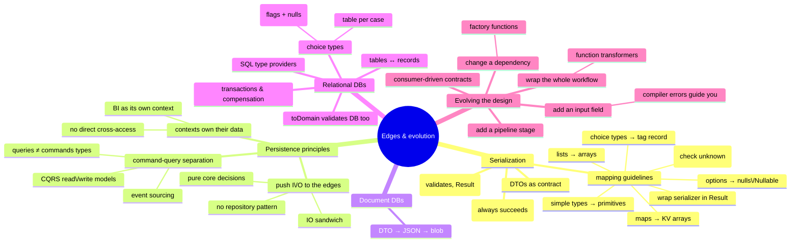

# Persistence and Evolution — Serialization, Databases, and Changing the Design

> Source: *Domain Modeling Made Functional* — ch 11 (Serialization), ch 12
> (Persistence), ch 13 (Evolving a Design and Keeping It Clean).

**Persistence** = state that outlives the process that created it.
**Serialization** = converting between domain-specific representations and
easily-persisted formats (JSON, XML, binary). The domain model is designed
persistence-ignorant; this page covers how to connect it to the messy outside
world — and then how to evolve the whole design when requirements change
without creating a big ball of mud.



## Serialization (ch 11)

### DTOs are the contract

Infrastructure (queues, HTTP, databases) doesn't understand your domain. The
trick: convert domain objects to **DTOs** designed for serialization, and
serialize *those*. Two hard rules:

- **Deserialization into a DTO should almost always succeed** — only fail on
  corrupt data. *Domain* validation (bounds, formats) happens in the
  DTO→domain conversion, inside the bounded context where error handling is
  under control.
- DTOs of events/commands are a **contract** between contexts. Own the format
  explicitly — never let a library auto-magically decide it. Expect to
  support multiple DTO versions over time (see Greg Young's *Versioning in an
  Event Sourced System*).

### The pattern: `fromDomain` / `toDomain`

Both live with the DTO (in a `Dto` module) because **the domain must know
nothing about DTOs**:

```fsharp
module Dto =
    type Person = { First: string; Last: string; Birthdate: DateTime }

    module Person =
        let fromDomain (person:Domain.Person) : Dto.Person = …        // infallible
        let toDomain (dto:Dto.Person) : Result<Domain.Person, string> = …
```

`fromDomain` unwraps simple types with their `value` functions — it can
always succeed. `toDomain` runs the smart constructors (`String50.create`,
`Birthdate.create`) inside a `result { }` expression, so every constraint
failure is caught at the boundary.

**Wire the serializer into the pipeline**: deserialization at the front,
serialization at the end —
`jsonString |> deserialiseInputDto |> inputDtoToDomain |> workflow |>
outputDtoFromDomain |> serialiseOutputDto`. Wrap third-party serializers
(e.g. Newtonsoft) in your own `Json` module whose `deserialize` returns a
`Result` (catching exceptions); combine both failure sources with a common
`DtoError = ValidationError of string | DeserializationException of exn`
choice type. Serializer-specific attributes (`[<DataContract>]`,
`[<CLIMutable>]`) stay on the DTO — the domain stays clean. F#-only
serializers (FsPickler, Chiron) exist but couple contexts to one language.

### Mapping guidelines (domain type → DTO)

| Domain type | DTO representation |
| --- | --- |
| Simple type (single-case union) | the underlying primitive (`ProductCode of string` → `string`) |
| Option | `null` for reference types; `Nullable<int>` for value types |
| Record | record with each field converted |
| `list`/`seq`/`Set` | arrays (universally supported) |
| `Map<K,V>` | JSON object; or array of `{Key; Value}` pair records; or parallel `Keys`/`Values` arrays |
| Union used as enum | .NET enum (ints) — **must handle unrecognized values** on deserialization; or serialize case names as strings (rename-sensitive) |
| Tuple | a dedicated record (tuples aren't serializable) |
| Choice type | record with a `Tag` string + one nullable field per case; other fields null/empty |
| Generics | generic DTOs if the serializer supports them (nullable-constrained), else per-case DTOs |

For the choice-type DTO: serialization sets the tag and the matching field
(use `Nullable()` for value types, `Unchecked.defaultof<_>` only to fabricate
nulls for interop); deserialization matches on the tag, **always null-checks
the case data**, recursively converts nested DTOs (mapping `Result`s with
`Result.map`), and errors on unknown tags. An alternative "schemaless"
approach serializes everything as `IDictionary<string,obj>` — maximum
decoupling, zero contract (a `getValue` helper returns `Result`s for
missing keys and failed casts) — sometimes a little coupling is useful.

## Persistence (ch 12)

### Principle 1: push persistence to the edges

Separate every workflow into a **domain-centric pure part** and an **I/O edge
part**. The pure function takes all data as parameters and *returns a
decision* as a choice type (`InvoicePaymentResult = FullyPaid |
PartiallyPaid …`) instead of touching the DB; the edge "command handler"
loads, calls the pure core, then pattern-matches the decision to do I/O. This
is the **IO sandwich**: I/O at the edges, pure center. When queries must
inform decisions mid-flow, alternate I/O and pure segments ("layer cake") —
if it gets too deep, split into mini-workflows (sagas).

**Where's the Repository pattern?** Gone — it exists to hide persistence
behind an object-oriented mutable API. With functions + edges you define one
small explicit I/O function per need instead of a fat interface with tens of
unused methods.

### Principle 2: command-query separation (CQS → CQRS)

Model storage as an immutable object: each interaction is a function from
`(state, request) → new state`. CRUD decomposes into two kinds:

- **commands** (insert/update/delete) change state, return nothing useful
  (`… -> Unit`);
- **queries** (read) return data, change nothing.

"**Asking a question should not change the answer**." In FP terms:
data-returning functions have no side effects; side-effecting functions are
unit-returning. Practical signatures hide the `DbConnection` via partial
application and add effects:

```fsharp
type DbResult<'a> = AsyncResult<'a, DbError>
type InsertData = Data -> DbResult<Unit>
type ReadData   = Query -> DbResult<Data>
```

**Don't reuse one type for reads and writes** — query results (denormalized,
generated ids, bundled entities) differ from write inputs; queries multiply
faster than commands and should evolve independently. Separate **read model**
and **write model** types (and modules) → **CQRS**. Taken to storage: two
stores (one write-optimized, one denormalized/indexed for reads) — or
logically just tables vs views in one relational DB. Physically separate
stores need a copy process and are **eventually consistent**; the payoff is
many purpose-built read stores (including cross-context aggregations for
reporting/analytics).

**Event sourcing**: persist every state change as an event (`InvoicePaid`)
rather than the current object — replay events to rebuild state, like
version control; matches audited domains ("accountants don't use erasers").

### Principle 3: bounded contexts own their data

- A context owns its store and schema; can change them without coordination.
- **No other system reads its data directly** — use its public API or a copy.
  Shared data couples systems even when code doesn't.
- Isolation can be physical (separate DBs) or logical (namespaces in one DB).
- **Reporting/BI is its own context**: subscribe to events (the "pure" way)
  or run ETL copies (easier, but schema-coupled). Inside BI, formal domain
  modeling matters less than a multidimensional cube; operational metrics get
  their own "Operational Intelligence" context similarly.

### Document databases

Trivial with the serialization chapter: DTO → `Json.serialize` → store via
the store's API (e.g. Azure blob `UploadText`), and the reverse to load.

### Relational databases

Good news: tables ≈ record collections; SQL set operations ≈ list operations
(map/filter). Bad news: only primitives are storable, and choice types don't
map naturally.

**Choice types → tables** (borrowed from OO-hierarchy mapping), e.g. for
`ContactInfo = Email of EmailAddress | Phone of PhoneNumber`:

1. **All cases in one table** — case flags (`IsEmail bit`, `IsPhone bit`) +
   nullable columns per case. Compact, easy to index. *Default choice.*
2. **Table per case** — main table holds id + flags; child tables (shared
   primary key) hold each case's `NOT NULL` data. Better constraints; use
   when case data is large and dissimilar.

**Reading**: prefer raw SQL via an F# **SQL type provider** (e.g.
`FSharp.Data.SqlClient`) — queries are type-checked **at compile time**
against a compile-time connection, and results come back as record types.
The DB is an **untrusted source**: write a `toDomain` that validates every
column through smart constructors inside a `result { }` (helpers:
`Result.ofOption` for nulls, `bindOption` to push a switch function through
an option). Then a `readOneCustomer`-style function handles the three cases
explicitly — none found → `Error (MissingRecord …)`; one found →
`toDomain` (+ `mapError InvalidRecord`); multiple found → **panic** (raise
`DatabaseError`). Parameterize the case-handling into a generic
`convertSingleDbRecord tableName idValue records toDomain`.

If you trust the DB completely, `panicOnError` converts failed smart
constructors to exceptions and `toDomain` returns a plain record — a
deliberate, documented trade-off either way.

**Writing**: either generated mutable table types (`SqlProgrammabilityProvider`,
set row fields, `Update`) or hand-written `INSERT` commands — both start by
unwrapping the domain object's primitives (choice → flags + data).

**Why not an ORM (Entity Framework, NHibernate)?** They can't validate email
addresses or order quantities or handle nested choice types — the mechanical
toDomain/fromDomain work is the price of an always-trusted domain.

### Transactions

Aim for **one aggregate = one transaction**. When multiple writes must be
atomic: use the store's transaction API (`BeginTransaction` … `Commit`), or
combine operations into a single call for stores that only transact per
connection. Across services there is *no* cross-service transaction — assume
success, then **reconciliation** detects drift and **compensating
transactions** undo (`unmarkAsFullyPaid` when the second call fails).

## Evolving a design, keeping it clean (ch 13)

When requirements change, **re-evaluate the domain model first** — don't just
patch the implementation. Four worked changes show the technique.

### Change 1 — adding shipping charges (new pipeline stage)

Don't modify working pricing code — **add a stage**:
`AddShippingInfoToOrder = PricedOrder -> PricedOrderWithShippingInfo`,
slotted between pricing and acknowledgment. Two sub-lessons:

- Tame the branching business rule with **active patterns** — turn condition
  soup into named, matchable categories (separating *categorization* from
  *pricing logic*; changes to categories touch only the pattern):
  `let (|UsLocalState|UsRemoteState|International|) address = …`.
- Create the new `PricedOrderWithShippingMethod` type instead of stuffing
  `ShippingInfo` into `PricedOrder` — it makes wrong stage-ordering a compile
  error and avoids "what's the default before shipping is calculated?" bugs.
  (Choosing header-field vs new-order-line storage is a real trade-off; they
  chose the header so order total = sum of lines.)

Adding/removing **isolated, type-conforming stages** is the general
extension mechanism: logging/metrics/auditing stages, authorization gates,
even dynamically assembled pipelines in the composition root.

### Change 2 — VIP customers (new input)

Store the **input** to business rules, not their outputs (no "free shipping"
flag — rules will change). Model the status *dimension* as its own choice
type in `CustomerInfo` (`VipStatus = Normal | Vip`), composable with other
orthogonal statuses (`LoyaltyCardStatus`). Then follow the compiler: adding
the field to `CustomerInfo` errors until `UnvalidatedCustomerInfo` and the
DTO gain it (as a plain nullable string), and the validation code creates it
— the errors *guide* the full ripple.

### Change 3 — promotion codes (changed dependency, contract evolution)

The pricing dependency becomes a **factory**:
`GetPricingFunction = PricingMethod -> GetProductPrice` with
`PricingMethod = Standard | Promotion of PromotionCode` (a self-documenting
option). Implementation: look up a price table per promotion (falling back to
standard prices), returning the right `GetProductPrice`. "Show the discount"
becomes a new kind of order line — `PricedOrderLine = Product of … |
Comment of CommentLine` — a choice-type change that proves why
`ValidatedOrderLine` and `PricedOrderLine` were kept separate types.

Consequences cascade: the shipping context must know about comment lines →
the `OrderPlaced` event changed → **contract broken**. Fix with
**consumer-driven contracts**: ask what shipping *really* needs (products,
quantities, address — not prices/discounts) and emit a minimal
`ShippableOrderPlaced`. Printing? Ship a rendered PDF/HTML blob — the
downstream prints, doesn't interpret. Also a smell detector: accumulating
pricing schemes (promotions, vouchers, loyalty) signals **pricing should
become its own bounded context** (distinct vocabulary, dedicated team,
own data, autonomy).

### Change 4 — business hours (wrap the whole workflow)

New global constraint "orders only during business hours" is implemented with
a **function transformer**: `businessHoursOnly getHour onError onSuccess`
wraps any same-shaped function, adding an `OutsideBusinessHours` case to the
error choice and swapping the wrapped function in at the composition root —
zero changes to the workflow itself. (Injecting `getHour` as a parameter
keeps it testable.)

### More changes, same instincts

- "VIP free postage only inside USA" → edit one small segment.
- "Split orders into shipments" → new segment; output becomes a *list* of
  shipments.
- "Customer order-status page" → knowledge is scattered across contexts, so
  create a new **Customer Service context** subscribing to the others'
  events.

**Why the design survives change**: type-driven modeling turns every model
edit into compiler errors that walk you to every affected site; composition
means new behavior is a new isolated segment; function-types-as-interfaces
allow whole-function transformation without breaking plugs.

## Cross-links

- DTOs are the concrete face of the trust-boundary gates from ch 3:
  [domain-driven-design](../domain-driven-design/index.md).
- The smart constructors and Result machinery used everywhere here:
  [functional-design-and-types](../functional-design-and-types/index.md),
  [workflows-and-error-handling](../workflows-and-error-handling/index.md).
- EF Core data access in Blazor and circuit-state "persist to backing store"
  advice echo the same principles: [blazor-app-services](../blazor-app-services/index.md),
  [remote-data-and-security](../remote-data-and-security/index.md).
- CQRS/event-sourcing and microservice data ownership pair with MAUI's
  containerized microservices chapter: [remote-data-and-security](../remote-data-and-security/index.md).
