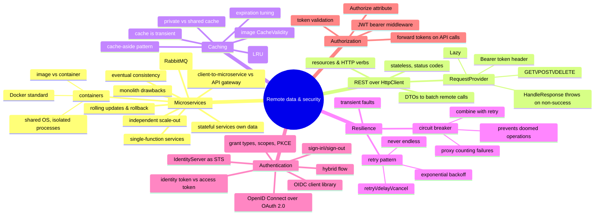

# Remote Data and Security — APIs, Caching, Resilience, Auth

> Source: *Enterprise Application Patterns Using .NET MAUI* — ch 9
> (Containerized microservices), ch 10 (Accessing remote data), ch 11
> (Authentication and authorization). Cross-referenced with the data-access
> and security chapters of *Blazor for ASP.NET Web Forms Developers*.

Client ↔ backend over HTTP, without knowing backend internals: the backend
shape (microservices), the client calls (`HttpClient`), speed (caching),
reliability (retry, circuit breaker), and security (IdentityServer bearer
tokens).



## Containerized microservices (ch 9)

### Monolith vs microservice

| Monolith | Microservice |
| --- | --- |
| one change → retest + redeploy everything | each service deploys alone |
| scale = clone the whole app | scale **only the hot service** |
| one technology stack | free choice per service |

eShop splits into four: identity, catalog (EF Core/SQL), ordering
(domain-driven), basket (Redis) — **each with its own database**.

Costs to accept:

- partitioning is hard — each service is autonomous end-to-end, *including
  its data*;
- **no atomic transactions across services** — the business embraces
  eventual consistency;
- operation overhead; direct client→service coupling breaks clients on
  refactor (an **API gateway** fixes that at ~10+ services).

### Containers in one breath

Image = app + deps + config, versioned. Container = running instance.
Unlike VMs, containers **share the host OS** — far cheaper. Standard =
Docker (host, OS image, registry e.g. Docker Hub).

### Communication: REST for queries, events for updates

- Client→service: direct HTTP to public endpoints (one port each).
- Service→service: **HTTP REST for queries**, **async messaging for
  updates**.
- The **event bus** = pub/sub behind an interface (RabbitMQ in eShop; also
  Azure Service Bus, NServiceBus, MassTransit).

Example: user-profile receives `UpdateUser` → updates DB → publishes
`UserUpdated` → basket + ordering update their buyer data. A distributed,
*eventually consistent* "transaction" in steps — DMMF's bounded-context
coordination in practice ([persistence-and-evolution](../persistence-and-evolution/index.md)).

## Accessing remote data (ch 10)

### REST in four lines

- **Resources** have URIs; verbs name the operation (GET/POST/PUT/DELETE);
  body carries data.
- **Stateless** — requests independent, order-free; standard status codes
  (200, 404).
- `Accept` / `Content-Type` negotiate formats.
- **Batch data into fewer calls** — the core client performance lever.

### HttpClient, wrapped once

```csharp
public async Task<TResult> GetAsync<TResult>(string uri, string token = "")
{
    HttpClient httpClient = GetOrCreateHttpClient(token);
    HttpResponseMessage response = await httpClient.GetAsync(uri);
    await HandleResponse(response);                      // throws on non-success
    return await response.Content.ReadFromJsonAsync<TResult>();
}
```

- **Cache and reuse `HttpClient`** (here `Lazy<T>`) — one per request =
  socket exhaustion.
- Token → `Authorization: Bearer <token>` header, or use the
  `IHttpClientFactory` named-client pattern (`AddHttpClient("github", …)`,
  `factory.CreateClient("github")`).
- GET: `_requestProvider.GetAsync<CatalogRoot>` on
  `api/v1/catalog/items`; server pages via EF Core (`Skip`/`Take`).
- POST: serialize to JSON (`StringContent`), post with token; controller
  persists to `RedisBasketRepository`.
- DELETE: by user id, token-protected.

**EF Core two ways** (Blazor book, shared source with
[web-forms-migration](../web-forms-migration/index.md)):

- **Code First**: write the model class (conventions find the PK;
  `[Required]`, `[MaxLength]` generate constraints) →
  `AddDbContext<T>(o => o.UseSqlServer(conn))` →
  `dotnet ef migrations add` + `dotnet ef database update`.
- **Database First**: scaffold —
  `dotnet ef dbcontext scaffold "<conn>" Microsoft.EntityFrameworkCore.SqlServer`.

### Caching: cache-aside

```
check cache → miss? read store → add to cache → next time, fast
```

- **The cache is transient** — it can vanish; the store stays the source of
  truth.
- **Expiration**: tune to access pattern (too short = no benefit; too long =
  stale).
- **Eviction**: least-recently-used is typical.
- MAUI `Image` caches downloads 24h by default (`CacheValidity`).

### Resilience: retry, then circuit breaker

Remote calls fail **transiently** (blips, load spikes) — often
self-correcting. Detect → retry with a tuned strategy:

| Operation | Retry tuning |
| --- | --- |
| User-interactive | short interval, few retries |
| Long-running workflow | longer delays, more retries |

- ⚠️ Aggressive retry can crush a struggling service. **Never retry
  forever — exponential backoff, finite count.**
- **Circuit breaker** = a proxy counting recent failures; trips → fail fast
  → trial requests later to detect recovery.

> Retry expects success; the circuit breaker prevents doomed calls.
> Combine: retry *through* the breaker; stop when it says the fault isn't
> transient.

## Authentication (ch 11)

**Authentication** = prove identity. **Authorization** = decide access.
eShop: an identity microservice running **IdentityServer** (implements
OpenID Connect + OAuth 2.0); **ASP.NET Core Identity** supplies the user
store and login UI (IdentityServer provides neither).

Mobile/desktop clients use **bearer tokens**, not cookies.

| Token | Answers | Goes where |
| --- | --- | --- |
| **Identity token** | who authenticated, how, when | the client |
| **Access token** | what API may be called, as whom | forwarded to APIs |

### IdentityServer config checklist

- `app.UseIdentityServer()` **before** the login UI framework.
- **API scopes**: which APIs need tokens (`orders`, `basket`, `webhooks`).
- **Identity resources**: user claims in identity tokens (`openid`,
  `profile`, …).
- **Clients**: `ClientId`, `AllowedGrantTypes` (flow), `RedirectUris`,
  `AllowedScopes` — a client can access *nothing* by default. Plus secrets,
  PKCE, CORS, token lifetimes, `AllowOfflineAccess` (refresh tokens).
- **Hybrid flow** = recommended for native apps (identity token front
  channel + signed response; access/refresh tokens back channel).

### Sign-in with OidcClient (hybrid + PKCE)

1. `/connect/authorize` → authorization code + identity token.
2. `/connect/token` with the code + **PKCE verifier** (hash sent first,
   secret shown at redemption — an intercepted code is useless) → access +
   identity + refresh tokens.
3. Store via `ISettingsService.SetUserTokenAsync` → navigate to
   `//Main/Catalog`.

**Sign-out**: `/connect/endsession` → clear stored tokens → reset state →
back to Login. Mock services bypass IdentityServer in development.

### Authorization on the APIs

- `[Authorize]` on controller/action — unauthenticated = **401**. Narrow
  further with roles/policies (same model as Blazor:
  [web-forms-migration](../web-forms-migration/index.md)).
- APIs add **JWT bearer middleware** — `Authority` = the identity service
  URL; the middleware validates issuer + audience.
- Clients **forward the token on every protected call** — the
  `RequestProvider` does it when given a token.

## Cross-links

- DI/mocking makes this testable: [testing-practices](../testing-practices/index.md).
- Settings service + HttpClient wiring: [mvvm-patterns](../mvvm-patterns/index.md),
  [blazor-app-services](../blazor-app-services/index.md).
- Event-driven consistency, context-owned data: [persistence-and-evolution](../persistence-and-evolution/index.md).
- The Blazor twin (EF Core, Identity roles/policies, EditForm): [web-forms-migration](../web-forms-migration/index.md).
- Request handling as pipelines: [blazor-app-services](../blazor-app-services/index.md).
