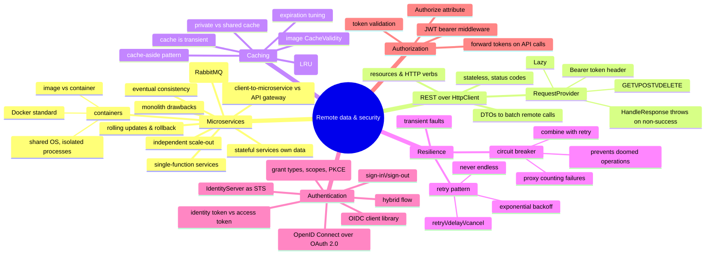

# Remote Data and Security — APIs, Caching, Resilience, Auth

> Source: *Enterprise Application Patterns Using .NET MAUI* — ch 9
> (Containerized microservices), ch 10 (Accessing remote data), ch 11
> (Authentication and authorization). Cross-referenced with the data-access
> and security chapters of *Blazor for ASP.NET Web Forms Developers*.

A client app should consume a web API without knowing how it's implemented —
which requires common standards for data formats and message structure. This
page covers the backend shape (containerized microservices), the client
techniques for talking to it (REST over `HttpClient`), keeping it fast
(caching) and reliable (retry, circuit breaker), and locking it down
(IdentityServer bearer tokens).



## Containerized microservices (ch 9)

### Why not a monolith

Tiered monoliths couple components within a tier; a single component change
requires the whole tier to be retested and redeployed; and scaling means
*cloning the entire application* even when only one function is hot.

### The microservice model

An application is split into **independent components, each implementing a
single function** (shopping carts, inventory, payments), with well-defined
contracts for inter-service communication. Benefits: small and easy to
evolve; independent development/deployment; **independent scale-out** (scale
only the web-facing service under load — near-instantaneous); fault
isolation (an issue in one service leaves others serving); freedom to use the
latest technology per service. **Stateful microservices manage their own
persistent data** — usually local to the server for speed — and partition
data across instances to go beyond one machine's capacity. Independent
updates enable **rolling updates** (only a subset of instances update at a
time; a bad build is rolled back before it spreads) and **schema versioning**
(clients see a consistent version during rollout).

Costs to accept: partitioning is hard (each service must be autonomous
end-to-end, *including its data*); inter-service communication adds
complexity and latency; **atomic transactions across microservices usually
aren't possible — the business must embrace eventual consistency**;
operational overhead; and direct client-to-microservice coupling makes
refactoring service contracts break clients (consider an **API gateway** for
tens of services — direct communication is fine for small apps).

### Containers

A **container image** packages the app + versioned dependencies + environment
config (as deployment manifests); a **container** is a runtime instance of an
image — isolated, resource-controlled, portable, looks like a fresh machine.
Unlike VMs, containers **share the host OS** (isolated processes), so they
need far fewer resources. Key vocabulary: container host, container OS image
(the immutable first layer), container repository/registry (Docker Hub). The
standard implementation is **Docker**. The eShop reference application runs
four containerized microservices — identity, catalog (CRUD + EF Core/SQL),
ordering (domain-driven), basket (CRUD + Redis) — **each with its own
database**, fully decoupled; cross-service consistency is achieved with
application-level events (see DMMF's consistency discussion in
[persistence-and-evolution](../persistence-and-evolution/index.md)).

### Communication

Client→microservice: direct HTTP calls to each service's public endpoint
(one TCP port per service; in production each endpoint maps to a load
balancer). Microservice→microservice: **HTTP REST for queries** and
**lightweight asynchronous messaging for updates** — a service publishes an
event when something notable happens; subscribers react and may publish more.
The **event bus** is a publish-subscribe channel behind an interface
(implementations: RabbitMQ — eShop's choice, Azure Service Bus, NServiceBus,
MassTransit) giving one-to-many asynchronous pub/sub. Example: the
user-profile service receives `UpdateUser`, updates its DB, publishes
`UserUpdated`; basket and ordering subscribe and update their buyer data — a
distributed, *eventually consistent* transaction in a series of steps. This
is the same event-driven coordination DMMF advocates between bounded
contexts.

## Accessing remote data (ch 10)

### REST fundamentals

REST is an architectural style based on hypermedia and open standards: the
service could be ASP.NET Core while clients use any stack that speaks HTTP.
**Resources** are identified by URIs; HTTP methods (GET/POST/PUT/DELETE) name
the operation; the request body carries data. REST is **stateless** —
requests are independent and order-free. Responses use standard status codes
(200 OK; 404 Not Found). Clients declare acceptable formats in `Accept`;
servers answer with `Content-Type`; the client parses the body. Media types
enable content negotiation.

**DTOs on the wire**: the app's model objects double as DTOs passed to/from
controllers and repositories. Batching more data into a single remote call
reduces the number of remote calls — a core client performance lever.

### Making requests with HttpClient

`HttpClient` (async requests), `HttpResponseMessage` (status, headers, body),
`HttpContent` (`ReadAsStringAsync`, `ReadFromJsonAsync`, …). The eShop
pattern wraps this in a **`RequestProvider`**:

```csharp
public async Task<TResult> GetAsync<TResult>(string uri, string token = "")
{
    HttpClient httpClient = GetOrCreateHttpClient(token);
    HttpResponseMessage response = await httpClient.GetAsync(uri);
    await HandleResponse(response);                      // throws on non-success
    TResult result = await response.Content.ReadFromJsonAsync<TResult>();
    return result;
}

private readonly Lazy<HttpClient> _httpClient = new(() => {
    var c = new HttpClient();
    c.DefaultRequestHeaders.Accept.Add(new MediaTypeWithQualityHeaderValue("application/json"));
    return c;
});
```

- **Cache and reuse `HttpClient`** (here via `Lazy<T>`) — creating one per
  request causes socket exhaustion.
- Auth: `httpClient.DefaultRequestHeaders.Authorization = new
  AuthenticationHeaderValue("Bearer", token);` when a token is supplied.
  For named, pre-configured clients the Blazor book shows the
  `IHttpClientFactory` pattern — `builder.Services.AddHttpClient("github",
  c => { c.BaseAddress = …; c.DefaultRequestHeaders.Add(…) })` then
  `@inject IHttpClientFactory factory` … `factory.CreateClient("github")` —
  one named client per downstream service.
- `HandleResponse` throws on non-success status — errors become exceptions at
  the boundary (see [workflows-and-error-handling](../workflows-and-error-handling/index.md)
  for turning these into typed domain errors).
- **GET** — `CatalogService.GetCatalogAsync` builds the URI
  (`api/v1/catalog/items`), calls `_requestProvider.GetAsync<CatalogRoot>`,
  returns `catalog?.Data`. Server side, a controller pages through EF Core
  (`Skip`/`Take`) and returns `Ok(model)`.
- **EF Core workflows** (the Blazor book's data-access chapter, shared
  source with [web-forms-migration](../web-forms-migration/index.md)):
  **Code First** — write the model class (conventions identify the primary
  key; annotations like `[Required]`, `[MaxLength]`, `[Range]` generate
  schema constraints), register a `DbContext` with
  `services.AddDbContext<T>(options => options.UseSqlServer(connectionString))`,
  then `dotnet ef migrations add <name>` + `dotnet ef database update` to
  create and evolve the schema (generated classes live in `Migrations/`).
  **Database First** — scaffold existing databases with
  `dotnet ef dbcontext scaffold "<conn>" Microsoft.EntityFrameworkCore.SqlServer
  -c MyDbContext -t Product -t Customer`.
- **POST** — `BasketService.UpdateBasketAsync` serializes the
  `CustomerBasket` to JSON (`StringContent` + `application/json`), posts with
  the auth token; the controller persists to a `RedisBasketRepository` and
  returns the updated basket.
- **DELETE** — `ClearBasketAsync` deletes the basket by user id (again
  token-protected).

Services (`ICatalogService`, `IBasketService`) are DI-registered interface
mappings, injected into view models — the request plumbing is invisible to
callers.

### Caching

Caching frequently-accessed, infrequently-changing data close to the app
improves response times. The standard shape is **read-through caching via the
cache-aside pattern**: check the cache; on miss, read the data store and add
to the cache. Distributed apps may use a **shared cache** (multiple
processes/machines) or a **private cache** (on-device — eShop's choice).

- **Treat the cache as transient** — it can disappear at any time; the
  original data store must remain the source of truth.
- **Expiration**: set a default expiration; tune it to the data's access
  pattern (too short = no benefit, too long = staleness). Evicted/expired
  data is re-fetched into the cache on next access.
- **Eviction**: caches fill; typical policy is least-recently-used (others:
  MRU, FIFO).
- **Images**: MAUI's `Image` control caches downloaded images for 24h by
  default, configurable via `CacheValidity`.

### Resilience: transient faults

Remote calls fail transiently — momentary connectivity loss, temporary
service unavailability, timeouts under load. These are often self-correcting:
retrying after a suitable delay likely succeeds. An app must **detect**
likely-transient faults, **retry** while counting attempts, and use a
tuned **retry strategy** (count, delay, actions after failure):

| Operation type | Retry tuning |
| --- | --- |
| User-interactive | short interval, few retries (don't make users wait) |
| Long-running workflow (cancel/restart expensive) | longer delays, more retries |

**Warnings**: an aggressive strategy (minimal delay, many retries) can
degrade a service already at capacity and hurt app responsiveness. **Never
implement endless retries — prefer exponential backoff**, and stop after a
finite count.

**Circuit breaker pattern**: when faults persist (partial connectivity loss
to total service failure), retrying is pointless. A circuit breaker is a
**proxy** for the operation that monitors recent failures and decides whether
to proceed or fail fast; after a set period it lets trial requests through to
detect recovery. Distinct purposes: *retry expects the operation to succeed;
the circuit breaker prevents operations likely to fail*. **Combine them** —
retry *through* the circuit breaker, and stop retrying when the breaker
indicates the fault isn't transient. (The multi-platform app implements
retry; the backend implements the breaker.)

## Authentication and authorization (ch 11)

**Authentication** = obtaining and validating credentials → an authenticated
identity. **Authorization** = deciding what that identity may access. The
eShop approach: a containerized **identity microservice** running
**IdentityServer**, with **ASP.NET Core Identity** supplying the user store
and login UI (IdentityServer provides neither).

### Tokens, not cookies

Cookies work for browser apps; a mobile/desktop client hitting RESTful
endpoints uses **bearer tokens**, retrieved once and attached to each web
request's `Authorization` header.

- **OpenID Connect** is an authentication layer on top of **OAuth 2.0**
  (which lets apps request access tokens from a security token service and
  call APIs with them) — centralizing auth reduces complexity in both
  clients and APIs. IdentityServer implements both.
- **Identity token** — the result of authentication: at minimum a user
  identifier plus how/when they authenticated (may carry identity data).
- **Access token** — grants access to an API resource; contains client (and
  user) info the API uses to authorize. Requested by clients, forwarded to
  APIs.

### Configuring IdentityServer

- Pipeline order matters: `app.UseIdentityServer()` **before** the UI
  framework that implements the login screen.
- `services.AddIdentityServer(...)` plus fluent config: signing credentials,
  ASP.NET Identity integration, configuration/operational stores (EF/SQL —
  or in-memory lists, which production should load dynamically from config or
  database).
- **API resources** (`ApiScope`): which APIs are protected — `orders`,
  `basket`, `webhooks` — requiring IdentityServer-issued access tokens.
- **Identity resources** (`IdentityResource`): user data (claims) included in
  identity tokens — standard `openid`, `profile` (spec covers openid, email,
  profile, telephone, address) or custom ones.
- **Clients** must be registered: unique `ClientId`, `AllowedGrantTypes`
  (the flow), `RedirectUris`, `AllowedScopes` (a client has access to
  *nothing* by default), plus secrets, PKCE requirement, CORS origins,
  token lifetimes, `AllowOfflineAccess` (refresh tokens).
- **Flows**: *implicit* (browser-only, no refresh tokens), *authorization
  code* (back-channel tokens, client authentication), **hybrid** (identity
  token via front channel with signed response + authorization code; access
  and refresh tokens via back channel) — **hybrid is the recommended flow
  for native apps**, mitigating browser-channel attacks.

### Performing authentication

The app's `IdentityService` (implementing `IIdentityService`: `SignInAsync`,
`SignOutAsync`, `GetUserInfoAsync`, `GetAuthTokenAsync`) uses the
**`IdentityModel.OidcClient`** package. Hybrid flow:

1. Sign-in request to `/connect/authorize` → on success an authorization
   code + identity token come back.
2. The code (+ **PKCE** secret verifier — client generates a secret, sends
   its hash in the authorize request, presents it unhashed when redeeming the
   code, protecting an intercepted code from reuse) is sent to
   `/connect/token` → access, identity, and refresh tokens.
3. Tokens are stored via `ISettingsService` (`SetUserTokenAsync`); success
   navigates to `//Main/Catalog` (`SignInCommand` → `SignInAsync` →
   `NavigationService.NavigateToAsync` — see
   [mvvm-patterns](../mvvm-patterns/index.md)).

**Sign-out**: `/connect/endsession` (with post-logout redirect), clear stored
tokens (`SetUserTokenAsync(default)`), reset state, navigate back to Login.
Mock services (configured in settings) bypass IdentityServer for development.

### Authorization on the APIs

- `[Authorize]` on a controller/action restricts it to authenticated users;
  unauthenticated calls get **401 Unauthorized**. (Attribute parameters can
  narrow further to roles/policies — the same roles/claims/policies model the
  Blazor book details: [web-forms-migration](../web-forms-migration/index.md).)
- APIs add the **JWT bearer middleware** (`AddAuthentication().AddJwtBearer`):
  the `Authority` is the identity service's URL; the middleware **validates
  the incoming token** — trusted issuer, valid for this audience/ API.
- Clients **forward the token on every protected call**:
  `GetAuthTokenAsync()` from `IIdentityService`, then
  `Authorization: Bearer <token>` on the `HttpClient` (the `RequestProvider`
  does this given a token) — for orders, basket updates, and deletes alike.

## Cross-links

- DI/mocking makes all of this testable: [testing-practices](../testing-practices/index.md).
- The settings service and HttpClient wiring: [mvvm-patterns](../mvvm-patterns/index.md),
  [blazor-app-services](../blazor-app-services/index.md).
- Event-driven consistency and context-owned data: [persistence-and-evolution](../persistence-and-evolution/index.md).
- The Blazor twin of this page (EF Core data access, Identity roles/claims/
  policies, EditForm validation): its sources are shared — see
  [web-forms-migration](../web-forms-migration/index.md).
- Server-side request handling as pipelines: [blazor-app-services](../blazor-app-services/index.md).
