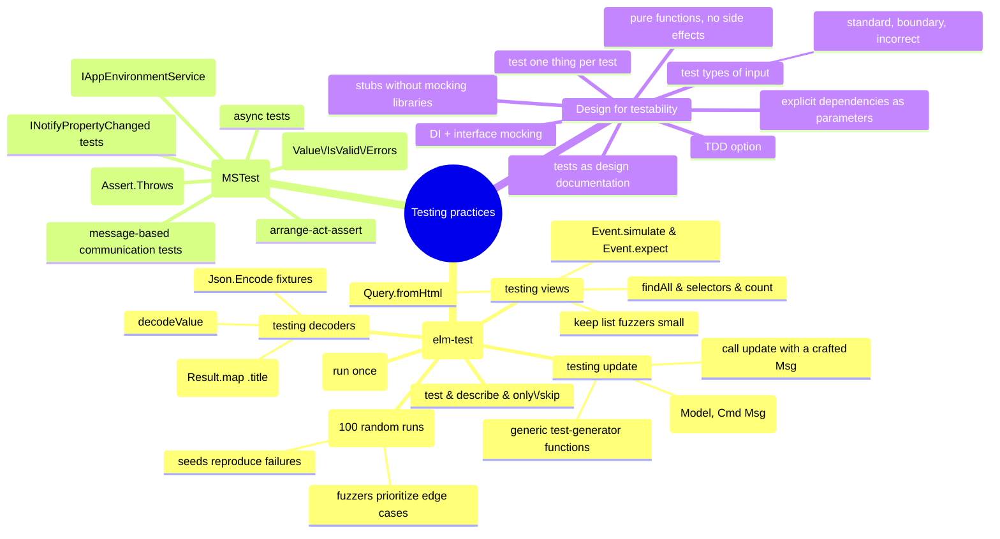

# Testing Practices — Unit, Fuzz, and Testing the Architecture

> Source: *Elm in Action* ch 6 (Testing) + ch 3/4 context; *Enterprise
> Application Patterns Using .NET MAUI* ch 13 (Unit testing); *Domain Modeling
> Made Functional* ch 9 §Testing dependencies.

Two books, one message: **testability is an architectural property**, not an
afterthought. Elm gets it from pure functions and a single model; MAUI gets
it from dependency injection and MVVM; DMMF gets it from explicit function
parameters. This page consolidates all three.



## Why these architectures are testable

- **Elm**: the entire application state is one `Model` value; the model
  changes *only* when `update` receives a `Msg`; `update`, `view`, and
  decoders are plain functions with no side effects — so tests just call
  them.
- **MAUI/MVVM**: view models hold presentation logic with dependencies
  declared as interfaces; the DI container resolves real services at runtime
  and **mocks at test time**, so tests never touch web services, databases,
  or platform features.
- **DMMF**: every workflow step receives its dependencies as parameters;
  stubs are one-line functions defined inline in the test — no mocking
  framework needed.

## Elm: `elm-test` (ch 6)

Setup: `elm-test init` creates `tests/`, a starter module (rename it — module
names must match filenames), and installs `elm-explorations/test` as a
**test dependency** (importable only from `tests/`). Expose what tests need
from the app module (`exposing (main, photoDecoder, update, view, …)`, and
`Msg(..)` to use variants). Run with `elm-test`.

### Unit tests

A **unit test runs once and performs no effects**:

```elm
decoderTest : Test
decoderTest =
    test "title defaults to (untitled)" <|
        \_ ->
            """{"url": "fruits.com", "size": 5}"""      -- triple quotes: multi-line, no escapes
                |> decodeValue PhotoGroove.photoDecoder
                |> Result.map .title                    -- narrow the assertion
                |> Expect.equal (Ok "(untitled)")
```

- `test : String -> (() -> Expectation) -> Test` — the anonymous wrapper
  **delays evaluation** so the runner controls execution (incremental
  progress, parallelism). Descriptions must be unique.
- Expectations: `Expect.equal`, `Expect.atLeast`, `Expect.all checks` (run a
  list of `subject -> Expectation` checks against one subject).
- Write a **failing test first** deliberately, then fix — proof the test
  verifies something.
- **Narrow the assertion** (`Result.map .title` instead of comparing the
  whole `Photo`): otherwise adding a model field breaks unrelated tests and
  spurious failures clutter output.
- `Test.describe "group"` labels a list of tests; `Test.only`/`Test.skip`
  focus runs; you can also pass specific files to `elm-test`.

### Fuzz tests

A **fuzz test runs ~100× with randomly generated inputs** (a.k.a. property-
based / generative testing) — one test covers a huge input space and surfaces
edge cases:

```elm
decoderTest =
    fuzz2 string int "title defaults to (untitled)" <|
        \url size ->
            [ ( "url", Encode.string url ), ( "size", Encode.int size ) ]
                |> Encode.object
                |> decodeValue PhotoGroove.photoDecoder
                |> Result.map .title
                |> Expect.equal (Ok "(untitled)")
```

- **Fuzzers** generate values: `string`, `int`, `list f`, `Fuzz.intRange 1 5`,
  and custom ones via `Fuzz.map` (e.g. `Fuzz.intRange 1 5 |> Fuzz.map
  urlsFromCount`). Fuzzers **bias toward bug-likely values**: empty strings,
  very short/long strings, 0, extremes.
- Build fixtures with `Json.Encode` (`Encode.object [(k, v), …]`) and decode
  with `decodeValue` (no string round-trip).
- Failures print a **seed**: `elm-test --fuzz 100 --seed <n>` reproduces the
  exact run; `--fuzz 5000` deepens coverage at the cost of time (a 5-person
  team running the suite 10×/day gets 5,000 runs anyway).
- **Keep generated collections small** — a `list string` fuzzer can emit
  hundreds of items and a per-item DOM traversal turns that into millions of
  node visits. Bound list sizes (`Fuzz.intRange 1 5`), or generate
  `(elem, List elem)` pairs for a guaranteed non-empty list.

### Testing `update`

The pattern: craft a `Msg`, run it through `update` with `initialModel`,
inspect the returned model:

```elm
slidHueSetsHue =
    fuzz int "SlidHue sets the hue" <|
        \amount ->
            initialModel
                |> update (SlidHue amount)
                |> Tuple.first        -- discard the Cmd
                |> .hue
                |> Expect.equal amount
```

Because variants are functions (`SlidHue : Int -> Msg`) and field accessors
are functions (`.hue : Model -> Int`), one **generic test generator** covers
a whole family:

```elm
sliders =
    describe "Slider sets the desired field in the Model"
        [ testSlider "SlidHue" SlidHue .hue
        , testSlider "SlidRipple" SlidRipple .ripple
        , testSlider "SlidNoise" SlidNoise .noise
        ]

testSlider description toMsg amountFromModel =
    fuzz int description <|
        \amount ->
            initialModel
                |> update (toMsg amount)
                |> Tuple.first
                |> amountFromModel
                |> Expect.equal amount
```

Share code across tests **only when the behavior is genuinely identical**
(duplication is fine — readable tests beat DRY tests; sharing is justified
when divergence would itself be a bug). `elm-test` can't execute `Cmd`s
directly; if you must assert on them, restructure `update` to return a
custom `Commands` type plus a `toCmd` converter (rarely worth it in
practice).

### Testing views

Render, query, assert — no browser:

```elm
noPhotosNoThumbnails =
    test "No thumbnails render when there are no photos to render." <|
        \_ ->
            initialModel
                |> view                       -- Model → Html Msg
                |> Query.fromHtml             -- → Query.Single (root node)
                |> Query.findAll [ tag "img" ]
                |> Query.count (Expect.equal 0)
```

- `Query.Single` (one node) vs `Query.Multiple` (many) are distinct types —
  `findAll` returns `Multiple`; `find` returns `Single` and **fails if the
  count isn't exactly one**.
- Selectors: `tag`, `attribute (Attr.src …)`, `text`. Prefer `Expect.atLeast
  1` over `Expect.equal 1` when duplicates are legal.
- **Simulate interaction**: `Query.find […] |> Event.simulate Event.click |>
  Event.expect (ClickedPhoto url)` — asserts the *message* the runtime would
  send to `update` (which other tests already verify handles it). Compose
  fuzzers for position: `fuzz3 urlFuzzer string urlFuzzer` builds
  `urlsBefore ++ clicked :: urlsAfter` with a uniquely-suffixed URL to click.

## MAUI: unit testing MVVM (ch 13)

Unit testing isolates a small unit (typically a method) and verifies its
behavior — **detecting a bug where it occurs beats observing it indirectly**.
Tests are most valuable as part of the daily workflow: they double as design
documentation and functional specs; write them for standard, boundary, and
incorrect inputs (or **test-first** / TDD). They are the best defense against
regressions. Use the **arrange-act-assert** structure; MSTest (`[TestMethod]`,
`[DataSource]` for data-driven tests), NUnit, and xUnit all work. Discipline:
**test one thing per test** — complex tests are hard to verify, read, and
diagnose.

### Mocks through dependency injection

```csharp
public OrderDetailViewModel(
    IAppEnvironmentService appEnvironmentService,
    IDialogService dialogService,
    INavigationService navigationService,
    ISettingsService settingsService) { … }
```

At runtime the DI container injects real implementations; in tests, pass a
**mock** — an object with the same interface, built to simulate behavior and
supply test data. The view model under test never knows the difference:

```csharp
[TestMethod]
public async Task OrderPropertyIsNotNullAfterViewModelInitializationTest()
{
    // Arrange
    var orderService = new OrderMockService();
    var orderViewModel = new OrderDetailViewModel(orderService);

    // Act
    var order = await orderService.GetOrderAsync(1, GlobalSetting.Instance.AuthToken);
    await orderViewModel.InitializeAsync(order);

    // Assert
    Assert.IsNotNull(orderViewModel.Order);
}
```

This is exactly the DMMF stub pattern wearing a container: interfaces +
injection = swappable dependencies.

### Specific MVVM test recipes

- **Asynchronous functionality** — `async Task` test methods awaiting view
  model methods, with mocked services (above).
- **`INotifyPropertyChanged`** — attach a handler to `PropertyChanged`,
  perform the change, assert the event fired with the right property name:

  ```csharp
  orderViewModel.PropertyChanged += (sender, e) =>
      { if (e.PropertyName.Equals("Order")) invoked = true; };
  await orderViewModel.InitializeAsync(order);
  Assert.IsTrue(invoked);
  ```

  (Change notification drives far more than data — animations and control
  enablement depend on it.)
- **Message-based communication** — subscribe to the message the code under
  test should publish, execute the command, assert receipt:

  ```csharp
  MessagingCenter.Subscribe<CatalogViewModel, CatalogItem>(
      this, MessageKeys.AddProduct, (sender, arg) => messageReceived = true);
  catalogViewModel.AddCatalogItemCommand.Execute(null);
  Assert.IsTrue(messageReceived);
  ```

  (Same technique works for the MVVM Toolkit Messenger.)
- **Exception handling** — `Assert.Throws<ArgumentException>(() =>
  listView.Behaviors.Add(behavior));`. **Never assert on exception message
  strings** — they change; such tests are brittle.
- **Validation** — two layers: (1) each rule's logic (simple, input→output),
  and (2) `ValidatableObject<T>` behavior — assert `Value`, `IsValid`, **and**
  `Errors` after `Validate()`:

  ```csharp
  mockViewModel.Forename.Value = "John";           // Surname left empty
  bool isValid = mockViewModel.Validate();
  Assert.IsFalse(isValid);
  Assert.IsTrue(mockViewModel.Forename.IsValid);
  Assert.IsFalse(mockViewModel.Surname.IsValid);
  Assert.AreEqual(mockViewModel.Forename.Errors.Count(), 0);
  Assert.AreNotEqual(mockViewModel.Surname.Errors.Count(), 0);
  ```

## Design-for-testability checklist (all three books)

1. **Pure logic, edges for effects** — workflows decide, edges do I/O (DMMF);
   `update` returns tuples, the runtime performs effects (Elm); view models
   orchestrate, services do I/O (MAUI).
2. **Dependencies as explicit parameters/interfaces** — stubbed inline (Elm,
   DMMF) or mocked via DI (MAUI).
3. **One model/state value per scope** — trivially inspectable and
   reconstructible in tests.
4. **Test one concern per test**; cover standard, boundary, and invalid
   inputs.
5. **Prefer failing-first tests** (Elm) and tests-as-specs (MAUI); assert on
   behavior and data, never on message strings (MAUI).
6. **Let the type system pre-test invariants** — smart constructors and
   "make illegal states unrepresentable" remove whole test categories (DMMF);
   the compiler's missing-patterns and type checks remove others (Elm).

## Cross-links

- Elm test targets: `update`/view/decoders — [elm-architecture](../elm-architecture/index.md),
  [elm-in-production](../elm-in-production/index.md).
- The DI and MVVM structures being tested: [mvvm-patterns](../mvvm-patterns/index.md).
- Smart constructors & Result-based logic under test:
  [functional-design-and-types](../functional-design-and-types/index.md),
  [workflows-and-error-handling](../workflows-and-error-handling/index.md).
- Validated inputs at UI boundaries: [blazor-components](../blazor-components/index.md).
