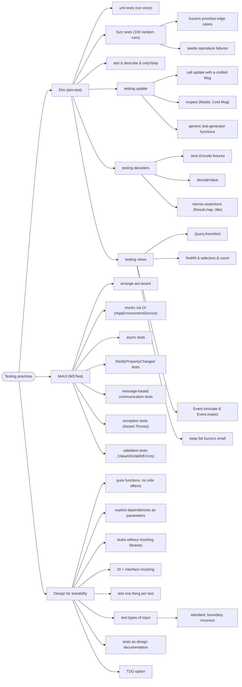

# Testing Practices — Unit, Fuzz, and Testing the Architecture

> Source: *Elm in Action* ch 6 (Testing) + ch 3/4 context; *Enterprise
> Application Patterns Using .NET MAUI* ch 13 (Unit testing); *Domain Modeling
> Made Functional* ch 9 §Testing dependencies.

**Testability is an architectural property.** Elm: pure functions + one
model. MAUI: DI + MVVM. DMMF: dependencies as explicit parameters. Same
message, three books.



## Why these architectures are testable

| Stack | Mechanism | Tests just… |
| --- | --- | --- |
| **Elm** | one `Model`; changes only via `update`; `update`/`view`/decoders are pure | call the function, inspect the output |
| **MAUI/MVVM** | dependencies declared as interfaces, injected by the DI container | pass mocks — no web, DB, or platform touched |
| **DMMF** | dependencies are parameters | write one-line inline stubs |

## Elm: `elm-test`

Setup: `elm-test init` → creates `tests/` + a starter module (module name
must match filename) → installs `elm-explorations/test` as a **test
dependency** (importable only from `tests/`). Expose what tests need
(`exposing (main, photoDecoder, update, view, …)`, `Msg(..)`).

### Unit tests: run once, no effects

```elm
decoderTest =
    test "title defaults to (untitled)" <|
        \_ ->
            """{"url": "fruits.com", "size": 5}"""
                |> decodeValue PhotoGroove.photoDecoder
                |> Result.map .title        -- narrow the assertion
                |> Expect.equal (Ok "(untitled)")
```

- `test : String -> (() -> Expectation) -> Test` — the anonymous wrapper
  **delays evaluation** so the runner controls execution/parallelism.
- Write a **failing test first**, then fix — proof the test can fail.
- **Narrow assertions** (`Result.map .title`, not whole `Photo`) — adding a
  model field won't break unrelated tests.
- `Test.describe` groups; `Test.only`/`Test.skip` focus.

### Fuzz tests: ~100 random runs (property-based)

```elm
decoderTest =
    fuzz2 string int "title defaults to (untitled)" <|
        \url size ->
            [ ( "url", Encode.string url ), ( "size", Encode.int size ) ]
                |> Encode.object
                |> decodeValue PhotoGroove.photoDecoder
                |> Result.map .title
                |> Expect.equal (Ok "(untitled)")
```

- Fuzzers **bias toward bug-likely values**: empty strings, 0, extremes.
- Build fixtures with `Json.Encode`, decode with `decodeValue` (no string
  round-trip).
- Failures print a **seed**: `elm-test --fuzz 100 --seed <n>` reproduces
  exactly; `--fuzz 5000` for deeper runs.
- ⚠️ **Keep generated collections small** — a `list string` fuzzer × DOM
  traversal = millions of node visits. Bound with `Fuzz.intRange 1 5`, or
  generate `(elem, List elem)` for guaranteed non-empty.

### Testing `update`: craft a Msg, inspect the model

```elm
slidHueSetsHue =
    fuzz int "SlidHue sets the hue" <|
        \amount ->
            initialModel
                |> update (SlidHue amount)
                |> Tuple.first        -- discard the Cmd
                |> .hue
                |> Expect.equal amount
```

Variants are functions (`SlidHue : Int -> Msg`) and accessors are functions
(`.hue`) — so **one generic generator tests a whole family**:

```elm
sliders =
    describe "Slider sets the desired field in the Model"
        [ testSlider "SlidHue" SlidHue .hue
        , testSlider "SlidRipple" SlidRipple .ripple
        , testSlider "SlidNoise" SlidNoise .noise
        ]
```

- Share test code **only when behavior is genuinely identical** — readable
  duplicated tests beat DRY tests.
- `elm-test` can't execute `Cmd`s; asserting on them means restructuring
  `update` to return a custom `Commands` type (rarely worth it).

### Testing views: render, query, assert — no browser

```elm
noPhotosNoThumbnails =
    test "No thumbnails render when there are no photos to render." <|
        \_ ->
            initialModel
                |> view
                |> Query.fromHtml
                |> Query.findAll [ tag "img" ]
                |> Query.count (Expect.equal 0)
```

- `Query.Single` vs `Query.Multiple` are distinct types; `find` **fails**
  unless exactly one match.
- **Simulate interaction**: `Query.find […] |> Event.simulate Event.click |>
  Event.expect (ClickedPhoto url)` — asserts the Msg the runtime would send
  (`update`'s handling is covered by other tests).

## MAUI: unit testing MVVM

Unit test = isolate one method, verify behavior — catching a bug where it
occurs beats observing it indirectly. Tests double as design docs and specs;
cover **standard, boundary, incorrect** inputs; **one thing per test**;
arrange-act-assert. MSTest/NUnit/xUnit all work.

### Mocks through DI

```csharp
public OrderDetailViewModel(
    IAppEnvironmentService appEnvironmentService,
    IDialogService dialogService,
    INavigationService navigationService,
    ISettingsService settingsService) { … }

[TestMethod]
public async Task OrderPropertyIsNotNullAfterViewModelInitializationTest()
{
    var orderService = new OrderMockService();              // Arrange
    var orderViewModel = new OrderDetailViewModel(orderService);

    await orderViewModel.InitializeAsync(order);            // Act

    Assert.IsNotNull(orderViewModel.Order);                 // Assert
}
```

The DMMF stub pattern wearing a container: interfaces + injection =
swappable dependencies.

### MVVM test recipes

| Target | How |
| --- | --- |
| **Async** | `async Task` test methods awaiting VM methods (mocked services) |
| **INotifyPropertyChanged** | attach handler → change property → assert fired with right name. (Notification drives animations + enablement too) |
| **Messaging** | subscribe to the expected message → execute the command → assert receipt |
| **Exceptions** | `Assert.Throws<ArgumentException>(() => …)`. **Never assert message strings** — brittle |
| **Validation** | assert `Value`, `IsValid`, **and** `Errors` after `Validate()` (both per-rule logic and `ValidatableObject<T>` behavior) |

## Design-for-testability checklist (all three books)

1. **Pure logic, effects at the edges** — workflows decide (DMMF); the
   runtime performs `Cmd`s (Elm); services do I/O (MAUI).
2. **Dependencies as explicit parameters/interfaces** — inline stubs (Elm,
   DMMF) or DI mocks (MAUI).
3. **One state value per scope** — trivially inspectable and reconstructible.
4. **One concern per test**; standard + boundary + invalid inputs.
5. **Fail first** (Elm); tests as specs (MAUI); assert on behavior and data,
   never on message strings.
6. **Let types pre-test invariants** — smart constructors, illegal states
   unrepresentable (DMMF), missing-patterns errors (Elm) delete whole test
   categories.

## Cross-links

- Test targets: `update`/view/decoders — [elm-architecture](../elm-architecture/index.md),
  [elm-in-production](../elm-in-production/index.md).
- The DI and MVVM structures under test: [mvvm-patterns](../mvvm-patterns/index.md).
- Smart constructors & Results under test: [functional-design-and-types](../functional-design-and-types/index.md),
  [workflows-and-error-handling](../workflows-and-error-handling/index.md).
- UI boundary validation: [blazor-components](../blazor-components/index.md).
