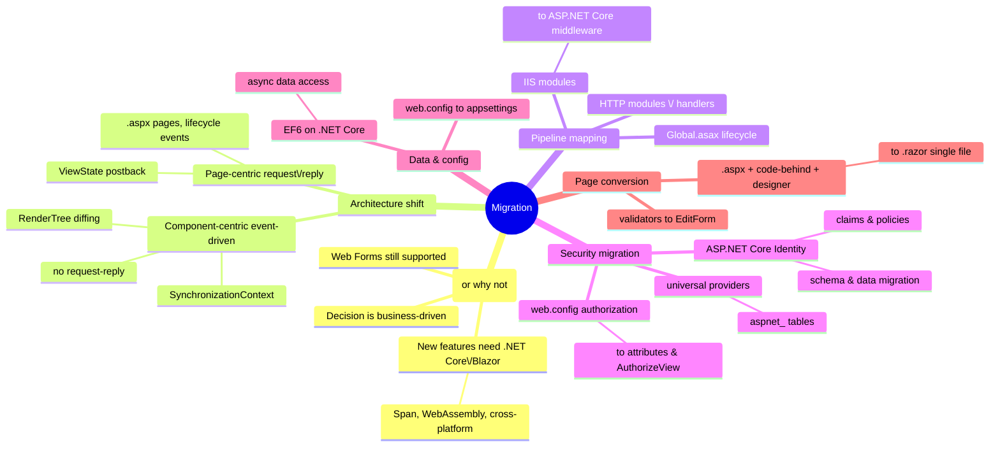

# Web Forms → Blazor Migration

> Source: *Blazor for ASP.NET Web Forms Developers* — ch 1 (why migrate),
> ch 2 (architecture comparison), ch 11 (modules/handlers/middleware),
> ch 13 (security migration), ch 14 (the migration walkthrough).

This page is the end-to-end "how do I move an ASP.NET Web Forms app to
Blazor" chapter, including the concept mapping that explains *why* each step
exists.

## Should you migrate at all?

Web Forms remains supported as long as the .NET Framework ships with Windows —
migration is **not** mandatory. Migrate when the new platform's features
matter: `Span<T>`-style performance, running as WebAssembly, cross-platform
(Linux/macOS) hosting, app-local deployment without shared-framework conflicts.
The decision is a business decision; the migration can be whole-app or
endpoint-by-endpoint.

Two platform trends motivated the book in the first place: the shift to
**open-source, cross-platform .NET** (Web Forms is Windows-only and will not
be ported) and the shift of **app logic to the client** (server-rendered
browser-as-thin-client → interactive client-side frameworks; WebAssembly
made running .NET in the browser possible in 2020).

## The two architectures, side by side

| | **ASP.NET Web Forms** | **Blazor** |
| --- | --- | --- |
| Model | page-centric, HTTP request-reply | component-based, event-driven, stateful; no request-reply context |
| Unit of UI | `.aspx` page + `.ascx` user controls | `.razor` components (like user controls, but .NET types usable anywhere) |
| Event flow | server postbacks; page lifecycle events (init/load/prerender/unload) | DOM events → component state change → RenderTree diff → DOM patch |
| State | ViewState hidden field round-trips (can balloon to MBs) | component state in memory (circuit on Server; JS-heap on WASM) |
| Rendering | server executes page code, replaces browser contents | component renders to a diffable tree; browser applies minimal update |
| Compiled? | `.aspx` recompiled on change at runtime, even while running | compile-time only (single assembly); Hot Reload instead |

Both share: reusable controls/components, event-driven programming, stateful
UI, designer-ish tooling (Hot Reload), data-binding ambitions. That is why
the mental mapping works.

## The concept map (Web Forms → Blazor/ASP.NET Core)

| Web Forms | Becomes in Blazor / ASP.NET Core |
| --- | --- |
| `.aspx` page | `@page` component |
| `.aspx.cs` code-behind + `.designer.cs` | merged into `.razor` (+ optional `.razor.cs` base class) |
| Master Page + `ContentPlaceHolder` | layout component + `@Body` |
| User control `.ascx` | Razor component |
| Server controls (`asp:Label`) | plain HTML or input components |
| Validation controls / unobtrusive JS | `EditForm` + `DataAnnotationsValidator` (shared client/server logic, no custom JS) |
| `Global.asax` `Application_Start` | `Program.cs` builder + services |
| `Application_BeginRequest` | `app.Use(...)` middleware |
| HTTP modules/handlers (`IHttpModule`, `IHttpHandler`) | middleware pipeline (registration order = execution order) |
| IIS modules (custom errors, static files, compression, caching, rewriting…) | ASP.NET Core middleware (Status Code Pages, Static Files, Response Caching, URL Rewriting, …) |
| `web.config` appSettings/connectionStrings | `appsettings.json` + sources; `IConfiguration` |
| `ConfigurationManager` | `IConfiguration` / Options pattern |
| Forms authentication + universal providers | ASP.NET Core Identity |
| web.config `<location>` authorization | `[Authorize]` attributes, policies, `AuthorizeView` |
| `Session`/`Application` | circuit state / singleton services (+ backing store) |
| `packages.config` (every transitive dep listed) | `PackageReference` (transitive resolution) |
| runtime bundling (`BundleConfig`) | build-time tools (Gulp/webpack) or declarative bundler config |
| static files anywhere in project | only `wwwroot/` is web-addressable |
| `Response.Redirect` | `NavigationManager.NavigateTo` |

## Migration walkthrough (the eShop example)

1. **Create a new SDK-style project** (see
   [blazor-app-services](../blazor-app-services/index.md) for project file
   differences). Reinstall libraries as `PackageReference`s. Windows-only
   APIs (Registry, WMI, Directory Services) come via the **Windows
   Compatibility Pack** (~20,000 APIs). Missing APIs surface as runtime
   errors — test.
2. **Port startup**: `Global.asax.cs`'s IoC container setup, DB initializer,
   and per-request logging move into `Program.cs` — DI registrations for
   mock-vs-real services, the `Application_BeginRequest` logging as
   `app.Use` middleware, `ConfigDataBase` as a scoped service resolution at
   startup. Note: **Session state is not supported** with Blazor Server
   (connections are independent of HTTP context) — apps relying on session
   need rearchitecting.
3. **Migrate modules/handlers → middleware** (see mapping above). Katana
   experience carries over — ASP.NET Core inherits its middleware pattern.
4. **Static files & bundling**: `app.UseStaticFiles()`; move bundling from
   runtime to build time.
5. **Convert pages**: three files (`Details.aspx`, `.aspx.cs`,
   `.aspx.designer.cs`) become one `Details.razor`:
   - `Page_Load` logic → `OnInitialized` (with `[Parameter] public int Id`
     bound from the route `@page "/Catalog/Details/{id:int}"`);
   - `<%# Bind(...) %>` labels → plain HTML/`@item.Prop` interpolation;
   - DI (`CatalogService`) via `@inject` instead of property injection;
   - route values come from the template, not `Page.RouteData`.
6. **Model validation** transfers almost unchanged: the same annotated model
   + `<EditForm Model="_item" OnValidSubmit=…><DataAnnotationsValidator/>`,
   replacing `RequiredFieldValidator` controls (see
   [blazor-components](../blazor-components/index.md)).
7. **Migrate configuration**: web.config XML → JSON
   `appsettings.json` (+ per-environment, secrets, env vars, CLI). Secrets
   stop living in source control. Read via `builder.Configuration` during
   startup and `@inject IConfiguration` in components.
8. **Migrate data access**: EF6 **is supported** on .NET Core. Required
   changes in the eShop sample: connection strings must be passed explicitly
   (`name=ConnectionString` convention no longer works), and synchronous DB
   access should become async for scalability (never block with
   `Task.Wait()`/`.Result` — thread-pool exhaustion).
9. **Architectural changes** inherent to .NET Core: no AppDomains, no
   Remoting, no Code Access Security/Security Transparency; no
   synchronization context (so no `HttpContext.Current`,
   `Thread.CurrentPrincipal`, or other static ambient accessors); no shadow
   copying; no request queue; embrace async.

## Security migration (universal providers → ASP.NET Core Identity)

The universal providers (membership/roles/profiles since ASP.NET 2.0) store
users in `aspnet_Users`, credentials in `aspnet_Membership` (password, salt,
lockout), roles in `aspnet_Roles`, membership in `aspnet_UsersInRoles` —
incompatible with Identity, so a data migration is required.

**Identity's richer model**: third-party/social login support, prebuilt
login/register UI, EF Core + migrations for schema. Beyond roles, Identity
adds:

- **claims** — name/value pairs describing *what the subject is*;
- **policies** — named requirement sets (e.g. `RequireClaim(ClaimTypes.Country, "Canada")`) replacing scattered imperative role checks;
- `[Authorize(Roles="administrators")]` or `[Authorize(Policy="CanadiansOnly")]` via `@attribute` (works only on routable `@page` components — child components use `AuthorizeView` instead);
- `AuthorizeView` (`<Authorized>` / `<NotAuthorized>`) for declarative UI visibility;
- authentication state as a `[CascadingParameter] Task<AuthenticationState>` or via `AuthenticationStateProvider`; `UserManager<T>`/`RoleManager<T>` to modify claims/roles (Server only — WebAssembly must call server APIs).

**Four-step migration guide**:
1. Create the Identity schema (`dotnet new webapp -au Individual`, apply
   migrations via the page, `dotnet ef database update`, or script with
   `dotnet ef migrations script -o auth.sql`). Column mapping:
   `aspnet_Membership` → `AspNetUsers`, `aspnet_Roles` → `AspNetRoles`,
   extra `aspnet_UsersInRoles` columns → `AspNetUserRoles` (or better:
   separate tables so future schema migrations stay clean).
2. Migrate users/roles data. **Passwords are not migrated** — users reset
   their password at next login (migrating hashes is possible but involved;
   forced reset improves security).
3. Move web.config auth config to `Program.cs`
   (`AddDefaultIdentity<IdentityUser>`, `UseAuthentication`, then
   `UseAuthorization` — in the right order) and convert `<location>` rules
   into `[Authorize]` attributes per page.
4. Update pages: `User.IsInRole(...)` conditionals become
   `AuthorizeView`/policy checks/`IAuthorizationService.AuthorizeAsync`.

## Cross-links

- Startup/DI/config details: [blazor-app-services](../blazor-app-services/index.md).
- Component authoring used in the page conversions: [blazor-components](../blazor-components/index.md).
- Identity's claims/policies parallel the MAUI bearer-token flows: [remote-data-and-security](../remote-data-and-security/index.md).
- The "explicit connection string, async boundary, no ambient context" rules are the same boundary discipline DMMF teaches: [persistence-and-evolution](../persistence-and-evolution/index.md).
