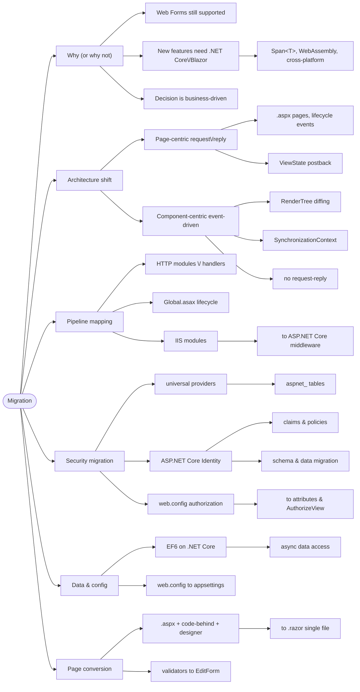

# Web Forms → Blazor Migration

> Source: *Blazor for ASP.NET Web Forms Developers* — ch 1 (why migrate),
> ch 2 (architecture comparison), ch 11 (modules/handlers/middleware),
> ch 13 (security migration), ch 14 (the migration walkthrough).

The end-to-end "move a Web Forms app to Blazor" guide, with the concept
mapping that explains *why* each step exists.

## Should you migrate at all?

- Web Forms is supported as long as .NET Framework ships with Windows —
  **not mandatory**.
- Migrate when the new platform matters: `Span<T>` performance,
  WebAssembly, Linux/macOS hosting, app-local deployment.
- It's a **business decision**; whole-app or endpoint-by-endpoint.

Two trends behind the book: .NET went **open-source, cross-platform** (Web
Forms is Windows-only, will not be ported) and app logic moved **to the
client** (WebAssembly made .NET-in-browser real in 2020).

## The two architectures

| | **Web Forms** | **Blazor** |
| --- | --- | --- |
| Model | page-centric, HTTP request-reply | component-based, event-driven, stateful |
| UI unit | `.aspx` + `.ascx` controls | `.razor` components (.NET types) |
| Events | postbacks; page lifecycle | DOM event → state → RenderTree diff → patch |
| State | ViewState round-trips (can hit MBs) | in-memory (circuit on Server; JS heap on WASM) |
| Compile | `.aspx` recompiled at runtime | compile-time only; Hot Reload |

Shared DNA (why the mapping works): reusable controls, event-driven,
stateful UI, data-binding ambitions.

## The concept map

| Web Forms | Becomes |
| --- | --- |
| `.aspx` page | `@page` component |
| code-behind + `.designer.cs` | one `.razor` (+ optional `.razor.cs`) |
| Master Page + `ContentPlaceHolder` | layout component + `@Body` |
| User control `.ascx` | Razor component |
| Server controls (`asp:Label`) | plain HTML / input components |
| Validation controls | `EditForm` + `DataAnnotationsValidator` (no custom JS) |
| `Global.asax Application_Start` | `Program.cs` builder + services |
| `Application_BeginRequest` | `app.Use(...)` middleware |
| HTTP modules/handlers | middleware pipeline (order = execution) |
| IIS modules | ASP.NET Core middleware (Status Code Pages, Static Files, Rewriting…) |
| `web.config` appSettings | `appsettings.json` + sources, `IConfiguration` |
| Forms auth + universal providers | ASP.NET Core Identity |
| `<location>` authorization | `[Authorize]`, policies, `AuthorizeView` |
| `Session` / `Application` | circuit state / singleton services (+ backing store) |
| `packages.config` | `PackageReference` (transitive) |
| runtime bundling | build-time tools |
| files anywhere | only `wwwroot/` is addressable |
| `Response.Redirect` | `NavigationManager.NavigateTo` |

## The walkthrough (eShop example)

1. **New SDK-style project**; libraries as `PackageReference`s. Windows-only
   APIs (Registry, WMI) via the **Windows Compatibility Pack** (~20k APIs);
   missing ones = *runtime* errors — test.
2. **Port startup** to `Program.cs`: IoC setup, DB initializer, per-request
   logging → DI registrations + `app.Use` middleware. ⚠️ **Session state is
   not supported** with Blazor Server (connections ≠ HTTP context) — session
   apps need rearchitecting.
3. **Modules/handlers → middleware** (mapping above; Katana experience
   carries over).
4. **Static files & bundling**: `app.UseStaticFiles()`; bundling to build
   time.
5. **Convert pages** — three files (`Details.aspx`, `.aspx.cs`,
   `.aspx.designer.cs`) become one `Details.razor`:
   - `Page_Load` → `OnInitialized` (+ `[Parameter] public int Id` bound from
     `@page "/Catalog/Details/{id:int}"`);
   - `<%# Bind(...) %>` → `@item.Prop`;
   - property injection → `@inject`;
   - `Page.RouteData` → route template.
6. **Validation transfers almost unchanged**: annotated model +
   `<EditForm Model="_item" OnValidSubmit=…><DataAnnotationsValidator/>`
   replaces `RequiredFieldValidator`s
   ([blazor-components](../blazor-components/index.md)).
7. **Configuration**: web.config XML → `appsettings.json` + environments +
   secrets + env vars + CLI. Secrets leave source control.
8. **Data access**: **EF6 is supported** on .NET Core. Required changes:
   connection strings passed explicitly (`name=…` convention gone); sync DB
   access → async (never `Task.Wait()`/`.Result` — thread-pool exhaustion).
9. **.NET Core architectural changes**: no AppDomains, Remoting, Code Access
   Security; **no synchronization context** (no `HttpContext.Current`,
   `Thread.CurrentPrincipal` static accessors); no shadow copying; embrace
   async.

## Security: universal providers → Identity

Universal providers (since ASP.NET 2.0) store users in `aspnet_Users`,
credentials in `aspnet_Membership` (password + salt + lockout), roles in
`aspnet_Roles` — incompatible with Identity. Migration required.

**Identity adds beyond roles**:

- **claims** — name/value pairs describing *what the subject is*;
- **policies** — named requirement sets
  (`RequireClaim(ClaimTypes.Country, "Canada")`) replacing scattered role
  checks;
- `[Authorize(Roles="administrators")]` / `[Authorize(Policy="CanadiansOnly")]`
  via `@attribute` (routable `@page` components only — child components use
  `AuthorizeView`);
- `AuthorizeView` (`<Authorized>` / `<NotAuthorized>`) for declarative UI;
- auth state as `[CascadingParameter] Task<AuthenticationState>`;
  `UserManager<T>`/`RoleManager<T>` (Server only — WebAssembly calls APIs).

**Four steps**:

1. Create the Identity schema (`dotnet new webapp -au Individual` +
   migrations, or `dotnet ef migrations script -o auth.sql`). Map:
   `aspnet_Membership` → `AspNetUsers`, `aspnet_Roles` → `AspNetRoles`.
2. Migrate users/roles. **Passwords are not migrated** — users reset at
   next login (safer anyway).
3. web.config auth → `Program.cs` (`AddDefaultIdentity<IdentityUser>`,
   `UseAuthentication` **then** `UseAuthorization`); `<location>` rules →
   `[Authorize]` per page.
4. `User.IsInRole(...)` conditionals → `AuthorizeView` / policy checks /
   `IAuthorizationService.AuthorizeAsync`.

## Cross-links

- Startup/DI/config details: [blazor-app-services](../blazor-app-services/index.md).
- Component authoring for page conversions: [blazor-components](../blazor-components/index.md).
- Identity claims/policies ↔ MAUI bearer tokens: [remote-data-and-security](../remote-data-and-security/index.md).
- The boundary discipline (explicit connection strings, async, no ambient
  context) is DMMF's: [persistence-and-evolution](../persistence-and-evolution/index.md).
