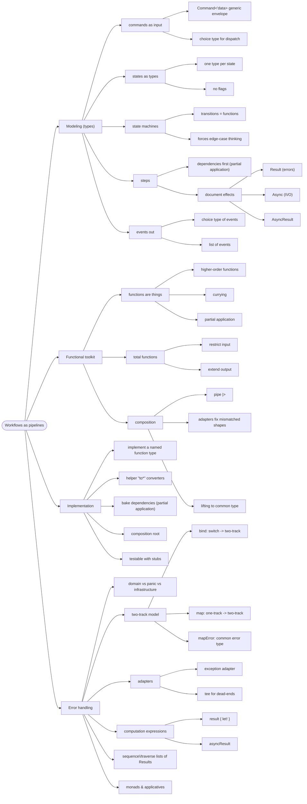

# Workflows and Error Handling — Pipelines, Two-Track, Composition

> Source: *Domain Modeling Made Functional* — ch 7 (Modeling Workflows as
> Pipelines), ch 8 (Understanding Functions), ch 9 (Implementation: Composing
> a Pipeline), ch 10 (Implementation: Working with Errors).

A workflow = small pure functions glued into a pipeline. This page: model it
with types, the function toolkit, wiring it together, and the two-track
error model.



## Model the workflow (ch 7)

### Input = a command

A command carries the data **plus metadata** (who, when) for auditing:

```fsharp
type Command<'data> = { Data: 'data; Timestamp: DateTime; UserId: string }
type PlaceOrder = Command<UnvalidatedOrder>   // generics, not OO inheritance
```

All commands on one channel (a queue)? Unify them with a choice type
(`Place of … | Change of … | Cancel of …`) and dispatch at the context edge.

### One type per state — never flags

❌ Wrong — states are implicit, nothing ties `AmountToBill` to `IsPriced`:

```fsharp
type Order = { IsValidated: bool; IsPriced: bool }
```

✅ Right — a type per lifecycle state, wrapped in a choice:

```fsharp
type Order =
    | Unvalidated of UnvalidatedOrder
    | Validated   of ValidatedOrder
    | Priced      of PricedOrder
```

- New state (`RefundedOrder`)? Add a case — existing code keeps compiling.
- `Quote` is not a state — it's a different workflow.

### Documents with lifecycles are state machines

Examples: email (Unverified → Verified), cart (Empty → Active → Paid),
delivery (Undelivered → Out for Delivery → Delivered).

Why bother:

- each state gets its own **allowable behavior** (pay only an Active cart)
  — encodable in function signatures;
- all states become **explicit** (the forgotten "empty cart" case surfaces);
- listing transitions **forces every edge case out** (pay twice? remove
  from an empty cart? verify an already-verified email?).

Implementation: choice type over per-state records (dataless states need no
record — `EmptyCart`); each command is a function `State -> … -> State`
implemented by pattern matching over all cases.

### Each step: dependencies first, then input, then output

```fsharp
type ValidateOrder =
    CheckProductCodeExists    // dependency
    -> CheckAddressExists     // dependency
    -> UnvalidatedOrder       // input
    -> AsyncResult<ValidatedOrder, ValidationError list>
```

Dependencies are **function types** — narrow, not a fat interface:

```fsharp
type CheckProductCodeExists = ProductCode -> bool
type CheckAddressExists =
    UnvalidatedAddress -> AsyncResult<CheckedAddress, AddressValidationError>
```

The dependency-first order is deliberate: **partial application bakes them
in** — the FP equivalent of DI (shown below).

### Document effects in the signature

| Signature says | Meaning |
| --- | --- |
| `Result<'s,'f>` | can fail with domain errors |
| `Async<'s>` | won't return immediately (I/O) |
| `AsyncResult<'s,'f>` | both — remote calls |

Local cached lookups need neither.

Pick result types deliberately. Send-acknowledgment options: `unit`
(can't tell if it sent — bad), `bool` (uninformative),
`SendResult = Sent | NotSent` (clear). ✅ the third.

### Output = a list of events (choice type)

```fsharp
type PlaceOrderEvent =
    | OrderPlaced of OrderPlaced
    | BillableOrderPlaced of BillableOrderPlaced
    | AcknowledgmentSent of AcknowledgmentSent
```

- A **list**, not a fixed record — adding an event breaks nothing.
- Consumers get subsets: `OrderPlaced = PricedOrder` (type alias);
  `BillableOrderPlaced` is a smaller record.

### Public vs internal signatures

- **Public API**: hide dependencies —
  `PlaceOrderCommand -> AsyncResult<PlaceOrderEvent list, PlaceOrderError>`.
- **Internal steps**: show dependencies — they document needs and force
  re-implementation when they change.

### Long-running steps become sagas

A step that takes hours (a human validates)? Persist state → end the
workflow → resume on a message. The workflow splits into **mini-workflows
triggered by events** — a *saga*. Load state → transition → save. Many
states/transitions → consider a **process manager** component.

## The functional toolkit (ch 8)

| Tool | One-liner | Example |
| --- | --- | --- |
| Functions are things | pass, return, store them | `(int -> int) list` |
| Currying | multi-param = chain of 1-param | `add : int -> int -> int` |
| Partial application | fix some args, get a function | `sayGreeting "Hello"` → `sayHello` |
| Composition | output type = input type | `x |> add1 |> square` |
| Total function | every input → documented output | see below |

**Total functions** — the signature never lies. Two moves:

- *restrict input*: `twelveDividedBy : NonZeroInteger -> int` — zero can't
  be constructed, so no zero case exists;
- *extend output*: `int -> int option` — `None` for the undefined case.

Exceptions in between are "lies" in the signature.

Mismatched shapes (the main challenge)? Convert both sides to the highest
common denominator: `5 |> add1 |> Some |> printOption`. Generalized in
ch 9–10 as adapters and lifting.

## Implement the pipeline (ch 9)

### Style: implement the named function type

```fsharp
let validateOrder : ValidateOrder =
    fun checkProductCodeExists checkAddressExists unvalidatedOrder ->
        ...
```

Annotating with the designed type makes the compiler check every parameter
and the return **inside the definition** — mistakes surface here, not at
assembly time. Sketching? `failwith "not implemented"` bodies keep it
compiling.

### Convert unvalidated → domain with `to*` helpers

```fsharp
let toCustomerInfo checkAddressExists (dto:UnvalidatedCustomerInfo) =
    // per field: call the smart constructor, assemble the record
```

- One helper per field group; low-level rules ("starts with W") live in the
  smart constructors.
- **Successfully constructing a `ValidatedOrder` *is* the validation.**
- Choice types guide construction: `toOrderQuantity` matches the
  `ProductCode` case — Widget → `UnitQuantity.create`, Gizmo → kilos — and
  both branches return the same `OrderQuantity` choice type.

### Adapters fix mismatched shapes

A dependency returns `bool` but the pipeline needs a passthrough? Write a
**generic function transformer**:

```fsharp
let predicateToPassthru errorMsg f x =
    if f x then x else failwith errorMsg
// string -> ('a -> bool) -> 'a -> 'a
```

`List.map` is the same idea: it lifts `'a -> 'b` to work on lists.

### Partial application = DI, wired at the composition root

No IoC container. The **composition root** (near the entry point) reads
config, creates services, and bakes them in:

```fsharp
let placeOrder : PlaceOrderWorkflow =
    let validateOrder = validateOrder checkProductCodeExists checkAddressExists
    let priceOrder    = priceOrder getProductPrice
    fun unvalidatedOrder ->
        unvalidatedOrder
        |> validateOrder
        |> priceOrder
        ...
```

- Steps that don't connect? Adapter, or a plain `let`-per-step style — both
  fine.
- Too many dependencies? Split the function, or group them into a record.
- Child service needs its own config (endpoint, credentials)? Bake it in at
  setup — callers get a simple one-parameter function.

### Testing = inline stubs, no mocking library

```fsharp
let checkProductCodeExists _ = true   // success case (false = failure case)
```

Arrange/Act/Assert with one-line stubs. Works because steps are stateless
functions with explicit dependencies. (F# niceties: double-backtick test
names, FsCheck property-based tests —
[testing-practices](../testing-practices/index.md).)

## Work with errors (ch 10)

### Three classes of errors

| Class | Example | Treatment |
| --- | --- | --- |
| **Domain** | invalid product code, order rejected | choice type in the domain; discuss with experts |
| **Panic** | out of memory, null reference | raise; catch at top level only |
| **Infrastructure** | network timeout, auth failure | handle either way; often promote to domain to decide "what do we tell the customer?" |

Unsure which class? Ask the expert. Connection abort → "????" →
infrastructure.

Don't enumerate all errors up front — add cases as they arise. The compiler
warns on unhandled new cases, forcing the conversation:

```fsharp
type PlaceOrderError =
    | ValidationError of string
    | ProductOutOfStock of ProductCode
    | RemoteServiceError of RemoteServiceError
```

### The two-track model

A `Result`-returning function is a **switch**: one input, two outputs.
Chain switches and you get **two tracks** — happy path on top, failure
track below. An error shunts you off and bypasses the rest.

Problem: a two-track output can't plug into a one-track input. Three
adapters fix everything:

```fsharp
let bind switchFn twoTrackInput =        // switch -> two-track
    match twoTrackInput with
    | Ok success -> switchFn success
    | Error failure -> Error failure

let map f aResult =                      // one-track -> two-track
    match aResult with
    | Ok success -> Ok (f success)
    | Error failure -> Error failure

let mapError f aResult =                 // transform the failure value
    match aResult with
    | Ok success -> Ok success
    | Error failure -> Error (f failure)
```

Put these in a `Result` module early in the project.

**One rule: the failure track must have ONE error type end to end.** Success
types may change step to step. Unify with a common choice type + `mapError`:

```fsharp
type PlaceOrderError = Validation of ValidationError | Pricing of PricingError

let placeOrder unvalidatedOrder =
    unvalidatedOrder
    |> validateOrderAdapted          // mapError Validation inside
    |> Result.bind priceOrderAdapted // mapError Pricing inside
    |> Result.map acknowledgeOrder   // one-track steps via map
    |> Result.map createEvents
```

Zero conditionals or try/catch in the pipeline.

### Two more adapters

- **Exception-throwing service** → wrap: catch only the *relevant*
  exceptions, return `Error (RemoteServiceError …)`. Name it
  `checkAddressExistsR` and map its error into the common type.
- **Dead-end function** (`string -> unit`, e.g. logging) → **tee**:
  `let tee f x = f x; x` — runs it, returns the original input. Slot in
  with `Result.map (tee f)`.

### Computation expressions hide the bind

Complex logic (conditionals, loops, nested Results)? `let!` hides `bind`:

```fsharp
let placeOrder unvalidatedOrder = result {
    let! validatedOrder =
        validateOrder unvalidatedOrder |> Result.mapError PlaceOrderError.Validation
    let! pricedOrder =
        priceOrder validatedOrder |> Result.mapError PlaceOrderError.Pricing
    let ack = acknowledgeOrder pricedOrder      // plain — no map needed
    return createEvents pricedOrder ack
}
```

- Minimal builder = `Return` + `Bind`. CEs compose (nest freely).
- Error type must still match — `mapError` still does the lifting.
- `asyncResult` CE = Async + Result combined;
  `AsyncResult.ofResult` lifts plain `Result`s into it.

### Lists of Results: `sequence` / `traverse`

`List.map` over fallible converters gives `Result list` — you need
`Result<list>`:

- **`sequence`** : `Result<'a> list -> Result<'a list>` (fails fast on the
  first error);
- **`traverse`** = map + sequence in one pass;
- collecting **all** errors requires **applicatives**, not monads.

### Monad vs applicative, demystified

- **Monad** = a data structure (`Result`) + `return`/`bind` + sanity laws.
  A "monadic function" = value in, enhanced value out — exactly the switches
  above. Bind chains them **in series**.
- **Applicative** combines enhanced values **in parallel** — how you
  aggregate all validation errors at once.

## Cross-links

- DTOs and serialization gates: [persistence-and-evolution](../persistence-and-evolution/index.md).
- TEA's update function is this pipeline shape on the client: [elm-architecture](../elm-architecture/index.md).
- Retry/circuit-breaker for infrastructure errors: [remote-data-and-security](../remote-data-and-security/index.md).
- Testing stubs and property-based testing: [testing-practices](../testing-practices/index.md).
- UI-level echo of smart constructors: [blazor-components](../blazor-components/index.md).
