# Workflows and Error Handling — Pipelines, Two-Track, Composition

> Source: *Domain Modeling Made Functional* — ch 7 (Modeling Workflows as
> Pipelines), ch 8 (Understanding Functions), ch 9 (Implementation: Composing
> a Pipeline), ch 10 (Implementation: Working with Errors).

A business workflow is a series of document transformations — a **pipeline**
built from small stateless, side-effect-free steps glued together
("transformation-oriented programming"). This page covers modeling the
pipeline with types, the functional toolkit (functions as things, total
functions, composition), implementing the steps, injecting dependencies, and
the two-track model that makes error handling clean.

```mermaid
mindmap
  root((Workflows as pipelines))
    Modeling (types)
      commands as input
        Command<'data> generic envelope
        choice type for dispatch
      states as types
        one type per state
        no flags
      state machines
        transitions = functions
        forces edge-case thinking
      steps
        dependencies first (partial application)
        document effects
          Result (errors)
          Async (I\\/O)
          AsyncResult
      events out
        choice type of events
        list of events
    Functional toolkit
      functions are things
        higher-order functions
        currying
        partial application
      total functions
        restrict input
        extend output
      composition
        pipe |>
        adapters fix mismatched shapes
        lifting to common type
    Implementation
      implement a named function type
      helper "to*" converters
      bake dependencies (partial application)
      composition root
      testable with stubs
    Error handling
      domain vs panic vs infrastructure
      two-track model
        bind: switch -> two-track
        map: one-track -> two-track
        mapError: common error type
      adapters
        exception adapter
        tee for dead-ends
      computation expressions
        "result &#123; let! &#125;"
        asyncResult
      sequence\\/traverse lists of Results
      monads & applicatives
```



## Modeling the workflow (ch 7)

### The input: commands

The workflow's *real* input is the **command** that triggered it, carrying
the workflow data plus metadata (timestamp, user) for auditing:

```fsharp
type PlaceOrder = {
    OrderForm : UnvalidatedOrder
    Timestamp : DateTime
    UserId    : string
}
```

Commands share common fields — share them with **generics instead of OO
inheritance**:

```fsharp
type Command<'data> = { Data: 'data; Timestamp: DateTime; UserId: string }
type PlaceOrder = Command<UnvalidatedOrder>
```

If all commands arrive on one channel (a queue), unify them with a **choice
type** (`OrderTakingCommand = Place of … | Change of … | Cancel of …`) and
add a routing/dispatching input stage at the context edge.

### The states: one type per state

A flag-based `Order {IsValidated; IsPriced; AmountToBill: decimal option}` is
wrong: states are implicit, conditional code multiplies, and nothing ties
`AmountToBill` to `IsPriced`. Instead, **a new type per lifecycle state**
(`UnvalidatedOrder`, `ValidatedOrder`, `PricedOrder` — each with exactly the
data valid for that state) plus a top-level choice:

```fsharp
type Order =
    | Unvalidated of UnvalidatedOrder
    | Validated   of ValidatedOrder
    | Priced      of PricedOrder
```

New states (e.g. `RefundedOrder`) can be added without breaking existing
code. `Quote` is *not* a state — it's a different workflow.

### State machines

Documents with lifecycles are simple **state machines**: a few states,
transitions triggered by commands. Examples: email (Unverified → Verified),
shopping cart (Empty → Active → Paid), delivery (Undelivered → Out for
Delivery → Delivered). Why bother:

- each state has its own **allowable behavior** (pay only an active cart;
  reset email only to unverified) — encodable in function signatures;
- all states become **explicitly documented** (implicit "empty cart" behavior
  is a common omission);
- the exercise **forces every edge case** to the surface (verify an already
  verified email? pay twice? remove from empty cart?).

Implementation: a choice type over per-state data records (states with no
data need no record — `EmptyCart`), and each command is a function
`State -> … -> State` implemented by pattern matching over all cases
(see the `addItem`/`makePayment` shopping-cart example in the source).

### The steps: dependencies and effects as types

Each substep gets a function type: dependencies first, input second-to-last,
output last (order chosen so **partial application** bakes dependencies in —
the FP equivalent of DI):

```fsharp
type ValidateOrder =
    CheckProductCodeExists    // dependency
    -> CheckAddressExists     // dependency
    -> UnvalidatedOrder       // input
    -> AsyncResult<ValidatedOrder, ValidationError list>   // output
```

**Dependencies are modeled as function types too** — a narrow interface
exposing exactly what's needed and no more (never a heavyweight
`IProductCatalog`):

```fsharp
type CheckProductCodeExists = ProductCode -> bool
type GetProductPrice = ProductCode -> Price
type CheckAddressExists =
    UnvalidatedAddress -> AsyncResult<CheckedAddress, AddressValidationError>
```

**Document effects in the signature**: a `Result` in the output means "error
effects"; `Async` means "won't return immediately"; combined as the
`AsyncResult<'s,'f> = Async<Result<'s,'f>>` alias (I/O + possible failure —
remote calls; local cached lookups need neither).

**Decide result types deliberately** — e.g. the send-acknowledgment service:
`unit` (can't tell whether it sent — bad), `bool` (uninformative), or
`SendResult = Sent | NotSent` (clear) — and whether the service or the
workflow creates the event.

**Events out**: model the success output as a **list of a choice type of
events** (`PlaceOrderEvent = OrderPlaced … | BillableOrderPlaced … |
AcknowledgmentSent …`) rather than a fixed record — adding a new event
doesn't break the workflow. Events for different consumers can be subsets:
`OrderPlaced = PricedOrder` (type alias), `BillableOrderPlaced` a record
subset.

### Public vs internal signatures

For the **public API** hide dependencies — callers don't need them:
`PlaceOrderWorkflow = PlaceOrderCommand -> AsyncResult<PlaceOrderEvent list,
PlaceOrderError>`. For **internal steps**, be explicit — dependencies
document what each step needs, and changes force re-implementation.

### Long-running workflows (sagas)

If a remote step takes hours (a human validates), persist state before the
call, then continue on a message when it completes. The workflow breaks into
**mini-workflows triggered by events** — a *saga* — with the state machine
model as the framework: load persisted state → transition → save new state.
Many states/transitions may warrant a **process manager** component.

## The functional toolkit (ch 8)

- **Functions are things**: pass as input, return as output, put in lists
  (`(int -> int) list`). Functions taking/returning functions are
  **higher-order functions**.
- **Currying**: every multi-parameter function is a chain of one-parameter
  functions; `add : int -> int -> int` can be read `int -> (int -> int)`.
- **Partial application**: supply some arguments, get a function with the
  rest "baked in" (`sayGreeting "Hello"` → `sayHello`). This powers
  dependency injection and adapter design.
- **Total functions**: every input maps to a documented output — the
  signature never lies. Two techniques:
  - *restrict the input* (`twelveDividedBy : NonZeroInteger -> int` — zero
    isn't representable, so no zero case exists);
  - *extend the output* (`int -> int option` — `None` for the undefined
    case). Exceptions in the middle ground are "lies" in the signature.
- **Composition**: functions compose when output-type matches input-type;
  F#'s pipe `x |> add1 |> square` chains them. Composition hides information
  (the intermediate "banana" is invisible). Whole applications are built this
  way: low-level functions → services → workflows → a dispatcher selecting
  workflows — "functions all the way up."
- **Mismatched shapes**: the main challenge. Fix by converting both sides to
  the "highest common denominator" (`5 |> add1 |> Some |> printOption`) —
  generalized in ch 9–10 as adapters and lifting.

## Implementing the pipeline (ch 9)

### Style: implement a named function type

```fsharp
let validateOrder : ValidateOrder =
    fun checkProductCodeExists checkAddressExists unvalidatedOrder ->
        ...
```

Writing the function as a value annotated with the *designed* function type
makes the compiler check every parameter and the return value **locally,
inside the definition** — mistakes surface here instead of at assembly time
(and prevent inference from silently guessing wrong types). For sketching,
`failwith "not implemented"` bodies keep the project compilable.

### Converting unvalidated → domain

The pattern: for each field of the domain type, convert the corresponding
primitive with a helper that calls the type's smart constructor
(`OrderId.create`, `String50.create`, `EmailAddress.create`), then assemble
the record. Low-level rules (e.g. "starts with W") live in the constructors
— **successfully constructing a `ValidatedOrder` *is* the validation**.
Sub-builders compose the same way (`toCustomerInfo`, `toAddress`, which
itself calls the `checkAddressExists` service passed down).

Choice types guide construction: `toOrderQuantity` matches on the
`ProductCode` case (Widget → `UnitQuantity.create` → lift to
`OrderQuantity.Unit`; Gizmo → kilos) so both branches return the *same*
choice type.

### Function adapters

When a dependency has the wrong "shape" (a predicate returning `bool` where
the pipeline needs a passthrough), write a **generic function transformer**:

```fsharp
let predicateToPassthru errorMsg f x =
    if f x then x else failwith errorMsg
// val predicateToPassthru : string -> ('a -> bool) -> 'a -> 'a
```

`List.map` is the same idea: it transforms an `'a -> 'b` function into one
working on lists. Adapters keep the *spec* unchanged while fitting functions
together.

### Composing steps: partial application as DI

Steps have dependency parameters that break naive piping. Bake the
dependencies in with partial application (shadowing the name locally):

```fsharp
let placeOrder : PlaceOrderWorkflow =
    let validateOrder = validateOrder checkProductCodeExists checkAddressExists
    let priceOrder    = priceOrder getProductPrice
    ...
    fun unvalidatedOrder ->
        unvalidatedOrder
        |> validateOrder
        |> priceOrder
        ...
```

Where steps don't quite connect (outputs that don't match inputs), either
write an adapter or drop to an imperative-ish `let`-per-step style — still
clear and maintainable.

### Injecting dependencies (the functional way)

No IoC container — **dependencies are explicit parameters**, passed from the
top-level **composition root** (near the application entry point) down
through each layer. The composition root sets up services (from
configuration), partially applies them into the workflows, and wires routing
(deserialize → workflow → post events → response). The workflow function
itself receives its dependencies as parameters, making the whole workflow
testable with fakes.

**Too many dependencies?** Split the function, or group dependencies into a
record. Crucially: if a child service needs its own config (endpoint,
credentials), *bake those in at setup time* so callers just receive a simple
one-parameter function — "pre-built" helper functions hide complexity, and a
function's interface should be as minimal as possible.

### Testing dependencies

Because dependencies are parameters, tests write **stubs inline** — no
mocking library: `let checkProductCodeExists _ = true` (success case) or
`= false` (failure case), then Arrange/Act/Assert. Benefits of the design:
stateless functions (same input → same output), explicit dependencies,
side-effects confined to parameters. (F# niceties: double-backtick test
names; F#-friendly frameworks — FsUnit, Unquote, Expecto; property-based
FsCheck — see [testing-practices](../testing-practices/index.md).)

## Working with errors (ch 10)

### Three classes of errors

- **Domain errors** — expected parts of the business process (invalid product
  code, order rejected by billing). Model them in the domain, discuss with
  experts, encode as choice types. Unsure? Ask the expert (connection abort?
  "????" → infrastructure error).
- **Panics** — unknown-state errors (out of memory, divide by zero, null
  reference). Abandon the workflow; raise; catch at the top level (`main`).
- **Infrastructure errors** — expected architecturally but not business
  (network timeout, auth failure). Handle either way; often worth treating as
  domain errors to force thinking about "what do we tell the customer?"

Domain errors become a **choice type with a case per failure mode** —
self-documenting, extensible, and the compiler *warns* on unhandled new
cases, forcing a conversation about what to do:

```fsharp
type PlaceOrderError =
    | ValidationError of string
    | ProductOutOfStock of ProductCode
    | RemoteServiceError of RemoteServiceError
```

Don't enumerate all errors up front — add cases as they arise during
development.

### The two-track model

A plain function is single-track; a `Result`-returning function is a
**switch** (one input, two outputs: success/failure). Chaining switches
gives the **two-track model** ("railroad-oriented programming"): top track =
happy path, bottom = failure track; an error shunts you off and bypasses the
rest. But a two-track output can't plug into a one-track input — fix it with
adapter blocks:

- **bind** (a.k.a. flatMap) — converts a *switch* into a two-track function:

  ```fsharp
  let bind switchFn twoTrackInput =
      match twoTrackInput with
      | Ok success -> switchFn success
      | Error failure -> Error failure
  ```

- **map** — converts a *one-track* function into a two-track function:

  ```fsharp
  let map f aResult =
      match aResult with
      | Ok success -> Ok (f success)
      | Error failure -> Error failure
  ```

- **mapError** — transforms the *failure* value (used to unify error types):

  ```fsharp
  let mapError f aResult =
      match aResult with
      | Ok success -> Ok success
      | Error failure -> Error (f failure)
  ```

Put these in a `Result` module early in the project.

Composition rules: on the success track types may change step-to-step (as
long as they match); the **failure track must have one uniform error type
throughout the pipeline**. Unify errors by creating a common choice type and
mapping each step's error into it:

```fsharp
type PlaceOrderError = Validation of ValidationError | Pricing of PricingError

let validateOrderAdapted input =
    input |> validateOrder |> Result.mapError PlaceOrderError.Validation
let priceOrderAdapted input =
    input |> priceOrder |> Result.mapError PlaceOrderError.Pricing

let placeOrder unvalidatedOrder =
    unvalidatedOrder
    |> validateOrderAdapted
    |> Result.bind priceOrderAdapted
    |> Result.map acknowledgeOrder     // one-track steps via map
    |> Result.map createEvents
```

The happy path stays clean — no conditionals or try/catch anywhere in the
pipeline.

### Adapting other shapes

- **Exception-throwing services** → wrap with an adapter that catches only
  the *relevant* exceptions and returns `Error (RemoteServiceError …)`:
  `serviceExceptionAdapter serviceInfo serviceFn x` with `try … with | :?
  TimeoutException as ex -> Error {Service=…; Exception=ex}`. Name the
  adapted variant `checkAddressExistsR` (or shadow) and map its error into
  the pipeline's common error type.
- **Dead-end functions** (`string -> unit`, e.g. logging) → **tee** runs the
  function and returns the original input (`let tee f x = f x; x`), then
  `Result.map (tee f)` slots it into the two-track pipeline.

### Computation expressions: hiding the bind

For complex logic (conditionals, loops, nested Results), a computation
expression hides `bind` behind `let!`:

```fsharp
let placeOrder unvalidatedOrder = result {
    let! validatedOrder =
        validateOrder unvalidatedOrder |> Result.mapError PlaceOrderError.Validation
    let! pricedOrder =
        priceOrder validatedOrder |> Result.mapError PlaceOrderError.Pricing
    let acknowledgementOption = acknowledgeOrder pricedOrder   // plain, no map needed
    let events = createEvents pricedOrder acknowledgementOption
    return events
}
```

A minimal builder is just `Return` (`Ok x`) and `Bind`
(`Result.bind f x`). Computation expressions **compose** — `result` blocks
nest inside bigger `result` blocks. The error type must still match
throughout (`mapError` still does the lifting). The `asyncResult` CE handles
the combined Async+Result effect, with `AsyncResult.ofResult` lifting plain
`Result`s into it.

**Lists of Results**: `List.map` over fallible converters yields a
`Result list`, but you need a `Result<list>`. Build the **`sequence`**
helper (foldBack with a `prepend` that fails if either side is an error) to
convert `Result<'a> list -> Result<'a list>`; combine map+sequence into
**`traverse`** for efficiency. Note `sequence` keeps only the *first* error —
collecting *all* errors requires **applicatives**.

### Monads and applicatives (demystified)

A **monad** is just: a data structure (`Result`), plus `return`/`bind`
functions, plus sanity rules ("monad laws"). A monadic function = normal
value in, enhanced value out = exactly the switch functions above. Bind
chains them **in series**. An **applicative** combines enhanced values **in
parallel** — the technique for aggregating *all* validation errors at once.

## Cross-links

- Where the errors and DTOs meet the outside world (serialization gates):
  [persistence-and-evolution](../persistence-and-evolution/index.md).
- The message-driven, state-machine flavor of TEA update functions is the
  client-side cousin of these pipelines: [elm-architecture](../elm-architecture/index.md).
- Resilience patterns for the infrastructure errors (retry, circuit breaker):
  [remote-data-and-security](../remote-data-and-security/index.md).
- Testing stubs and property-based testing: [testing-practices](../testing-practices/index.md).
- Validation of DTOs in Blazor forms is the runtime, UI-level echo of smart
  constructors: [blazor-components](../blazor-components/index.md).
